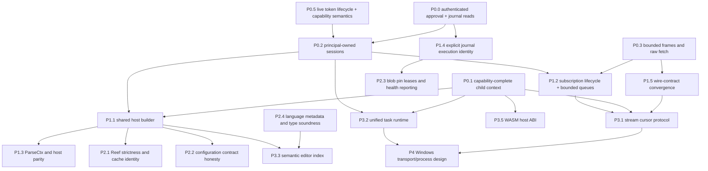

+++
title = "Roadmap and engineering priorities"
description = "A dependency-ordered roadmap for closing Shoal's authority, protocol, composition, persistence, language, and portability gaps with testable exit criteria."
weight = 122
template = "docs/page.html"

[extra]
group = "Maintenance"
eyebrow = "Execution plan"
status = "Prioritized from the 2026-07-16 source audit"
audience = "Maintainers, reviewers, and project planners"
wide = true
+++

Active remediation work is tracked task-by-task in the
[hardening roadmap](@/internals/hardening-roadmap.md), which retires every finding of the
[2026-07-16 deep audit](@/internals/deep-audit-2026-07-16.md); this page keeps the wider
dependency-ordered picture.

This roadmap starts from the [implementation status ledger](../implementation-status/), not the
historical feature waves. Its job is to order work so that new surface area is built on explicit
identity, authority, bounds, and lifecycle contracts. It contains no calendar promise: priorities
describe dependency and risk, while milestones describe verifiable exit conditions.

The old R0–R5 roadmap was useful for bootstrapping breadth. It is retired as a status authority
because a wave-sized “done” label hid host-specific gaps: streams exist without wire pulling,
tasks exist without kernel suspend/resume, and policies exist while some child evaluators omit the
parent policy entirely.

## Prioritization model

Every work package is ranked on five questions:

1. **Authority:** can the gap disclose or mutate state across a principal or capability boundary?
2. **Integrity:** can it silently violate a serialized, persisted, or language-level contract?
3. **Blast radius:** how many later features would otherwise copy the defect?
4. **Dependency:** does another useful package need this boundary to be stable first?
5. **Evidence:** can completion be expressed as focused and real-boundary tests?

| Priority | Meaning | Scheduling rule |
|---|---|---|
| P0 | authority or unbounded-input correctness | stop expanding the affected surface until closed |
| P1 | composition/protocol/persistence foundation | land before dependent agent or host features |
| P2 | semantic honesty and reliability | next coherent hardening wave |
| P3 | deliberate feature completion | begin only after its P0/P1 dependencies |
| P4 | portability, scale, and continuous quality | parallelize where it cannot obscure higher-risk work |

Small effort does not automatically raise priority. A one-line wire-format change needs migration and
compatibility thought; a large identity fix can be P0 because everything above it assumes ownership.

## Dependency spine



This graph is intentionally conservative. For example, a stream cursor protocol is not merely a new
RPC: it needs bounded queues, cancellation ownership, session/ref authorization, and wire budgets.
Building it before those contracts would multiply later migration work.

## Roadmap at a glance

| Package | Priority | Primary owner | Depends on | Exit signal |
|---|---:|---|---|---|
| authenticate approval and journal query; strengthen plan identity | P0 | kernel, proto, Leash | none | no unauthenticated authority mutation/read; refs cannot overwrite across owners |
| capability-complete child evaluator construction | P0 | `shoal-eval` | none | all child paths inherit exact authority/profile |
| principal-owned kernel sessions | P0 | `shoal-kernel`, `shoal-auth` | none | same name cannot cross owner without ACL |
| bounded frame and raw value retrieval | P0 | kernel, proto, MCP | none | no allocation or response exceeds negotiated budget |
| explicit policy-loader safety modes | P0 | Leash and hosts | none | agent hosts fail closed; local fallback is deliberate and visible |
| live token lifecycle and capability meaning | P0 | auth/kernel | none | bounded revocation latency; metadata cannot masquerade as grants |
| shared evaluator host builder | P1 | eval plus `shoal`/kernel | child context, identity | profile differences are declarative and tested |
| subscription lifecycle and bounded delivery | P1 | kernel/MCP | identity, wire bounds | unsubscribe stops worker; overflow is explicit |
| parser-context parity | P1 | syntax/eval/hosts | host builder | same bindings classify same statement across hosts |
| journal execution identity/schema | P1 | journal/kernel/eval | none | coarse/fine rows are explicitly related |
| wire-contract convergence | P1 | proto/kernel/MCP | wire bounds | DateTime/span/raw behavior matches schema and tests |
| Reef strictness and cache identity | P2 | Reef/eval | host builder | changes/errors cannot remain silently stale in strict mode |
| configuration honesty | P2 | config/hosts/prompt | host builder | every accepted field is consumed or rejected/deprecated |
| pin leases and durability health | P2 | journal/hosts | journal identity | pins have owners; write failure becomes observable |
| complete effectful ports | P2 | value/eval | child context | evaluator effect paths stop reaching ambient host directly |
| wire stream cursor | P3 | value/proto/kernel/MCP | P0/P1 bounds/lifecycle | bounded pull/cancel/end/error contract is live; local stdin feed is already bounded |
| unified task runtime | P3 | eval/exec/kernel | child context/identity | local and kernel control the same owned task abstraction |
| semantic editor index | P3 | syntax/eval/LSP | host builder/language metadata | symbols understand modules/scopes and UTF-16 positions |
| prompt producer completion | P3 | `shoal`, prompt | config honesty | context fields are real or removed; slow data is deferred |
| WASM host integration | P3 | WASM/eval/Leash | capability context | effect-scoped ABI with wall deadline and value conversion |
| Windows architecture | P4 | cross-crate | task/stream/transport contracts | native transport, ConPTY, path, sandbox honesty, CI |
| continuous quality gates | P4/continuous | workspace | package-specific | evidence generated, not restated manually |

## P0 — close authority and input-boundary defects

### P0.0 Authenticate approval and journal reads; fix plan identity — baseline complete

**Resolved baseline.** `cap.request` and `journal.query` now require attachments. Journal pages are
hard-capped and exact-owner scoped. Approval requires a distinct authorized approver by default,
binds requester/approver/source/plan/Session/scope into a durable audit row, and is consumed once.
Plan refs use a full caller/content-bound digest plus a unique object suffix, so equal-effect and
identical repeated plans cannot overwrite one another. Public tokenless clients are restricted and
cannot assert local-human presence.

**Remaining design.** Centralize method attachment classes so new handlers cannot regress; add
optional peer-credential/mandatory-bearer modes and richer `JournalRead` policy. Continue to evolve
approver routing, expiration/reason metadata, and cross-principal journal grants without weakening
the existing exact-owner default.

**Acceptance tests.** Through raw kernel connections and MCP:

- unattached `cap.request` and `journal.query` return `NOT_ATTACHED`;
- an attached non-approver cannot approve another principal's plan or query its rows;
- an authorized supervisor can approve only the exact allowed owner/session/effect/source record;
- two principals and two sources with identical effect sets receive independent stored plan IDs;
- creating the second never changes `plan.get`/`plan.apply` for the first;
- concurrent creation cannot overwrite, approve, or apply the wrong record;
- approval, denial, and journal access produce an audit event or durable record;
- deterministic content fingerprints, if exposed, are never treated as bearer authority.

**Exit.** The router's public/unattached allowlist is generated or pinned as `session.attach`,
`parse`, and `complete` only, unless a future method has an explicit proof for public access. Handler
signatures make caller context mandatory for every state read/mutation. Protocol comments and tests
agree with the router.

### P0.1 One capability-complete child evaluator constructor — complete

**Resolved.** `spawn`, parallel, channels, `.shl`, and stream producers now capture one typed child
context and rebuild through one exhaustive constructor. It carries explicit principal/Leash, Reef,
ports/config, echo, and cancellation capability without sharing arbitrary mutable evaluator state.
Production-site inventory tests reject direct `Evaluator::new` at child factories.

The implemented shape follows this design intent:

```rust
// Shape, not a pinned API.
struct EvaluatorContext {
    fs: Arc<dyn Fs>,
    exec: Arc<dyn Exec>,
    clock: Arc<dyn Clock>,
    opener: Arc<dyn Opener>,
    secrets: Arc<dyn SecretPort>,
    config: Arc<dyn ConfigPort>,
    leash: Arc<LeashContext>,
    reef: ReefContext,
    cancel: CancelToken,
    host_profile: HostProfile,
}
```

Separate inherited mutable language state—bindings, cwd, environment, module cache, transcript—from
authority. Each child kind can choose copy/share/isolate semantics for language state but must not
accidentally widen capabilities.

**Acceptance tests.** For every constructor site:

- a parent with `proc_spawn = deny` cannot spawn through the child;
- a denied filesystem effect remains denied;
- Reef resolution sees the documented inherited scope and lock;
- fake `Fs`, `Exec`, `Clock`, opener, secret, and config ports observe child operations;
- cancellation reaches a process tree and a waiting stream;
- child-local cwd/env mutation does not mutate the parent unless the construct promises it;
- adding a new capability field requires one explicit child-inheritance audit and, when inherited,
  one capture plus one exhaustively destructured builder update.

**Exit.** No direct `Evaluator::new` remains at semantic child sites; a repository check enumerates
and permits only composition-root construction. The security tests run through real `spawn`,
`parallel`, `on`, and `.shl` syntax, not only the builder.

### P0.2 Principal-owned kernel sessions

**Problem.** A named session remembers the principal that first created it, but lookup is by name.
A different authenticated principal can later attach to that same evaluator and transcript.

**Decision required.** Choose one model explicitly:

1. sessions are keyed by `(principal_id, session_name)` and names are private by default; or
2. sessions have a stable owner plus persisted or memory-resident ACL, with explicit share/revoke.

The first is the safer near-term contract. The second is a product feature and needs audit events,
permission inheritance, race handling, and protocol methods.

**Acceptance tests.** Use two real tokens and two connections:

- the second principal cannot read variables, transcript, task, PTY, plan, or event state from the
  first principal’s same-named session;
- attach races cannot create two inconsistent owners;
- refs from one owner fail under the other with one stable authorization error;
- journal principal/session filters reflect the owner model;
- disconnect and restart behavior is documented and tested;
- MCP resource URIs cannot bypass the same check.

**Migration.** Current live sessions are memory-only, so there is no session-state data migration.
Journal rows remain historical facts; do not rewrite principals. If the protocol’s returned session
ID changes, support old clients through a versioned attach response or a deliberate breaking version.

### P0.3 Bounded frame ingestion and explicit raw retrieval

**Status (2026-07-17): implemented.** Frame readers reject cap-plus-one during bounded ingestion.
Before tree allocation, the shared request/response scanner also caps depth, node count, container
width, decoded key bytes, and numeric-token bytes; outbound serialization uses the same limits.
Raw values now use bounded `slice` pages and CAS blobs use byte `offset`/`length` pages, both with an
8 KiB decoded-content wall and explicit continuation metadata. The adversarial suite covers resident
and CAS values, exact boundaries, overflowed requests, owner denial, and MCP context size.

**Original problem.** Kernel and MCP readers called `read_line` before checking the 16 MiB cap. A peer could force
larger allocation with a newline-free frame. `value.get {format:"raw"}` returns full base64 without
the ordinary 64 KiB elision clamp, and MCP forwards it.

**Design.** Replace line accumulation with a bounded delimiter reader that:

- consumes chunks up to a hard maximum;
- detects overflow before growing beyond the maximum;
- closes or drains the offending frame according to one documented rule;
- preserves multiple valid frames already buffered;
- rejects invalid UTF-8/JSON without poisoning the next connection state.

Raw data should use either `(offset, length)` slices with a hard per-response maximum or an immutable
blob resource with chunked reads. Base64 expansion must count against the response budget.

**Acceptance tests.** Cover one-byte chunking, exact-boundary frames, cap-plus-one without newline,
two frames in one read, malformed JSON followed by valid input according to the chosen recovery rule,
large raw values through kernel and MCP, offset overflow, and disconnect during a chunk.

**Exit.** Memory use is bounded independently of newline arrival, every response has a documented
maximum, and an agent can retrieve a large immutable value through bounded repeated requests.

### P0.4 Explicit policy-loader safety modes

**Problem.** The convenient local policy loader can turn a malformed user policy into permissive
operation. That may suit an interactive rescue mode, but it is unsafe as an implicit agent-host
default.

**Design.** Add an explicit mode such as `FailClosed`, `FailOpenWithDiagnostic`, or `NoPolicy`.
Composition roots choose deliberately. Kernel/MCP production startup should fail closed when a
configured policy cannot be read or parsed. The local REPL may offer a visible recovery choice.

**Acceptance tests.** Missing, unreadable, wrong-version, and malformed policies must be exercised
through CLI and kernel startup. Attach/capability results must distinguish “policy allowed” from “OS
dimension enforced.” No test may infer network containment when the backend is absent.

### P0.5 Live token lifecycle — closed; capability wording remains informational

Token create/revoke now takes an exclusive fd lock, reloads fresh disk state inside the lock, and
atomically replaces it. Validation takes a shared fd lock and reloads fresh state. The kernel
revalidates every bearer-backed attachment before each request and clears it on revocation, expiry,
corruption, or I/O/lock failure, so serving state changes without restart and fails closed.

`PROFILE` and `--cap` values remain descriptive attach metadata. They never widen authority: the
principal's Leash policy and explicit handler ownership checks decide access. Remaining work is
naming/schema clarity if those metadata fields continue to use capability vocabulary.

## P1 — stabilize shared composition, protocol, and persistence

### Delivered: shared evaluator host builder

`shoal-host::SessionBootstrap` is the host-neutral builder for language-visible configuration.
Named `Surface` profiles select echo, interactivity, and init eligibility; init eligibility is
enforced inside the bootstrap API rather than left to a caller comment.

The implemented ownership split is explicit:

| Input | Examples |
|---|---|
| identity | principal, session ID, interactive actor |
| filesystem/session | cwd, environment, state root |
| policy | Leash context and enforcement requirements |
| language extensions | adapters, Reef chain, aliases, init modules |
| persistence | journal handle, frecency, transcript policy |
| interaction | terminal/PTY, opener, picker, prompt snapshot producer |
| agent bridge | EventBus publisher, ref store, output limits |

Local CLI owns terminal/editor/prompt/history presentation. Kernel owns journals, event forwarding,
authenticated policy, and protocol refs. Only the inherited private-human TTY can select the
interactive kernel profile and run init files.

Tests feed the same config env, aliases, adapter directories, and init input to every profile, plus
real private and durable kernel processes, and assert both parity and deliberate omissions.

Composition roots now primarily parse CLI/protocol inputs, select a profile, and wire their owned
transport/presentation services.

### P1.2 Subscription ownership and bounded EventBus delivery

**Current split.** The kernel bus has a count/byte-bounded replay ring and subscriber queues, one
isolated writer thread per connection, coalesced `{dropped, dropped_bytes, latest_seq}` summaries,
and explicit queue closure on kernel unsubscribe/disconnect. The evaluator bus now independently
bounds channel identities, rings, subscribers, queues, and publishable retained values. Two adjacent
ownership/coordination gaps remain:

- evaluator publication still clones/fans out while holding its global channel-map mutex;
- MCP `resources/subscribe` creates a dedicated connection/thread, but
  `resources/unsubscribe` has no facade-side registry or handle with which to stop it.

**Design.** Reuse the kernel semantics as the cross-bus vocabulary: owner, subscription ID,
capacity, overflow/gap marker, cancellation token, and close/join path. Give MCP a URI-keyed registry
whose unsubscribe closes the dedicated connection and joins or supervises its worker. Release the
language bus's global map lock before fan-out where practical. Keep the two bus implementations'
different payload types and admission policies explicit.

**Acceptance tests.** Preserve the kernel and language stalled-consumer, bounded-retention,
coalesced-gap, unsubscribe, and disconnect tests. Through real MCP stdio, prove that unsubscribe
stops notifications and the forwarding worker, disconnect cleans all owned
subscriptions, and repeated cycles return thread/task counts to baseline. A durable-channel gap must
remain repairable through cursor read.

### Delivered: parser-context and host parity

`Evaluator::parse_context` now owns the immutable value/callable snapshot. Local REPL and kernel
plan/run parsing share it, while public parse/completion endpoints remain explicitly context-free.

This keeps evaluator dependencies out of the syntax leaf and prevents host copies from drifting.

Tests cover value/callable partitioning and a real multi-request kernel value binding through both
plan and run. Structural guards require each host to use the evaluator snapshot.

### Delivered: explicit journal execution identity

Schema v2 now records `kind = exec|statement|approval` and `parent_id`. Journal-channel membership
uses `kind=exec`, evaluator hosts receive exact completed IDs, and the kernel supplies its coarse
execution ID as the parent of every statement row.

Possible future metadata, if queries justify it:

```text
ordinal    = statement order inside the submission
host       = local | kernel | other stable vocabulary
```

Local multi-statement source continues to emit statement rows without a synthetic exec parent.
Unfiltered queries deliberately return every kind; callers can select a granularity.

**Migration.** v1 and unversioned legacy stores migrate transactionally. Known old producer shapes
backfill kind; unreconstructable historical parent links remain null.

**Acceptance tests.** Create a v1 fixture, migrate, execute multi-statement success/failure/crash
cases, reopen, query each granularity, replay journal/transcript channels, and verify no duplicate or
misattributed counts.

### P1.5 Wire-contract convergence

Resolve the known producer/schema disagreements together:

- emit DateTime in the documented RFC3339 form or version the schema to Unix nanoseconds;
- preserve the implemented optional outcome-span path in normal and elided encodings, with producer
  coverage for honest absence;
- make raw byte retrieval bounded as in P0.3;
- pin recursive value budget accounting and truncation summaries;
- distinguish durable blob refs from process-local task/PTY/stream/plan refs;
- generate or test the numeric error-code inventory from one owner.

Run serialization fixtures through proto, kernel producer, MCP mapper, and resource read. Avoid
changing only a comment: consumers need a transition story for any previously emitted DateTime.

## P2 — make semantic and operational contracts honest

### P2.1 Reef strict discovery, cache identity, and probe authority

Add a strict mode for scripts/agents that reports unreadable or malformed ancestor manifests,
lock-write failure, unavailable providers, and ambiguous `latest` resolution. Runner/hermetic-only
manifests now establish scope without tool constraints.

The former cwd-only evaluator cache now uses a fixed-size metadata identity over every candidate and
adjacent lock, including missing paths. Security-sensitive executable identity remains content-hashed.
Version probes execute code. Evaluator integration now checks opaque authority and spawn pins before
execution. Shipped probes and mise installers run through an injected bounded provider-command
capability carrying the evaluator's environment, cancellation, and Leash filesystem sandbox; a
requested sandbox remains fail-closed when OS enforcement is unavailable.

**Evidence.** Same-cwd manifest/lock replacement, lock-write failure, executable/view replacement,
tool-free runner/hermetic scopes, denied probe/fetch hooks, pinned-provider fetch selection, and live
Landlock wrapping for allowed probes/installers are covered. Remaining exit evidence is restart-level
deterministic lock/view behavior under strict mode.

### P2.2 Configuration contract honesty

For `render.width`, `kernel.*`, `journal.*`, and `leash.policy`, choose one of three honest outcomes:

1. wire the field through the shared host builder;
2. mark it experimental and reject it outside the owning host;
3. deprecate and remove it with a validation diagnostic.

Unify core and rich-prompt project discovery while migrating legacy `prompt.template` to
`prompt.format.left`. Add a generated consumer ledger so a typed field without a read site is a
review failure.

### P2.3 Journal pin leases and durability health

Replace anonymous permanent pins with owner leases: manual, history retention, live session spill,
or another stable class. Session shutdown/restart needs a recovery rule. GC should never delete a
leased object and should report why a candidate is retained.

Journaling intentionally avoids breaking command execution, but swallowed write errors need an
observable health channel, diagnostic counter, or degraded status. Align evaluator, kernel,
history, and doctor on one state-root resolver.

### P2.4 Method metadata parity and function type soundness — implemented core

Receiver metadata now matches table/range `.get` dispatch and boolean `.str`/`.display`, with
behavioral fixtures in the owning value modules.

One runtime annotation checker now owns expression calls, command-style calls, defaults, variadic
arguments, closures/module functions, and return values. Parameters perform the documented input
coercions and then validate tags recursively; returns check exactly. The conformance matrix covers
both surfaces, nested containers, invalid schemas, optionals, and failures with annotation spans.

### P2.5 Complete effectful capability ports — implemented core

Language-visible reads, path metadata/canonicalization/existence, directory operations, and writes
now cross `Fs`; watcher registration crosses `WatchPort`. The default watcher bounds its raw callback
queue and reports loss explicitly. Structural and denial tests prohibit reacquiring ambient watcher
authority in stream semantics.

**Exit met.** Denied/fake capabilities observe `.save`, `.append`, watch/tail registration,
canonicalization, and builtins. The source audit guards restricted production modules.

### P2.6 Resolution and registry consolidation — implemented core

`shoal-syntax` now owns the canonical source kinds, precedence table, and resolution function for
builtin, function, alias, adapter, Reef/plugin, ambient executable, and interpreter paths. Evaluator
dispatch/planning, completion, highlighting, and LSP consume the same result. Remaining product work
is an optional user/agent-facing explanation trace; do not fork another precedence list to add it.

## P3 — complete deliberately scoped features

### P3.1 Stream-to-stdin and wire cursor protocol

This is one lifecycle design, not two convenience patches. Define:

- cursor ownership and session/principal authorization;
- item, error, end, timeout, and cancellation frames;
- maximum items/bytes per pull and queue capacity;
- slow-consumer overflow behavior;
- conversion from structured items to stdin bytes;
- child exit versus producer error precedence;
- disconnect, drop, and kernel-restart semantics.

Prefer pull with bounded batches over an unbounded push-only socket. For stdin, write through a
cancellation-aware producer task and close the pipe deterministically. Never eagerly collect an
unbounded stream to simulate support.

### P3.2 Unified owned task runtime

Evaluator jobs and kernel async tasks still expose overlapping but different value/identity models.
Kernel cancellation epochs now own active capture/PTY process groups and provide real
suspend/resume for process-backed work; evaluator-only work remains cooperatively cancellable but
cannot be independently stopped while it owns the shared session evaluator. A future unified task
abstraction should converge identity, output refs, terminal association, and capability discovery
without pretending pure computation has an OS process-control backend.

### P3.3 Semantic editor index

Build an analysis layer over parsed ASTs with document/module identity, lexical scopes, exports,
function signatures, and source maps. It must not execute arbitrary config, Reef probes, or commands.
Convert byte spans to UTF-16 LSP positions at one tested boundary.

Then move declaration, references, rename, signature help, and semantic completion from token
splitting to this index. Dynamic aliases/adapter/Reef commands can remain explicitly partial with a
snapshot interface from the host.

### P3.4 Complete the prompt producer

Decide which `PromptContext` fields are product promises. Produce editing mode, multiline state,
output mode, stash count, battery, and custom modules, or remove misleading unused schema. Slow
segments such as git status should use a cached/deferred producer with invalidation and a redraw
signal; the pure renderer remains IO-free.

Set a host-side collection budget separately from pure render time. Snapshot tests should cover
missing, stale, and updated deferred segments without depending on a live git repository.

### P3.5 WASM host ABI

Do not expose the current Wasmtime leaf as “plugin support.” First define:

- component/module format and versioning;
- value and error conversion;
- declared effects and Leash checks for every host import;
- filesystem/network/process/secret capabilities;
- fuel plus wall-clock deadline/interruption;
- memory/table/instance limits and output budgets;
- cache identity, signature/provenance, and update policy;
- cancellation and trap diagnostics.

The first end-to-end test should invoke a tiny module through evaluator syntax, deny an undeclared
effect, interrupt an infinite loop by wall time, and preserve a structured value round trip.

### P3.6 Runner and PTY ergonomics

Generalize bare path-head execution beyond `.shl` only after command resolution is typed and runner
selection is unambiguous. Preserve explicit `run` as the diagnostic escape hatch.

For kernel PTYs, add a screen/change event or cursor protocol only after subscription lifecycle and
bounds land. Screen diffs need sequence, resize, reset, and slow-consumer semantics; polling remains
the honest current interface until then.

## P4 — portability, scale, and continuous evidence

### P4.1 Windows as an architecture project

Create a Windows design record before scattering `cfg(windows)` branches. It must decide:

- authenticated local transport replacing Unix sockets;
- ConPTY ownership, resize, screen, and cancellation;
- job objects replacing Unix process groups/signals;
- path/wide-string representation and non-UTF-8 contract translation;
- executable resolution and extension rules;
- filesystem sandbox honesty when no matching backend exists;
- symlink/reparse-point-safe undo;
- file watch semantics;
- state/config directory conventions;
- Windows CI and real integration tests.

Leaf language crates can be made portable in parallel. Do not claim host support until the transport,
execution, persistence, and security matrix is coherent.

### P4.2 Kernel scale and failure containment

After correctness work, replace thread-per-connection/subscription where measurements justify it.
Before selecting an async runtime, measure connection counts, publisher contention, memory per idle
session, and PTY/task load. Remove panic-capable work from shared lock sections and define poison
recovery or process-fail policy.

### P4.3 Continuous quality gates

- generate corpus/adapters/crate counts for the site instead of copying them;
- merge duplicate conformance harness logic into shared test support;
- make fuzz target compilation blocking before expanding fuzz claims;
- isolate ANSI tests from ambient `NO_COLOR` and test both modes deliberately;
- opt member crates into workspace lints one at a time, fixing existing violations first;
- record benchmark baselines with hardware/toolchain metadata and compare distributions;
- add architecture checks for child constructors, ambient filesystem calls, protocol error codes,
  method metadata parity, config consumers, and internal link targets.

## Milestone gates

Milestones are capability gates, not dates.

### Gate A — authority-safe embedding

Complete P0.0, P0.1, P0.2, P0.4, and P0.5.

Exit statement: “Every evaluator derives from an explicit capability profile, authenticated session
names cannot cross principal boundaries, and only an authorized attached caller can read shared
journal state or mutate plan approval.”

Required evidence: adversarial child syntax tests, two-token live kernel tests, fail-closed policy
startup tests, and updated threat model.

### Gate B — bounded agent transport

Complete P0.3, P1.2, and P1.5.

Exit statement: “Every inbound frame, outbound value, and live subscription has an enforced budget,
owner, overflow/cancellation rule, and tested facade mapping.”

Required evidence: cap-plus-one allocation tests, raw chunk retrieval through MCP, stalled-consumer
stress, unsubscribe lifecycle, and producer/schema serialization fixtures.

### Gate C — one deliberate host model

Complete P1.1, P1.3, P2.1, and P2.2.

Exit statement: “Local and kernel environments are constructed from named profiles, with tested
parity and explicit differences for config, parsing, adapters, Reef, and init state.”

### Gate D — durable execution identity

Complete P1.4 and P2.3.

Exit statement: “Every persisted row has a declared execution granularity/parent, every retained blob
has an owner, and degraded durability is observable.”

### Gate E — stream/task expansion

Complete Gate A and Gate B before P3.1/P3.2.

Exit statement: “Streams and tasks cross process boundaries with bounded pull/output, exact
ownership, cancellation, and honest control capabilities.”

## Pull-request slicing guidance

Avoid combining a schema migration, semantic behavior change, and broad module move in one review.
Preferred slices are:

1. characterization tests for current behavior and known defect;
2. new leaf type/trait or versioned protocol shape;
3. one composition-root integration;
4. remaining host/facade integrations;
5. migration/compatibility removal after consumers move;
6. docs/status/diagram update in the same semantic landing.

For security fixes, the characterization test must not normalize the vulnerable behavior as desired;
mark it ignored or assert the safe target in the fixing branch. For wire/schema changes, keep old
fixtures so backward handling is explicit.

## Work that can safely parallelize

| Track | Can run beside | Must coordinate with |
|---|---|---|
| journal v2 fixture tooling | prompt producer, LSP index exploration | kernel event replay and history CLI |
| prompt deferred snapshot design | journal, wire reader | shared host/config builder |
| Windows leaf-crate compile fixes | most Unix hardening | public path/value/proto representation decisions |
| benchmark harness metadata | all semantic work | release baseline claims |
| doc generation/link checks | all tracks | renamed routes and generated protocol/config data |

P0.1 and the shared host builder should be serialized around evaluator construction. P0.2 and task/
event ref work must agree on identity. P0.3 and stream cursor design must share one budget vocabulary.

## Deliberate non-goals for the next hardening gates

- adding more kernel methods before identity and bounds are stable;
- presenting WASM as a plugin ecosystem before a capability ABI exists;
- emulating stream support by unbounded collection;
- claiming universal hermetic networking without an enforcing backend;
- recovering live PTY/task objects after restart without a supervised-process design;
- broad Windows host claims based only on compiling leaf crates;
- rewriting the language to achieve resolver cleanup;
- preserving historical wiki/root prose as a second status database.

## Retiring the historical R0–R5 roadmap

The useful rationale maps forward as follows:

| Historical wave | Preserved result | Remaining work now owned by |
|---|---|---|
| R0 interactive ergonomics | local render/exit correctness | continuous host regression tests |
| R1 streams/channels | structured sources/combinators/bridge | P1.2 and P3.1 |
| R2 namespaces/builtins | structured data/OS command surface | P2.5 and effect-backend honesty |
| R3 modules/tasks/plan/undo | composition primitives and journal integration | P0.1, P1.4, P3.2 |
| R4 ports/modularization | dependency direction and smaller modules | P1.1, P2.5, P2.6 |
| R5 corpus/docs/polish | corpus beyond original target | continuous quality and this Zola atlas |

Historical counts—1,218 corpus cases, 74 suites, and 42 adapters—must not be used as current status.
The corpus audit represented in this site found 1,310 cases across 77 suites. Adapter inventory is
better generated because definitions and command tables do not map one-to-one to a meaningful feature
count.

## Roadmap maintenance rule

A package moves to complete only when its stated exit tests exist and the
[implementation status ledger](../implementation-status/) loses the corresponding qualification.
If implementation reveals a new dependency, update the dependency spine before starting dependent
work. If a product decision removes a feature, replace the package with an explicit unsupported
contract and test; deletion can be a valid completion.
