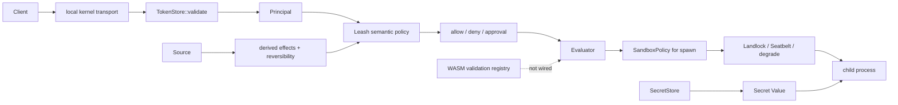
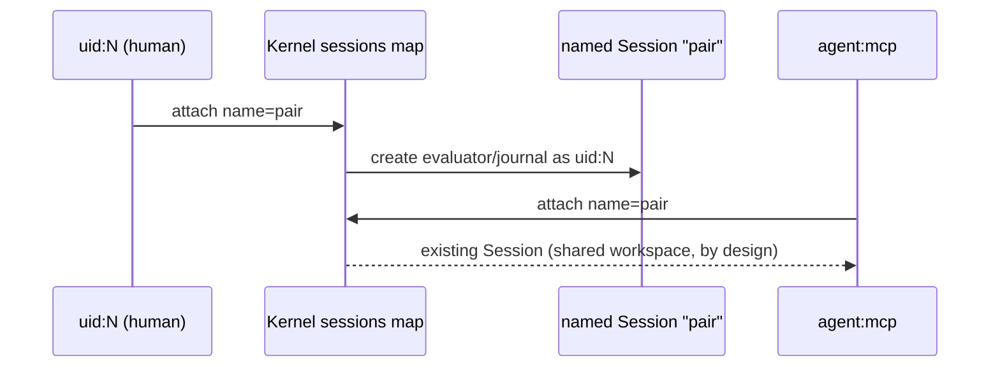
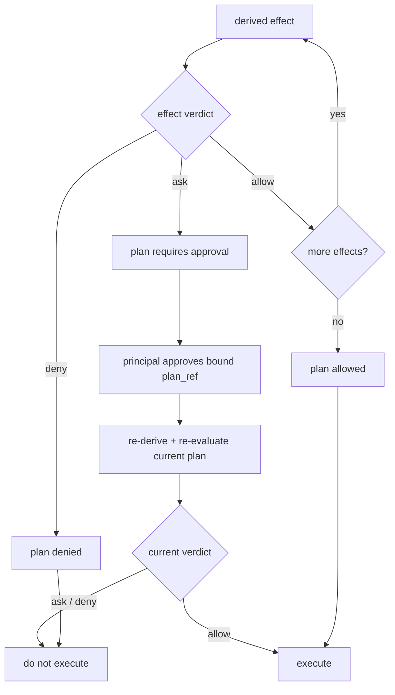
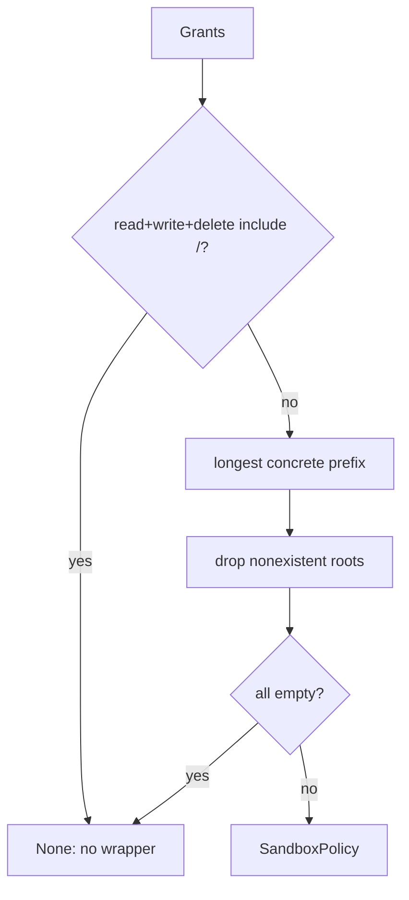
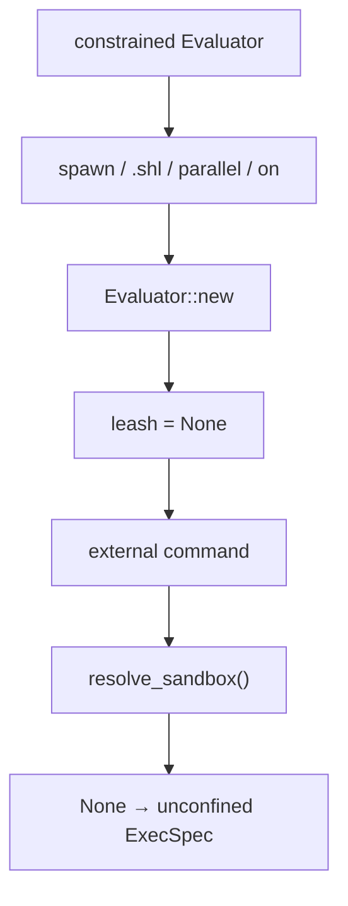
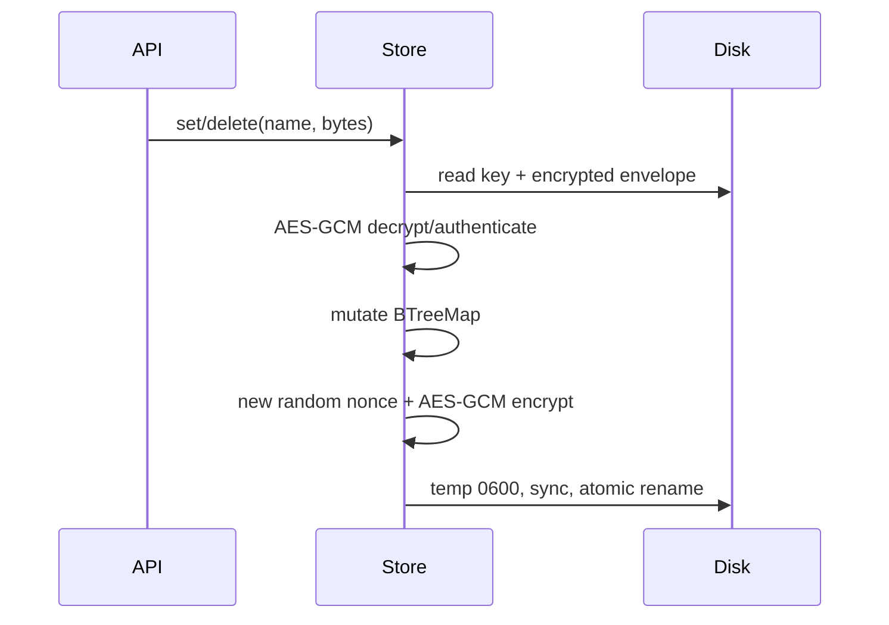

+++
title = "Authority, authentication, secrets, and sandbox threat model"
description = "Trust boundaries from bearer attachment through Leash plans and OS confinement, secret storage/injection, WASM validation, known bypasses, and fail-open/fail-closed choices."
weight = 53
template = "docs/page.html"

[extra]
group = "Execution & security"
eyebrow = "Security book"
status = "Source-grounded threat model"
audience = "Kernel, evaluator, policy, execution, and security reviewers"
wide = true
+++

Shoal security is a chain of distinct mechanisms, not one sandbox switch:

1. a connection may authenticate a principal with a bearer token;
2. the kernel/evaluator derives semantic effects and policy verdicts;
3. approval and auto-apply rules decide whether a plan may proceed;
4. a spawn may lower filesystem grants into an OS sandbox request;
5. `shoal-exec` reports what the platform actually enforced;
6. secret values use a separate encrypted local store and restricted language paths;
7. WASM code is currently validated only and is not a runtime plugin surface.

Each step has different coverage. Authentication does not imply authorization, a semantic policy
does not imply OS confinement, and an `enforced` filesystem flag does not imply network isolation.

Sources: [`shoal-auth`](https://github.com/alliecatowo/shoal/tree/main/crates/shoal-auth/src),
[`shoal-leash`](https://github.com/alliecatowo/shoal/tree/main/crates/shoal-leash/src),
[`shoal-secret`](https://github.com/alliecatowo/shoal/tree/main/crates/shoal-secret/src),
[`shoal-wasm`](https://github.com/alliecatowo/shoal/tree/main/crates/shoal-wasm/src), and kernel
[`session.rs`](https://github.com/alliecatowo/shoal/blob/main/crates/shoal-kernel/src/session.rs).

## Trust-boundary map



The local human path can attach without a token and derives a local principal. Durable token auth is
available only when the kernel opened a state directory; an ephemeral kernel has no `TokenStore` and
rejects bearer attachment.

## Assets and adversaries

The current design attempts to protect:

- session cwd, environment, bindings, transcript, plans, tasks, and PTYs;
- filesystem content and mutation scope;
- executable identity and command arguments;
- journal/CAS history;
- bearer secrets and token metadata;
- named secrets and their plaintext;
- network connection intent;
- host process stability and resource bounds.

Relevant adversaries include an untrusted/buggy agent with a valid scoped token, malicious Shoal
source, a compromised plugin/component file, a replaced executable between checks, same-user local
processes, malformed configuration, and accidental host integration omissions. The implementation
does **not** claim protection from a fully compromised same-user account that can read process memory
and user-owned key files.

## Bearer token storage

`TokenStore` persists one JSON document containing:

- format version;
- a random 32-byte keyed-hash key, base64 encoded;
- token metadata;
- a keyed BLAKE3 digest of each bearer.

The plaintext bearer is returned exactly once by `create` and is not persisted. It is 32 random
bytes encoded URL-safe without padding. Token id is the first eight digest bytes rendered in hex.

| Metadata field | Meaning |
|---|---|
| `id` | short management/revocation identifier |
| `principal` | policy identity attached to connection |
| `profile` | descriptive capability profile |
| `caps` | advertised token capability strings |
| `created_ns` | creation time |
| `expires_ns` | optional absolute expiry |
| `revoked_ns` | optional revocation time |


`validate` performs constant-time byte equality after decoding each stored digest, then checks
revocation and strict `expires_ns > now`. It returns cloned metadata, not a mutable token object.

The persistent kernel opens `TokenStore` once during `Kernel::open`/`open_with_policy` and retains
that in-memory key/token vector behind a mutex. The separate `shoal-token` process opens and rewrites
`tokens.json`, but the running kernel has no reload, file watch, generation check, or management RPC.
Therefore:

- a token created by `shoal-token` after kernel startup is rejected until that kernel restarts;
- a token revoked by `shoal-token` after kernel startup remains accepted by that kernel until restart
  (unless its already-loaded expiry passes, which `validate` checks against current time);
- listing in the CLI describes disk state, not necessarily the serving kernel's authentication state;
- multiple management processes can load the same snapshot and atomically replace one another's
  updates because the store has no interprocess lock or compare-and-swap generation.

This is a revocation-latency security boundary, not merely an administrative UX issue. Until live
reload or a kernel-owned management path exists, token create/revoke instructions must explicitly
require kernel restart and operational tooling must verify the serving generation.

Persist uses create-new temporary file mode 0600, writes and `sync_all`s, then renames. Opening an
existing store actively sets its file permissions to 0600 before reading rather than rejecting a
looser mode. The containing directory is created but this crate does not itself set an explicit 0700
directory mode.

The keyed hash key lives in the same file as digests. That is adequate to avoid plaintext token
persistence and make random-token offline guessing infeasible; it is not an HSM/OS-keychain
separation. A process that can modify this file can change principals/cap strings and hash key.

## Token capabilities versus policy authority

At `session.attach`, the kernel reports token `caps` and `profile`, but policy evaluation uses the
token's `principal`. The cap strings are metadata in the shown attach path, not an independent
enforced intersection with Leash grants. Security review must follow principal policy, handler
checks, and resource ownership—not assume the returned token-cap array is a capability engine.

No-token attach is split by declared client kind (HR-D6): a `client.kind:"mcp"` attach lands on the
restricted **`agent:mcp`** principal with the `"agent"` profile; any other kind uses the local
`uid:N` principal and `local-human` profile. The kernel's built-in default policy defines
`agent:mcp` with execution availability intact but without env value reads, env writes, or secret
use — so a zero-config MCP agent works, is journaled under its own identity, and (under the
approval separation default) cannot approve its own plans. The legacy permissive mapping for
MCP-kind clients is an explicit opt-in: a non-empty `SHOAL_MCP_PERMISSIVE` on the kernel process,
or `Kernel::set_mcp_permissive`. A bearer token is the per-principal alternative. The kind string
is a client declaration inside the same-UID socket boundary — a default-authority posture, not a
defense against a malicious same-UID process. A durable kernel validates a provided bearer with
`TokenStore::validate`; invalid, expired, or revoked tokens share an auth-failed response.

`PROFILE` and repeated `--cap` values accepted by `shoal-token create` are not authorization rules.
They are copied into `AttachResult.caps.profile`/`token_caps` for client metadata. No handler
intersects them with Leash, and no resource check consumes them; the token's `principal` is the value
used to look up policy. Creating a token with `--cap fs.read` grants nothing unless that principal's
Leash policy and handler ownership rules already allow the operation.

## Named sessions: the shared pair-shell model (HR-D7)

Kernel sessions are cached by user-supplied session name and are **intentionally shared across
principals** — the pair-shell model documented in
[kernel-protocol](@/internals/kernel-protocol.md#session-identity-and-the-pair-shell-model).
`Kernel::session(name, principal)` consults `principal` only on first creation; later attachments to
the same name receive the existing `Arc<Session>` and full shared control of its transcript, tasks,
and PTYs.



The security consequences are explicit, not accidental:

- authority stays per-actor — each exec installs the current attachment principal's Leash policy,
  and approval requires a distinct approver by default (HR-D3);
- attribution follows the actor on coarse journal rows and journal/approval events; the evaluator's
  finer statement-level rows keep the session creator's identity (a documented seam — read actor
  attribution from the coarse rows);
- a token scopes authority, **not** object visibility inside a session it joins. The isolation
  boundary is the session name: give untrusted or differently-trusted agents their own session
  names, and never reuse a name across trust boundaries. Cross-session lookups remain opaque
  not-founds.

## Semantic effect algebra

`Effect` is a tagged, serializable enumeration:

| Effect | Payload |
|---|---|
| `FsRead`, `FsWrite`, `FsDelete` | concrete path list |
| `ProcSpawn` | binary hash and argv0 |
| `NetConnect` | host and port |
| `NetListen` | port |
| `EnvRead`, `EnvWrite` | name list |
| `SecretUse` | secret name list |
| `SessionWrite` | none |
| `JournalRead` | none |
| `Time` | none |
| `Opaque` | unknown/unclassified behavior |

A `Plan` combines ordered effects, reversibility (`Reversible`, `Irreversible`, or `Unknown`), and
optional byte/item estimates. Its reference is `plan:` plus the first 16 hex characters of a BLAKE3
hash over canonical JSON of those three inputs.

The shortened plan ref is a convenient content address, not a cryptographic authorization token.
Approval storage must scope it to source/session/principal and preserve the full plan.

## Principal policy schema

One `PrincipalPolicy` holds:

| Grant/control | Type |
|---|---|
| `fs.read`, `fs.write`, `fs.delete` | path-glob lists |
| `net_connect`/`net` | host[:port] grant list |
| `net_listen` | port list |
| `proc_spawn`/`spawn` | executable name/hash list |
| `env_read`, `env_write` | name or `*` list |
| `secret_use`/`secrets` | name or `*` list |
| `session_write`, `journal_read`, `time` | booleans |
| `auto_apply` | `never`, `in-grant`, or `reversible` |
| `opaque` | `deny`, `ask`, or `allow` |
| `hermetic` | require requested OS enforcement or refuse spawn |

The TOML loader flattens dotted/nested `fs`, `env`, `secret`, and `proc` namespaces into serde field
names before deserializing. Unknown fields are not globally described as denied by serde here; policy
schema tests should pin typo behavior.

An unknown principal returns `Deny` for semantic effect and plan evaluation.

## Effect verdict rules



Filesystem paths are lexically normalized before glob matching; `..` pops a component. Leading `~/`
uses `HOME`. Pattern compilation failure denies. The check does not canonicalize the effect path, so
symlink resolution and lexical grant semantics must not be conflated.

Name grants require every requested name to equal a grant or `*`. Spawn grants match exact hash,
full argv0, or argv0 basename. Network grants match host/port according to `host_grant`, including
configured wildcard hosts.

### Spawn pinning special case

An empty `proc_spawn` list would make direct `evaluate_effect(ProcSpawn)` deny every spawn. To keep
default-permissive behavior, the spawn gate first calls `spawn_pinning_active`; it only hashes and
evaluates ProcSpawn when the principal declared a nonempty allowlist. Therefore “no spawn grants” at
the execution gate means no pinning, not deny-all. This exception must remain explicit.

## Plan verdict and approval

Denial dominates approval, and approval dominates allow. If every effect is allowed, `auto_apply`
then decides:

| `auto_apply` | Result after all effects allow |
|---|---|
| `never` | approval required |
| `in-grant` | allow |
| `reversible` + reversible plan | allow |
| `reversible` + irreversible/unknown plan | approval required |


Policy evaluation is only as complete as plan derivation. An effect omitted or classified too
narrowly cannot be recovered by the verdict engine. Opaque behavior should remain opaque rather than
inventing a false concrete effect.

### Kernel approval boundary (HR-D1/D2/D3)

The verdict engine above is sound only when the actor changing approval state is authenticated and
authorized. `cap.request` now enforces that:

- **Attachment required (HR-D1).** An unattached caller is rejected with `NOT_ATTACHED` before any
  approval logic runs; the attachment principal is the **approver**. The Unix socket's `0600` mode
  restricts access to the OS user; the attachment gate preserves the token-principal boundary.
- **Separation of duties (HR-D3).** The approver must differ from the plan's requester (owner). A
  requester approving its own plan is `LEASH_DENIED` ("self-approval is not permitted") **by
  default**. Self-acknowledgement is an explicit opt-in (`SHOAL_ALLOW_SELF_ACK`, or
  `Kernel::set_allow_self_ack`) for single-operator deployments that knowingly accept it. This is the
  chosen model: *default separation, opt-in self-ack.* Approval still never overrides a hard `Deny`
  from the plan owner's policy — it only lifts an approval-*required* verdict.
- **Auditable binding (HR-D2).** On approval the kernel writes an `ApprovalRecord` onto the plan
  binding requester, approver, plan ref/hash, granted scope, timestamp, and — once the approved plan
  runs — the journal entry id of the consuming execution. The record is mirrored into the journal as
  a `# approval …` audit row (queryable via `journal.query`) and surfaced on `plan.get.approval`.

Residual hardening (tracked in the roadmap, not yet done): the plan key is still a 16-hex-character
prefix of a hash over effects/reversibility/estimates, excluding source/session/principal, so
equal-shape plans overwrite one another in the global map. `plan.apply` and approved `exec` verify the
currently stored source/session/principal, which limits direct reuse; unique owner-bound plan object
identity is the remaining step.

`journal.query` had the same missing-attachment shape; **HR-D4 closed it**: the handler now rejects
an unattached caller with `NOT_ATTACHED` before reading any row, and its `limit` is bounded (omitted →
default page, explicit `0` → zero rows, any value clamped to a server maximum — HR-D5). Within a
shared pair-shell session the journal is intentionally readable by every attached principal; the
isolation boundary is the session name, not per-row principal scoping.

## Policy loading defaults

The user policy path is `$XDG_CONFIG_HOME/shoal/leash.toml` or
`~/.config/shoal/leash.toml`. `load_user_or_permissive` returns an all-access policy for the requested
principal when the file is missing **or malformed**. This prevents a broken local config from
bricking a human shell, but it is a fail-open choice.

Kernel startup with an explicit policy can use the fallible loader. Agent-facing hosts should not
silently reuse the local-human convenience loader unless fail-open authority is intentional and
observable.

The built-in zero-config kernel policy defines two principals (HR-D6): the same-UID human keeps the
fully permissive grants (root read/write/delete, wildcard env, session/journal/time, opaque allow,
in-grant auto-apply), and the restricted `agent:mcp` principal keeps execution availability (opaque
allow, unrestricted filesystem, in-grant auto-apply, session/journal/time) while dropping env value
reads, env writes, and secret use. Neither enables spawn pinning. An explicit `--policy` file
replaces this built-in entirely; a file that does not define `agent:mcp` leaves zero-config agents
at the unknown-principal deny default.

## Lowering glob policy to OS roots

`PrincipalPolicy::to_sandbox_policy` does not transfer arbitrary glob semantics to the OS. It reduces
each filesystem grant to its longest concrete leading path:

```text
/work/generated/**  → /work/generated
~/src/**             → $HOME/src
**/private           → no concrete root
```

It lexically removes `.`/`..`, drops roots that do not currently exist, sorts/deduplicates, and
returns no sandbox when all dimensions are empty. A root-wide grant in every fs dimension is also
considered unrestricted and returns no sandbox.



Dropping a nonexistent write target is fail-closed at the sandbox grant level, but returning `None`
when **all** roots disappear means the exec layer receives no confinement. The semantic plan layer
is expected to deny unauthorized work. This layering must be preserved end-to-end.

Network policy from `to_sandbox_policy` is currently `Unrestricted` because there is no enforcing
backend; network intent remains a semantic plan verdict.

## Enforcement tiers and honesty

`EnforcementStatus` separates availability from activation:

| Field | Question answered |
|---|---|
| `available_tier` | strongest plausible platform backend |
| `active_tier` | backend actually activated for this child |
| `enforced` | any concrete sandbox active |
| `filesystem_enforced` | filesystem grants active |
| `spawn_exec_enforced` | executable pin checked/enforced for this spawn |
| `network_enforced` | network restriction active |
| `landlock_abi` | detected Linux ABI when any |
| `detail` | human-readable caveats |

Tier detection alone returns `enforced = false`; availability is not activation.

Linux uses Landlock with hard-requirement compatibility. macOS generates and activates a deny-by-
default Seatbelt profile. Other platforms report advisory/degraded status. The exec wrapper performs
enforcement in a child helper, never by irreversibly restricting the parent shell.

## Linux Landlock mapping

Landlock handles all filesystem access kinds for the detected/supported ABI. Read roots receive read
access; write roots receive the implementation's full filesystem access set; delete roots receive
remove-file/remove-dir. Full enforcement is checked after `restrict_self`; partial status is an error.

Landlock does not provide the current network enforcement. A `net.deny` request appends an honest
caveat. With `hermetic = true`, an unenforced requested network denial makes spawn fail closed.

## macOS Seatbelt mapping

The generated profile begins with deny-default, allows process operations and signals to self, then
adds canonical subpath rules:

- read grants allow `file-read*`;
- write grants allow read and write;
- delete grants allow metadata read and unlink.

Every grant must canonicalize and be UTF-8 encodable without control characters. Backslashes and
quotes are escaped. These restrictions can reject policy paths that semantic glob matching accepted.

Seatbelt is reported as tier C filesystem enforcement; network remains unenforced.

## Executable pinning and TOCTOU

`preflight_spawn` reads and BLAKE3-hashes the binary, then matches hash or filename against an
allowlist. The actual exec happens later. A privileged/competing process can replace the path between
verification and exec. `EnforcementStatus.detail` explicitly acknowledges this; no BPF-LSM or
file-descriptor exec pin closes the race.

Hash identity still provides valuable drift detection and normal replacement refusal. It is not an
atomic proof of the executed inode.

## Critical transitive-authority gap

The evaluator installs Leash as optional `(Policy, principal)` state. `resolve_sandbox` is consulted
for an external spawn. Fresh evaluators created by `spawn_block`, `.shl` `run_script_file`,
`builtin_parallel`, and `builtin_on` do **not** inherit that field.



This is a policy escape: source running under a constrained parent can move external work into a
fresh evaluator and lose OS sandbox state. The same sites omit Reef scope/resolver data, and some
omit ConfigPort. Fixing it requires a single capability-complete child constructor plus tests that
assert policy principal and resolved sandbox at every child path.

## In-process effects are not OS-sandboxed

Landlock/Seatbelt wraps external children. Builtins, value `.save`, module discovery, watch setup,
journal access, network namespace methods, and other evaluator work occur in the parent process.
They must be gated by semantic policy and routed through enforceable ports.

Current filesystem port coverage is incomplete on the **read** side: several
`Path::exists/is_dir/canonicalize` observations still bypass injected `Fs`. Every language-visible
**write** now crosses the port — value `.save`/`.append` and stream `.save` route through
`CallCtx::fs()` (HR-C1/HR-C2), so a fake can observe or deny them (inventory in the HR-C3 ledger in
[effects, plans, ports, and authority](@/internals/effects-plans-security.md)), and the evaluator's
`CallCtx::fs()` override returns its injected `Arc<dyn Fs>`, so those writes hit the session's
actual (sandboxed) port rather than the `StdFs` default — a denying injected adapter blocks
`"x".save(...)` end to end. A child sandbox still cannot protect the parent from its own
builtin/method effects outside the ported routes, and read-side probes remain unported, so any
claim that Leash confines **all** language I/O is still too strong today.

## Secret store design

`SecretStore` keeps:

```text
<dir>/master.key
<dir>/secrets.json
```

On Unix, opening sets directory mode 0700; key/data files are written 0600 and reads reject files
with group/other permission bits. The key is 32 random bytes. The entire sorted map of secret names
to byte values is JSON-serialized, encrypted with AES-256-GCM under a fresh 12-byte random nonce, and
stored in a versioned base64 envelope.



Names must be nonempty ASCII alphanumeric, underscore, or hyphen. `get` returns `Zeroizing<Vec<u8>>`.
Plain serialization and decrypted bytes use zeroizing wrappers in key paths, though intermediate map
values and caller copies can still live in memory.

AES-GCM detects envelope modification. The master key sits beside ciphertext under the same user
permission boundary, so disk theft of both files yields decryption capability. This protects
accidental plaintext disclosure and at-rest separation from the JSON data file; it does not protect
against the same compromised user/process.

## Secret language boundary

`secret.get(name)` routes through the evaluator `SecretPort`, decodes the bytes as UTF-8, and returns
`Value::Secret { name, value }`. Secret values:

- render only as `secret(name)`;
- JSON-project to the same redacted descriptor;
- cannot be string-interpolated;
- cannot be fed as stdin data;
- are intended for spawn-time injection.

Internal equality compares name and secret content, and the value necessarily resides in process
memory. Debugging, error construction, method additions, wire projection, and journal serialization
must remain audited for accidental plaintext copies. Redacted rendering is not memory secrecy.

Secret policy has a `SecretUse` effect and per-name grants, but all host paths must actually derive
and evaluate that effect. Port injection alone is not authorization.

## WASM validation boundary

`shoal-wasm` loads strict TOML manifests with name, version, component path, declared commands,
methods, and effect strings. Relative component paths resolve beside the manifest. Registry loading
sorts manifest paths and rejects duplicate plugin names deterministically.

The host enables Wasmtime's component model and fuel consumption, then validates by:

1. compiling the component (not a core module);
2. enumerating imports and rejecting **any** import;
3. installing store limits;
4. setting fuel;
5. instantiating with an empty component linker.

Default limits are:

| Resource | Default |
|---|---:|
| fuel | 10,000,000 |
| linear memory | 64 MiB |
| table elements | 10,000 |
| instances | 16 |

There is **no wall-clock timeout** in `Limits`. A component constrained by fuel may still need an
epoch/deadline design for host-level latency guarantees.

Most importantly, validation produces/stores only a `Manifest`. There is no evaluator command or
method invocation path, no host ABI, no value codec, no effect authorization bridge, and no plugin
call lifecycle. It is a prepared validation registry, not a supported plugin sandbox.

Declaring effect strings in the manifest does not enforce them. A future runtime must parse them into
the canonical effect algebra, reject unknown claims, expose only capability-scoped imports, and bind
limits/authorization to each invocation.

## Fail-open/fail-closed ledger

| Decision | Current behavior |
|---|---|
| missing/malformed local user Leash file | fail open to permissive |
| unknown principal in direct policy evaluation | deny |
| no proc-spawn allowlist at spawn gate | no pinning; allow ordinary spawn path |
| nonhermetic sandbox unavailable | run with honest degraded status |
| hermetic requested dimension unavailable | fail closed before spawn |
| unattached `cap.request` / `journal.query` | reject with `NOT_ATTACHED` (HR-D1/D4) |
| no-token MCP-kind attach | restricted `agent:mcp` principal; permissive is explicit opt-in (HR-D6) |
| requester approving its own plan | reject `LEASH_DENIED` unless self-ack explicitly enabled (HR-D3) |
| `journal.query` `limit` omitted vs. `0` | omitted → default page; explicit `0` → zero rows; clamped to server max (HR-D5) |
| malformed/unknown bearer | reject attach |
| ephemeral kernel bearer | reject as unavailable |
| expired bearer or bearer marked revoked in the kernel's loaded snapshot | reject |
| bearer revoked only by an external CLI after kernel startup | currently accepted until restart |
| unreadable/corrupt secret envelope | error |
| nonexistent sandbox grant roots | drop roots; possibly no OS sandbox, rely on semantic gate |
| WASM imports | reject component validation |
| unknown WASM manifest field | reject via `deny_unknown_fields` |

Security review should make every new choice explicit in this table's style. Accidental fallback is
the most common source of authority widening.

## Audit checklist

For a new externally reachable effect:

1. identify the authenticated principal at the exact handler/evaluator call site;
2. derive a concrete canonical `Effect`, or `Opaque` when unknowable;
3. include it in plan identity, reversibility, and estimates;
4. evaluate the correct principal policy and approval state;
5. decide whether parent-process execution needs a port/policy gate;
6. if spawning, lower grants and verify actual `EnforcementStatus`;
7. propagate policy/principal into every child evaluator/task;
8. scope resource ownership to session and principal;
9. redact secrets from values, errors, logs, journals, events, and wire responses;
10. test malformed configuration, unavailable backend, symlink/`..`, binary replacement, token
    expiry/revocation, session-name collision, and child-feature bypasses;
11. document what is advisory, semantic-only, filesystem-only, or truly OS-enforced;
12. never describe validated-but-unwired WASM as an executable plugin system.

## Priority debt

1. **Unique owner-bound plan identity.** `cap.request` and `journal.query` now require attachment
   (HR-D1/D4), approval binds a distinct approver and an auditable record (HR-D2/D3), and journal
   limits are bounded (HR-D5). The remaining step is replacing colliding 16-hex plan refs with a
   unique owner-bound object identity so equal-shape plans cannot overwrite one another.
2. **Close child evaluator Leash inheritance escape.** This is a direct transitive-policy failure.
3. **Statement-level attribution in shared sessions.** The pair-shell shared-session model is now
   documented as intentional (HR-D7); the remaining seam is that evaluator statement-level journal
   rows keep the session creator's identity rather than the current actor's.
4. **Make token revocation live and generation-safe.** A running kernel currently retains its startup
   snapshot while external management rewrites disk.
5. **Complete parent-process port/policy coverage.** Direct filesystem/network effects bypass child
   sandbox enforcement.
6. **Unify token caps and policy semantics or clearly keep caps informational.** Parallel authority
   vocabularies invite false assumptions.
7. **Add real network enforcement or keep hermetic network requests failing.** Never report advisory
   denial as enforced.
8. **Design atomic executable identity if strong pinning is required.** Current hash-before-exec is
   TOCTOU-prone.
9. **Define a capability ABI before WASM invocation.** Validation alone is not authority isolation.
