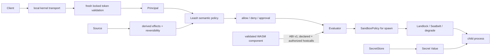
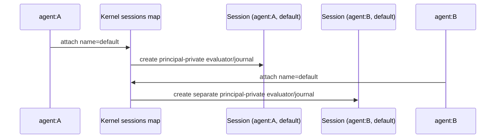
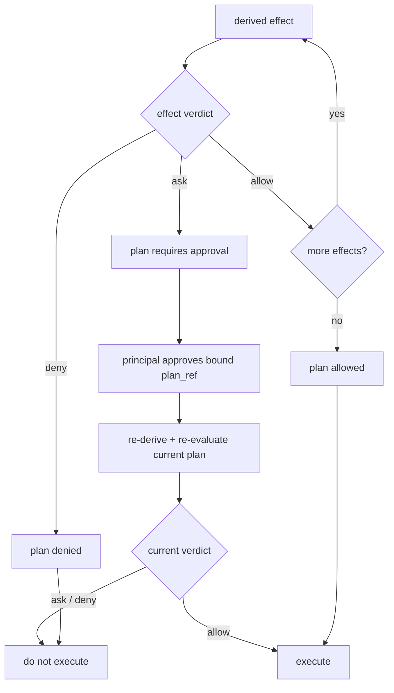
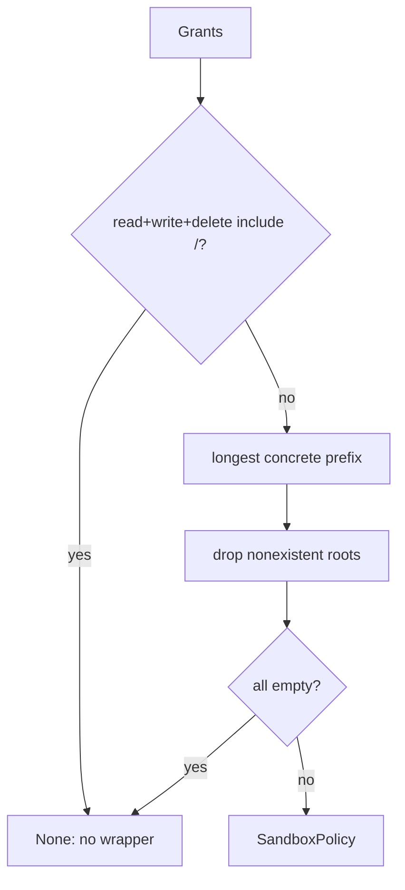
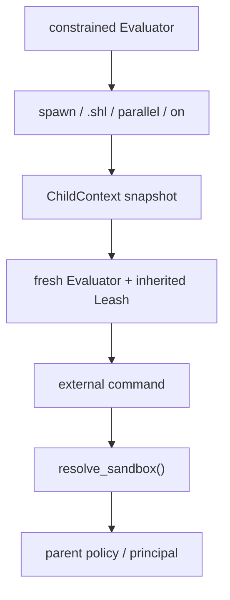
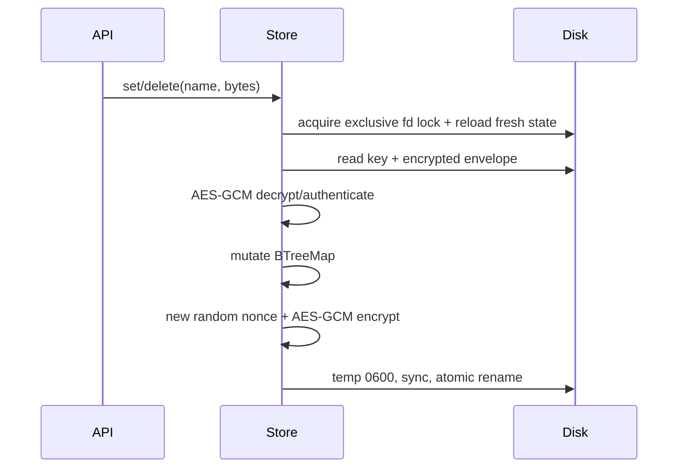

+++
title = "Authority, authentication, secrets, and sandbox threat model"
description = "Trust boundaries from bearer attachment through Leash plans and OS confinement, secret storage/injection, WASM execution, known bypasses, and fail-open/fail-closed choices."
weight = 53
template = "docs/page.html"

[extra]
group = "Execution & security"
eyebrow = "Security book"
status = "Source-grounded threat model"
audience = "Kernel, evaluator, policy, execution, and security reviewers"
wide = true
+++

Shoal security is a chain of distinct mechanisms, not one sandbox switch:

1. a connection may authenticate a principal with a bearer token;
2. the kernel/evaluator derives semantic effects and policy verdicts;
3. approval and auto-apply rules decide whether a plan may proceed;
4. a spawn may lower filesystem grants into an OS sandbox request;
5. `shoal-exec` reports what the platform actually enforced;
6. secret values use a separate encrypted local store and restricted language paths;
7. validated WASM components execute through a bounded preview ABI with declared and authorized
   hostcalls.

Each step has different coverage. Authentication does not imply authorization, a semantic policy
does not imply OS confinement, and an `enforced` filesystem flag does not imply network isolation.

Sources: [`shoal-auth`](https://github.com/alliecatowo/shoal/tree/main/crates/shoal-auth/src),
[`shoal-leash`](https://github.com/alliecatowo/shoal/tree/main/crates/shoal-leash/src),
[`shoal-secret`](https://github.com/alliecatowo/shoal/tree/main/crates/shoal-secret/src),
[`shoal-wasm`](https://github.com/alliecatowo/shoal/tree/main/crates/shoal-wasm/src), and kernel
[`session.rs`](https://github.com/alliecatowo/shoal/blob/main/crates/shoal-kernel/src/session.rs).

## Trust-boundary map



The public socket is machine-only: tokenless clients receive the restricted `agent:mcp` identity and
client-asserted `local-human` is rejected. Human trust exists only on the server-selected anonymous
descriptor inherited by the private REPL. Durable token auth is available only when the kernel
opened a state directory; an ephemeral kernel has no `TokenStore` and rejects bearer attachment.

## Assets and adversaries

The current design attempts to protect:

- session cwd, environment, bindings, transcript, plans, tasks, and PTYs;
- filesystem content and mutation scope;
- executable identity and command arguments;
- journal/CAS history;
- bearer secrets and token metadata;
- named secrets and their plaintext;
- network connection intent;
- host process stability and resource bounds.

Relevant adversaries include an untrusted/buggy agent with a valid scoped token, malicious Shoal
source, a compromised plugin/component file, a replaced executable between checks, same-user local
processes, malformed configuration, and accidental host integration omissions. The implementation
does **not** claim protection from a fully compromised same-user account that can read process memory
and user-owned key files.

## Bearer token storage

`TokenStore` persists one JSON document containing:

- format version;
- a random 32-byte keyed-hash key, base64 encoded;
- token metadata;
- a keyed BLAKE3 digest of each bearer.

The plaintext bearer is returned exactly once by `create` and is not persisted. It is 32 random
bytes encoded URL-safe without padding. Token id is the first eight digest bytes rendered in hex.

| Metadata field | Meaning |
|---|---|
| `id` | short management/revocation identifier |
| `principal` | policy identity attached to connection |
| `profile` | descriptive capability profile |
| `caps` | advertised token capability strings |
| `created_ns` | creation time |
| `expires_ns` | optional absolute expiry |
| `revoked_ns` | optional revocation time |


`validate` takes a shared advisory file lock, reloads the store from disk, performs constant-time
byte equality after decoding each stored digest, then checks revocation and strict
`expires_ns > now`. Create and revoke take the exclusive lock, reload fresh state inside that lock,
build a candidate snapshot, and atomically replace the file before publishing that candidate in
memory. This prevents two management processes from publishing updates derived from stale snapshots
and prevents a failed replace from creating process-local authority that disk readers cannot see.

The authority document has hard admission limits: 4 MiB total, 4,096 tokens, 256-byte principals,
128-byte profiles, and at most 128 capability labels of 128 bytes each per token. Reads stop at the
byte boundary before JSON deserialization; unknown fields, duplicate token identities/digests,
duplicate capability labels, noncanonical key/digest/id encodings, and any over-limit field reject
the entire snapshot as `InvalidData`. No authority record is truncated or evicted automatically,
and the rejected file is left intact for diagnosis. Create validates and canonicalizes its input
before mutation, then rejects capacity or serialized-size overflow as `InvalidInput`.

The kernel revalidates the attached bearer before every attached request. Create is therefore
visible without restart; revocation, expiry, a corrupt store, or a lock/read failure invalidates a
live attachment and fails closed. The attachment is cleared after failed revalidation, so subsequent
stateful calls must attach again. This provides serving-state behavior without a file watcher or a
separate token generation protocol.

Persist uses create-new temporary file mode 0600, writes and `sync_all`s, atomically renames, and
syncs the directory. The store directory is mode 0700 and the data and lock files are private to the
user boundary.

The keyed hash key lives in the same file as digests. That is adequate to avoid plaintext token
persistence and make random-token offline guessing infeasible; it is not an HSM/OS-keychain
separation. A process that can modify this file can change principals/cap strings and hash key.

## Token capabilities versus policy authority

At `session.attach`, the kernel reports token `caps` and `profile`, but Leash policy evaluation uses
the token's `principal`; labels do not independently intersect filesystem/process policy. Two exact
machine-administration labels are consumed by handlers: `plan.approve` authorizes approval of another
principal's plan, and `token.admin` authorizes live durable-token management. The legacy `supervisor`
profile also authorizes plan approval/shutdown but deliberately does not authorize token minting.

No-token attach on a public socket uses restricted `agent:mcp`; public clients cannot assert
`local-human`. Only the private REPL's inherited anonymous descriptor supplies the server-selected
local-human identity. A durable kernel validates a provided bearer with `TokenStore::validate`;
invalid, expired, or revoked tokens share an auth-failed response.

`PROFILE` and repeated `--cap` values accepted by `shoal-token create` do not alter Leash rules. They
are copied into `AttachResult.caps.profile`/`token_caps`; only the exact administrative exceptions
above are handler-consumed. Creating a token with `--cap fs.read` grants nothing unless that
principal's Leash policy and handler ownership rules already allow the operation.

## Named session isolation

The session registry is keyed by `(principal, visible Session name)`, not the user-supplied name
alone. Equal names under different authenticated principals produce different evaluator, transcript,
journal, plan, task, PTY, and quota ownership domains.



Exact owner keys also scope retained refs and journal access. This closes name-collision leakage; it
does not make one process a hostile multi-tenant boundary because principals still share global
memory, CPU, file roots, and kernel-wide quotas.

## Semantic effect algebra

`Effect` is a tagged, serializable enumeration:

| Effect | Payload |
|---|---|
| `FsRead`, `FsWrite`, `FsDelete` | concrete path list |
| `ProcSpawn` | binary hash and argv0 |
| `NetConnect` | host and port |
| `NetListen` | port |
| `EnvRead`, `EnvWrite` | name list |
| `SecretUse` | secret name list |
| `SessionWrite` | none |
| `JournalRead` | none |
| `Time` | none |
| `Opaque` | unknown/unclassified behavior |

A `Plan` combines ordered effects, reversibility (`Reversible`, `Irreversible`, or `Unknown`), and
optional byte/item estimates. The Leash value's short content fingerprint covers those semantic
fields. The kernel's externally returned plan object ref is stronger: it binds source, canonical AST,
effects/estimates, Session, and principal with a full BLAKE3 digest plus a unique per-kernel suffix.
It is an ephemeral owner-scoped object id, not a transferable authorization token.

## Principal policy schema

One `PrincipalPolicy` holds:

| Grant/control | Type |
|---|---|
| `fs.read`, `fs.write`, `fs.delete` | path-glob lists |
| `net_connect`/`net` | host[:port] grant list |
| `net_listen` | port list |
| `proc_spawn`/`spawn` | executable name/hash list |
| `env_read`, `env_write` | name or `*` list |
| `secret_use`/`secrets` | name or `*` list |
| `session_write`, `journal_read`, `time` | booleans |
| `auto_apply` | `never`, `in-grant`, or `reversible` |
| `opaque` | `deny`, `ask`, or `allow` |
| `hermetic` | require requested OS enforcement or refuse spawn |

The TOML loader flattens dotted/nested `fs`, `env`, `secret`, and `proc` namespaces into serde field
names before deserializing. Unknown fields are not globally described as denied by serde here; policy
schema tests should pin typo behavior.

An unknown principal returns `Deny` for semantic effect and plan evaluation.

## Effect verdict rules



Filesystem paths are lexically normalized before glob matching; `..` pops a component. Leading `~/`
uses `HOME`. Pattern compilation failure denies. The check does not canonicalize the effect path, so
symlink resolution and lexical grant semantics must not be conflated.

Name grants require every requested name to equal a grant or `*`. Spawn grants match exact hash,
full argv0, or argv0 basename. Network grants match host/port according to `host_grant`, including
configured wildcard hosts.

### Spawn pinning special case

An empty `proc_spawn` list would make direct `evaluate_effect(ProcSpawn)` deny every spawn. To keep
default-permissive behavior, the spawn gate first calls `spawn_pinning_active`; it only hashes and
evaluates ProcSpawn when the principal declared a nonempty allowlist. Therefore “no spawn grants” at
the execution gate means no pinning, not deny-all. This exception must remain explicit.

## Plan verdict and approval

Denial dominates approval, and approval dominates allow. If every effect is allowed, `auto_apply`
then decides:

| `auto_apply` | Result after all effects allow |
|---|---|
| `never` | approval required |
| `in-grant` | allow |
| `reversible` + reversible plan | allow |
| `reversible` + irreversible/unknown plan | approval required |


Policy evaluation is only as complete as plan derivation. An effect omitted or classified too
narrowly cannot be recovered by the verdict engine. Opaque behavior should remain opaque rather than
inventing a false concrete effect.

### Kernel approval boundary (HR-D1/D2/D3)

The verdict engine above is sound only when the actor changing approval state is authenticated and
authorized. `cap.request` now enforces that:

- **Attachment required (HR-D1).** An unattached caller is rejected with `NOT_ATTACHED` before any
  approval logic runs; the attachment principal is the **approver**. The Unix socket's `0600` mode
  restricts access to the OS user; the attachment gate preserves the token-principal boundary.
- **Separation and authority (HR-D3).** The approver must be a local-human attachment, use the
  `supervisor` profile, or hold the `plan.approve` capability, and must differ from the plan's
  requester (owner). A
  requester approving its own plan is `LEASH_DENIED` ("self-approval is not permitted") **by
  default**. Self-acknowledgement is an explicit opt-in (`SHOAL_ALLOW_SELF_ACK`, or
  `Kernel::set_allow_self_ack`) for single-operator deployments that knowingly accept it; the
  environment variable accepts only explicit true spellings (`1`, `true`, `yes`, `on`). Approval
  still never overrides a hard `Deny` from the plan owner's policy — it only lifts an
  approval-*required* verdict.
- **Auditable binding (HR-D2).** On approval the kernel writes an `ApprovalRecord` onto the plan
  binding requester, authorized approver, full plan/source hashes, session, granted scope,
  timestamp, and — once the approved plan runs — the journal entry id of the consuming execution.
  It is surfaced on `plan.get.approval`. Approval first reserves the transition, then writes the
  durable audit record; an append error or unwind restores the reservation instead of publishing a
  grant. The grant is consumed atomically by exactly one execution, whose journal id is bound back to
  the approval record.

Plan identity is a full BLAKE3 binding over source, canonical AST, effects/estimates, session, and
requester plus a unique per-kernel object id. Identical plans stored twice remain distinct objects;
approval and execution revalidate the immutable binding. Grants are one-shot, not reusable
authorization handles.

`journal.query` had the same missing-attachment shape; **HR-D4 closed it**: the handler now rejects
an unattached caller with `NOT_ATTACHED` before reading any row, and its `limit` is bounded (omitted →
default page, explicit `0` → zero rows, any value clamped to a server maximum — HR-D5). The handler
forces the attachment's exact `(principal, Session)` owner; a caller cannot widen the query to
another principal with filters or a colliding visible Session name.

## Policy loading defaults

The user policy path is `$XDG_CONFIG_HOME/shoal/leash.toml` or
`~/.config/shoal/leash.toml`. `load_user_or_permissive` returns an all-access policy for the requested
principal when the file is missing **or malformed**. This prevents a broken local config from
bricking a human shell, but it is a fail-open choice.

Kernel startup with an explicit policy can use the fallible loader. Agent-facing hosts should not
silently reuse the local-human convenience loader unless fail-open authority is intentional and
observable.

The built-in permissive policy grants root read/write/delete, wildcard env, session/journal/time,
opaque allow, and in-grant auto-apply. It does not enable spawn pinning.

## Lowering glob policy to OS roots

`PrincipalPolicy::to_sandbox_policy` does not transfer arbitrary glob semantics to the OS. It reduces
each filesystem grant to its longest concrete leading path:

```text
/work/generated/**  → /work/generated
~/src/**             → $HOME/src
**/private           → no concrete root
```

It lexically removes `.`/`..`, drops roots that do not currently exist, sorts/deduplicates, and
returns no sandbox when all dimensions are empty. A root-wide grant in every fs dimension is also
considered unrestricted and returns no sandbox.



Dropping an individual nonexistent target remains safe. If **all** roots disappear, a nonhermetic
scope retains the best-effort behavior and reaches no OS wrapper; a hermetic scope is instead carried
to the exec boundary as an unresolved request and refused before the target spawns. The semantic plan
layer remains authoritative for modeled effects in both cases.

A hermetic scoped principal with no network grants lowers to coarse `Deny`. Linux Landlock ABI 4+
denies TCP bind/connect and macOS Seatbelt retains deny-by-default networking. Declared host/port
allowlists cannot be expressed by either backend and remain semantic plan verdicts; hermetic opaque
spawns with such an allowlist are refused.

## Enforcement tiers and honesty

`EnforcementStatus` separates availability from activation:

| Field | Question answered |
|---|---|
| `available_tier` | strongest plausible platform backend |
| `active_tier` | backend actually activated for this child |
| `enforced` | any concrete sandbox active |
| `filesystem_enforced` | filesystem grants active |
| `spawn_exec_enforced` | executable pin checked/enforced for this spawn |
| `network_enforced` | network restriction active |
| `landlock_abi` | detected Linux ABI when any |
| `detail` | human-readable caveats |

Tier detection alone returns `enforced = false`; availability is not activation.

Linux uses Landlock with hard-requirement compatibility. macOS generates and activates a deny-by-
default Seatbelt profile. Other platforms report advisory/degraded status. The exec wrapper performs
enforcement in a child helper, never by irreversibly restricting the parent shell.

## Linux Landlock mapping

Landlock handles all filesystem access kinds for the detected/supported ABI. Read roots receive read
access; write roots receive the implementation's full filesystem access set; delete roots receive
remove-file/remove-dir. Full enforcement is checked after `restrict_self`; partial status is an error.

Landlock ABI 4+ handles TCP bind/connect access. A coarse `net.deny` ruleset handles those rights and
adds no allow rules, so new TCP listeners and connections fail. Older ABIs report the request as
unenforced, and hermetic execution fails closed. Hostname/port allowlists remain inexpressible: a
configured principal allowlist refuses opaque external spawning in hermetic mode; nonhermetic mode
remains policy-only and the kernel preview reports that limitation.

## macOS Seatbelt mapping

The generated profile begins with deny-default, allows process operations and signals to self, then
explicitly grants networking only for `Unrestricted` and adds canonical subpath rules:

- read grants allow `file-read*`;
- write grants allow read and write;
- delete grants allow metadata read and unlink.

Every grant must canonicalize and be UTF-8 encodable without control characters. Backslashes and
quotes are escaped. These restrictions can reject policy paths that semantic glob matching accepted.

Seatbelt is reported as tier C filesystem enforcement and reports coarse network denial when that
deny-by-default profile was requested.

## Executable pinning and TOCTOU

`preflight_spawn` reads and BLAKE3-hashes the binary, then matches hash or filename against an
allowlist. The actual exec happens later. A privileged/competing process can replace the path between
verification and exec. `EnforcementStatus.detail` explicitly acknowledges this; no BPF-LSM or
file-descriptor exec pin closes the race. Therefore a principal combining `hermetic = true` with a
spawn allowlist refuses external spawning; treating preflight as an atomic hermetic guarantee would
be false.

Hash identity still provides valuable drift detection and normal replacement refusal. It is not an
atomic proof of the executed inode.

## Child authority propagation

The evaluator installs Leash as optional `(Policy, principal)` state. `resolve_sandbox` is consulted
for an external spawn. Fresh evaluators created by `spawn_block`, `.shl` `run_script_file`,
`builtin_parallel`, and `builtin_on` now build through one `ChildContext` and inherit that policy,
the effect ports, config, Reef state, event bus, and session attribution.



The constructor removes the route-by-route partial-copy escape. It is not magically exhaustive for
future evaluator fields: its destructuring forces every field already captured in `ChildContext` to
be applied, but contributors must still decide whether each newly added `Evaluator` field belongs in
that separate snapshot. The owned journal handle is deliberately not inherited; the parent journals
the outer concurrent/script invocation, while session/principal attribution is copied.

## In-process effects are not OS-sandboxed

Landlock/Seatbelt wraps external children. Builtins, value `.save`, module discovery, watch setup,
journal access, network namespace methods, and other evaluator work occur in the parent process.
They must be gated by semantic policy and routed through enforceable ports.

Language-visible reads, path probes/canonicalization, and writes cross injected `Fs`; watcher
registration crosses the narrower injected `WatchPort`. Value `.save`/`.append` and stream `.save`
route through `CallCtx::fs()` (HR-C1/HR-C2), so an injected fake can observe or deny them (inventory
in the HR-C3 ledger in
[effects, plans, ports, and authority](@/internals/effects-plans-security.md)). The evaluator returns
its configured host capabilities and tests prove denial end to end, but production hosts currently
configure no policy-aware filesystem/watch adapter: defaults remain `StdFs` and `StdWatchPort`, with
real parent-process authority. Host-owned persistence/artifact code retains narrow explicit ambient
exceptions. Landlock/Seatbelt only wraps external children. Port routing is the necessary
enforcement seam, not a claim that Leash presently confines in-process I/O.

## Secret store design

`SecretStore` keeps:

```text
<dir>/master.key
<dir>/secrets.json
<dir>/.secrets.lock
```

On Unix, opening sets directory mode 0700; key/data files are written 0600 and reads reject
non-regular files or files with group/other permission bits. The key is 32 raw random bytes, not a
password-derived key. The entire sorted map of secret names to byte values is JSON-serialized,
encrypted with AES-256-GCM under a fresh 12-byte random nonce, and stored in a versioned base64
envelope.



Names must be nonempty ASCII alphanumeric, underscore, or hyphen. `get` returns `Zeroizing<Vec<u8>>`.
Reads take a shared fd lock; mutations take an exclusive fd lock and reload inside it, preventing
lost updates between processes. Master-key buffers, plaintext serialization/decryption buffers, and
every secret map value are zeroized on drop. The final `Arc<str>` language value and copies made for
environment variables, argv, or the child process cannot receive the same Rust-level guarantee and
remain part of the process-memory threat model.

Admission is fail closed and happens before expensive transformations: 16 MiB encrypted-file wall,
10 MiB decrypted-JSON wall, 4,096 identities, 128-byte names, 256 KiB per value, and 2 MiB aggregate
secret bytes. The loader also bounds JSON shape, requires the fixed envelope schema and canonical
base64, rejects duplicate identities, and authenticates before plaintext parsing. AES-GCM has no
decompression stage: decrypted length is ciphertext length minus its fixed 16-byte tag. An invalid
snapshot is never partially accepted or rewritten; all checked operations return an error and leave
the file available for diagnosis. Input-limit failures are `InvalidInput`, persisted-integrity
failures are `InvalidData`, and errors contain no plaintext.

AES-GCM detects envelope modification. The master key sits beside ciphertext under the same user
permission boundary, so disk theft of both files yields decryption capability. This protects
accidental plaintext disclosure and at-rest separation from the JSON data file; it does not protect
against the same compromised user/process. OS keyring storage was evaluated but deferred because a
portable rollout needs explicit migration, headless-service behavior, and recovery semantics; Unix
directory ownership and permissions remain the documented security boundary.

## Secret language boundary

`secret.get(name)` routes through the evaluator `SecretPort`, decodes the bytes as UTF-8, and returns
`Value::Secret { name, value }`. Secret values:

- render only as `secret(name)`;
- JSON-project to the same redacted descriptor;
- cannot be string-interpolated;
- cannot be fed as stdin data;
- are intended for spawn-time injection.

Internal equality compares name and secret content, and the value necessarily resides in process
memory. Debugging, error construction, method additions, wire projection, and journal serialization
must remain audited for accidental plaintext copies. Redacted rendering is not memory secrecy.

Secret policy has a `SecretUse` effect and per-name grants, but all host paths must actually derive
and evaluate that effect. Port injection alone is not authorization.

## WASM runtime boundary

`shoal-wasm` loads strict TOML manifests with name, version, component path, declared commands,
methods, and effect strings. Relative component paths resolve beside the manifest. Registry loading
sorts manifest paths, rejects duplicate plugin names deterministically, parses effects into the
canonical effect algebra, and retains the validated component bytes/component so invocation does not
reread a replaced path.

`shoal-eval` includes plugin commands in canonical command resolution and invokes the retained
component through preview ABI v1. The host exposes only declared hostcalls that the current principal
policy authorizes. Current capability providers include bounded `now_ns` and scoped `read_file`;
unknown or unauthorized imports fail closed.

Default limits are:

| Resource | Default |
|---|---:|
| fuel | 10,000,000 |
| memory per instance | 64 MiB |
| memories | 1 |
| table elements | 10,000 |
| tables | 4 |
| instances | 16 |
| manifest bytes | 256 KiB |
| component bytes | 16 MiB |
| hostcall bytes | 4 MiB |
| value bytes | 4 MiB |
| metadata bytes | 1 MiB |
| declarations | 256 |
| arguments | 256 |
| compilation jobs | 2 process-wide |
| compilation admission wait | 2 s (10 s hard ceiling) |
| wall time | 2 s |

Fuel, store limits, epoch deadlines, and cancellation bound guest execution. Synchronous Wasmtime
compilation is byte-bounded and admitted through a two-slot process-wide semaphore; admission wait
is bounded, and Wasmtime's optional internal parallel compilation is disabled. The admitted compile
is not itself epoch-interruptible, so its duration remains an operational limit. Native host code,
Wasmtime bugs, and the authority of an incorrectly implemented hostcall remain outside the guest
sandbox claim.

## Fail-open/fail-closed ledger

| Decision | Current behavior |
|---|---|
| missing/malformed local user Leash file | fail open to permissive |
| unknown principal in direct policy evaluation | deny |
| no proc-spawn allowlist at spawn gate | no pinning; allow ordinary spawn path |
| nonhermetic sandbox unavailable | run with honest degraded status |
| hermetic requested dimension unavailable | fail closed before spawn |
| unattached `cap.request` / `journal.query` | reject with `NOT_ATTACHED` (HR-D1/D4) |
| requester approving its own plan | reject `LEASH_DENIED` unless self-ack explicitly enabled (HR-D3) |
| `journal.query` `limit` omitted vs. `0` | omitted → default page; explicit `0` → zero rows; clamped to server max (HR-D5) |
| malformed/unknown bearer | reject attach |
| oversized/noncanonical bearer-shaped input | reject before hashing or token-store I/O; never echo the credential |
| ephemeral kernel bearer | reject as unavailable |
| expired or externally revoked bearer, including on an existing attachment | fresh validation rejects and clears attachment |
| token-store lock/read/parse/integrity/limit failure during an attached request | fail closed and clear attachment; leave snapshot intact |
| unreadable/corrupt secret envelope | error |
| nonexistent sandbox grant roots | drop roots; possibly no OS sandbox, rely on semantic gate |
| undeclared or policy-unauthorized WASM hostcall | reject invocation |
| unknown WASM manifest field | reject via `deny_unknown_fields` |

Security review should make every new choice explicit in this table's style. Accidental fallback is
the most common source of authority widening.

## Audit checklist

For a new externally reachable effect:

1. identify the authenticated principal at the exact handler/evaluator call site;
2. derive a concrete canonical `Effect`, or `Opaque` when unknowable;
3. include it in plan identity, reversibility, and estimates;
4. evaluate the correct principal policy and approval state;
5. decide whether parent-process execution needs a port/policy gate;
6. if spawning, lower grants and verify actual `EnforcementStatus`;
7. propagate policy/principal into every child evaluator/task;
8. scope resource ownership to session and principal;
9. redact secrets from values, errors, logs, journals, events, and wire responses;
10. test malformed configuration, unavailable backend, symlink/`..`, binary replacement, token
    expiry/revocation, session-name collision, and child-feature bypasses;
11. document what is advisory, semantic-only, filesystem-only, or truly OS-enforced;
12. test WASM declaration parsing, hostcall authorization, byte/fuel/time limits, cancellation, and
    path replacement between validation and invocation.

## Priority debt

1. **Keep child-context inheritance audited.** The direct Leash escape is closed; newly added
   evaluator state still needs an explicit inheritance decision and nested journal entries remain
   intentionally absent.
2. **Complete parent-process port/policy coverage.** Direct filesystem/network effects bypass child
   sandbox enforcement.
3. **Unify token caps and policy semantics or clearly keep caps informational.** Parallel authority
   vocabularies invite false assumptions.
4. **Keep network reporting dimension-specific.** Coarse denial is real on Landlock ABI 4+ and
   Seatbelt; hostname/port allowlists remain semantic-only and must keep hermetic spawns failing.
5. **Design atomic executable identity if strong pinning is required.** Current hash-before-exec is
   TOCTOU-prone.
6. **Keep the WASM ABI narrow and versioned.** Every new hostcall needs canonical effects, scoped
   arguments, policy authorization, bounded transfer, cancellation behavior, and adversarial tests.
