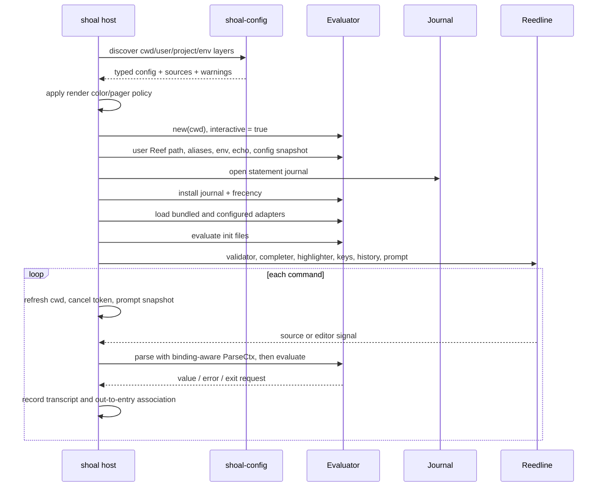
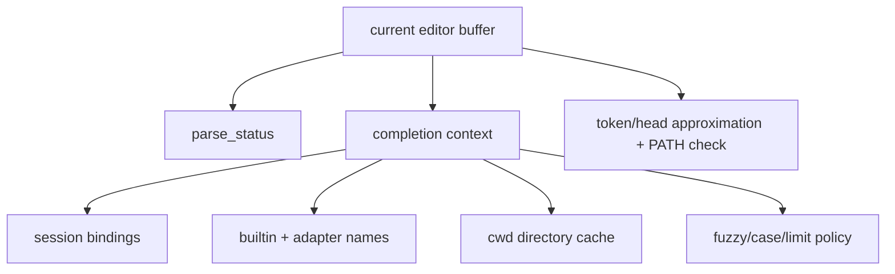
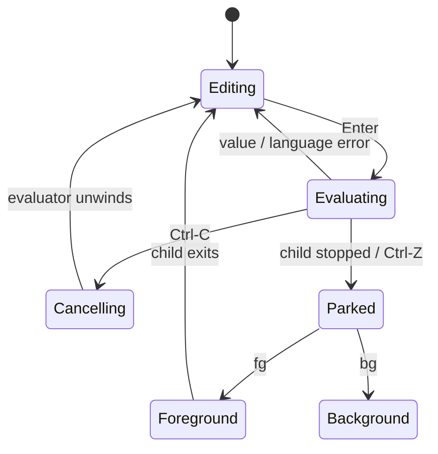

+++
title = "Local shell host"
description = "How the shoal binary assembles configuration, evaluator state, line editing, completion, prompt snapshots, jobs, history, and local journal behavior."
weight = 60
template = "docs/page.html"

[extra]
group = "Language & runtime"
eyebrow = "Host architecture"
status = "Human-facing composition root"
audience = "CLI and terminal contributors"
wide = true
+++

The `shoal` crate is a host around the language libraries. Its responsibility is to assemble a safe,
pleasant terminal session: parse CLI actions, load configuration, create an evaluator, wire concrete
ports and catalogs, manage terminal signals and editor state, collect a prompt snapshot, and present
results. Language semantics should remain in `shoal-eval`; terminal policy should remain here.

## CLI action tree

The argument parser selects interactive REPL, source execution (`-c` or a script), formatting,
doctor, shell completions, prompt support, or companion processes such as LSP/MCP. Non-interactive
source paths create their own evaluator and host assembly; they do not send work to a resident
kernel.

## REPL assembly sequence

Order matters because init files and completions must see the same bindings/adapters as evaluation,
and warnings must honor the resolved color policy.

Source: [`shoal/src/repl.rs`](https://github.com/alliecatowo/shoal/blob/main/crates/shoal/src/repl.rs).

## Configuration architecture

`shoal-config` discovers four precedence layers: defaults, user config, the **single nearest ancestor**
`.shoal.toml`, and environment overrides. It does not merge an ancestor project chain. Later layers
merge key-by-key rather than replacing whole tables. The loader validates
types, reports unknown keys with suggestions, and returns paths of layers that contributed.

The `[reef]` subtree is only shape-checked as opaque by `shoal-config` and parsed independently by
`shoal-reef`. The rich `[prompt]` subtree uses the same ownership pattern: core config shape-checks
the table, while the bounded loader in `shoal/src/prompt.rs` validates its dynamic schema. It reads
system/user `[prompt]`, dedicated user `prompt.toml`, and the same nearest-ancestor project file the
core loader selects, then environment overrides.

The legacy `prompt.template` field is not simply dead: the rich prompt loader sees that key in files
it independently reads and migrates it to `format.left` (`{cwd}` becomes `$directory`) when no
`format` is present; when both exist, `format` wins with a warning. The typed
`shoal_config::Config.prompt.template` projection remains legacy-only, but discovery no longer makes
the same key behave differently by project depth.

### Parsed does not always mean wired

Source usage shows several schema fields currently parsed but not consumed by the host runtime:

- `render.width`;
- `kernel.enabled` and `kernel.session`;
- `journal.enabled` and `journal.state_dir`;
- `leash.policy`;
- the already-resolved typed core `prompt.template` value (the rich prompt subsystem independently
  reloads/migrates legacy template keys from its own, slightly different file set).

Documenting these as active knobs would be misleading. When wiring one, add host tests that prove it
changes behavior and remove it from this list.

## Editor boundary

Reedline owns terminal line editing. Shoal supplies:

- a validator backed by syntax `parse_status`;
- a context-sensitive completer;
- a modal highlighter;
- configured Emacs/Vi/custom keybindings;
- file-backed history wrapped with ignore/dedup filters;
- normal and optional transient prompt renderers.

Completion distinguishes command head, expression/member context, flags, and filesystem candidates.
Filesystem candidates use an mtime-based cache. Fuzzy matching is a subsequence-style ranking, not a
semantic resolver.

Completion and highlighting necessarily approximate the parser and command resolver. They share the
canonical builtin registry, but still contain their own head/context heuristics. A grammar or
dispatch change should include editor tests; otherwise accepted syntax can be colored or completed
as if it meant something else.

## Prompt pipeline

Prompt rendering is pure with respect to the OS. The host gathers facts once per command—cwd,
repository state, jobs, Reef/tool context, status, timing, and static session data—into an immutable
`PromptContext`. Reedline may render that snapshot repeatedly per keystroke without filesystem or
subprocess IO.

This invariant is performance-critical. New prompt modules should extend the gather phase and pure
formatter separately, with a test ensuring render does no IO.

## History versus journal

Shoal has two histories with different purposes:

| System | Contents | Owner | Purpose |
|---|---|---|---|
| Reedline file history | entered source lines | editor host | recall/search while typing |
| structured journal | source, outcome metadata, output refs, undo records | evaluator/journal | provenance, query, undo, agent refs |

The REPL opens an evaluator journal writer and an independent reader against the same SQLite/WAL
store. After a successful statement it queries the latest matching entry after the statement start
and associates that journal ID with the corresponding `out[n]`, enabling `undo out[n]`.

The source explicitly notes a concurrency limitation: latest-by-timestamp/principal association is
acceptable for today's single local REPL but could misattribute if concurrent sessions wrote under
the same principal. A future schema should return the entry ID directly from evaluation rather than
infer it with a second handle.

## Local job control

The shell installs a SIGINT handler that cancels the evaluator's current token instead of allowing
the default signal to terminate the shell. On a real TTY it protects the shell from job-control
signals while children reset dispositions and own their PTY/process group.

`fg`/`bg` for parked external PTY jobs are host-level operations. The REPL also rewrites task forms
where needed so language tasks can be addressed. Keep local terminal handoff separate from generic
`TaskVal` semantics and from kernel `pty.*`.

## Output and paging

Evaluator statement sinks deliver structured values to the host. Rendering decides color and human
layout; configured automatic paging can route sufficiently relevant output through a pager. Echo
mode determines which statement results are printed but does not change their evaluated values or
journal identity.

The evaluator's logical `cwd` and process environment are session state. The host must not implement
`cd` by mutating process-global `cwd`, because the same evaluator code also serves concurrent kernel
sessions.

## Shell-specific failure boundaries

- Config warnings are non-fatal; type errors are fatal for that load.
- An unavailable journal warns and disables journal/history/undo features without disabling the
  shell.
- Invalid configured keybindings warn and are skipped.
- Missing/unreadable init files fail startup because requested initialization did not occur.
- Prompt config/module warnings degrade rendering but should not put IO on the render path.
- Ctrl-C should cancel the active statement and return to editing, never terminate the host.

## Change checklist

- Does the change belong in host assembly or in evaluator semantics?
- Is the same configuration applied to REPL and `-c`/script paths?
- Does completion/highlighting use the same canonical names and syntax contexts?
- Are terminal modes and signal dispositions restored on every error/stop/exit path?
- Does prompt rendering remain pure and bounded per keystroke?
- Is the feature intentionally local, or does kernel/MCP parity require separate wiring?
- Does journal-disabled operation remain usable and honest about missing features?
