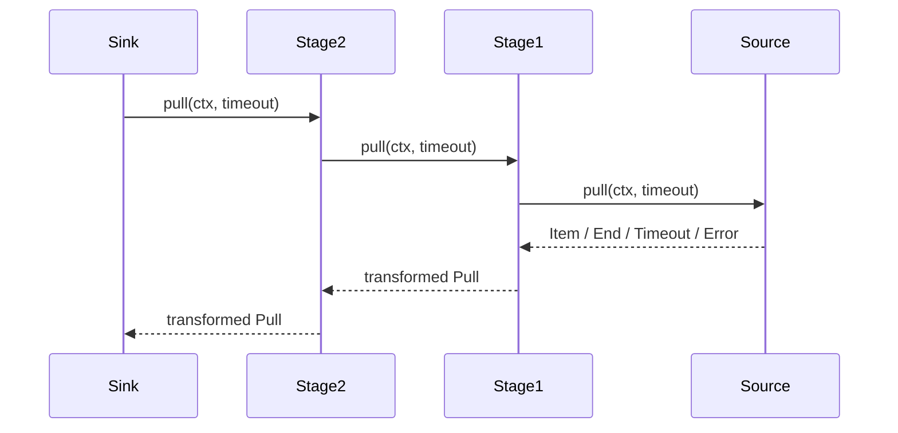
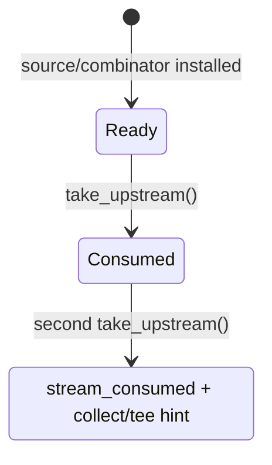
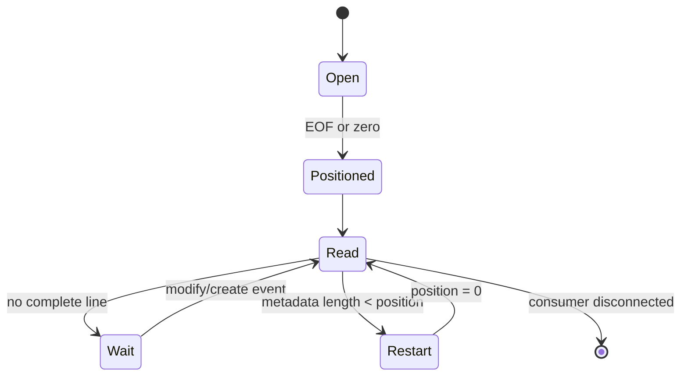
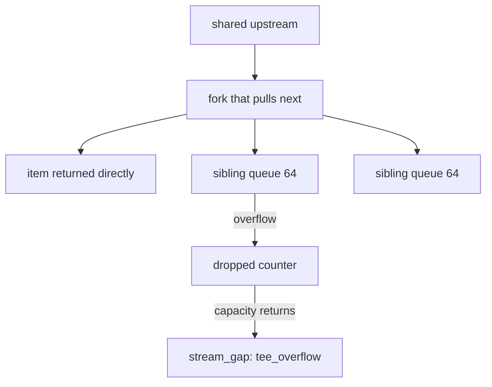
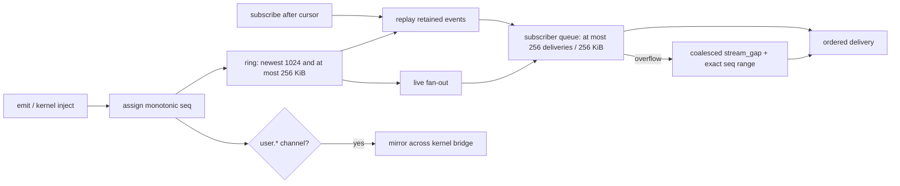

+++
title = "Streams, channels, and backpressure"
description = "The pull protocol, single-consumption state, every/watch/tail sources, lazy stages, tee queues, channel replay, sinks, cancellation, and overflow semantics."
weight = 43
template = "docs/page.html"

[extra]
group = "Language & runtime"
eyebrow = "Value book"
status = "Temporal data state machines"
audience = "Runtime, concurrency, kernel-event, and I/O contributors"
wide = true
+++

Shoal models time-varying data as a lazy, pull-based, single-consumption `stream<T>`. Finite values,
filesystem events, file tails, timers, and in-language channels all enter the same `StreamVal`
pipeline. The unification is real at the value/method layer, but source buffers and the kernel wire
still have different durability and backpressure properties.

Sources: [`shoal-value/src/stream`](https://github.com/alliecatowo/shoal/tree/main/crates/shoal-value/src/stream),
[`shoal-eval/src/streams.rs`](https://github.com/alliecatowo/shoal/blob/main/crates/shoal-eval/src/streams.rs),
[`channels.rs`](https://github.com/alliecatowo/shoal/blob/main/crates/shoal-eval/src/channels.rs), and
[`methods/stream.rs`](https://github.com/alliecatowo/shoal/blob/main/crates/shoal-value/src/methods/stream.rs).

## Core pull protocol

An `Upstream` is `Send` and exposes one operation:

```text
pull(ctx, optional_timeout) -> VResult<Pull>
```

where `Pull` is:

| Variant | Meaning |
|---|---|
| `Item(Value)` | one element arrived |
| `End` | source ended naturally and permanently |
| `Timeout` | deadline elapsed without an element; source remains live |
| `Err(ErrorVal)` | pipeline/source failure through `VResult` |

Closure-bearing stages receive `CallCtx` during each pull. This is why a stream is not a standard
Rust `Iterator`: `.map`, `.where`, `.scan`, and `.flat_map` can call language closures that need the
evaluator bridge.



Most stages run only when a sink pulls. There are two eager boundaries: constructing a
`watch`/`tail`/`every` source starts its producer, and constructing `.buffer(n)` starts an owned
producer pump that drives the stages below it. Stages above the buffer remain pull-driven. Dropping
the buffered stream signals its pump to stop; dropping a source receiver is the stop mechanism for
the other thread-backed sources.

## Stream state and identity

`StreamVal` contains a label, a boundedness bit, and `Arc<Mutex<StreamState>>`. State has only two
variants:



Cloning a `StreamVal` clones the same state handle; it does **not** create a replayable stream.
Equality uses `Arc` identity. The first consumer atomically replaces `Ready(upstream)` with
`Consumed`. Every combinator consumes the previous stream and returns a fresh wrapper around the
taken upstream.

Use `.tee(n)` to request explicit fan-out, or collect a bounded stream into a replayable list.

## Boundedness is metadata with safety consequences

`from_iter` creates a bounded stream. `from_channel` marks a live source unbounded. Combinators
propagate or alter the bit:

| Stage | Result boundedness |
|---|---|
| `map`, `filter`, `scan`, `flat_map`, `dedupe`, `distinct`, `buffer`, timing/window stages | same as input |
| `take(n)` | always bounded |
| predicate `take_until` | currently same as input, even though predicate may stop it |
| stream `take_until` | currently same as primary input |
| `merge(a,b)` | bounded only when both inputs are bounded |
| `zip(a,b)` | bounded when either side is bounded |
| `tee` fork | inherits source bit |

`collect_stream` checks the bit before taking upstream. An unbounded stream immediately returns
`stream_unbounded` with a hint to use `take`, `take_until`, or `each`; it never enters a potentially
infinite loop.

The metadata is conservative. Predicate/signal termination is not recognized as a proof of
boundedness, so an actually terminating `take_until` chain can still be rejected by `.collect()`
unless another stage such as `.take(n)` marks it bounded.

## Base sources

### Finite value source

`.stream()` converts:

- list elements directly;
- table rows to record values;
- range integers;
- string lines;
- lossy-decoded byte lines.

It uses `IterSource`, which returns the iterator's next result and never times out.

### Live channel source

`ChanSource` wraps `std::sync::mpsc::Receiver<VResult<Value>>`. Without a timeout it blocks in
`recv`; with one it maps `recv_timeout` to item, timeout, or end on disconnection. Timer, watch,
tail, and `.buffer` use this adapter with their own capacity and shutdown policy. Language-channel
subscriptions use `EventUpstream` instead: its mutex/condition-variable queue has a hard 256-item
and 256 KiB retained-byte bound, explicit gap records, and cancellation-aware receives for `on`
handlers. One evaluator admits at most 64 live subscriber queues.

## System source matrix

| Source | Producer | Buffer | Overflow contract | Item shape |
|---|---|---:|---|---|
| `every(duration)` | one sleeping thread | `sync_channel(1)` | drop tick silently | `DateTime` |
| `watch(path/glob)` | `notify` watcher thread | `sync_channel(64)` | count loss and owe one gap summary | event or gap record |
| `tail(path)` | `notify` + `Fs` reads | `sync_channel(64)` | count and report dropped lines | string or gap record |
| `channel(name).events()` | session EventBus | 256 deliveries and 256 KiB per subscriber | discard oldest queued deliveries, insert exact gap before newest | event or gap record |
| finite value `.stream()` | caller pull | no producer buffer | exact | element |

EventBus publishers never wait for a slow subscriber. A subscriber queue holds at most 256
deliveries and 256 KiB of measured retained data. When either bound fills, it removes the oldest
entries until there is room for one coalesced
`stream_gap` record and the newest event. If an evicted entry is itself a gap, its count and sequence
range are absorbed, so loss remains explicit. Replay uses the same bounded queue: a large replay can
also compact older deliveries into a gap rather than allocating in proportion to the 1,024-event
ring.

## Timer state machine

`every` rejects a zero interval, starts one thread, sleeps the interval, and tries to place the
current zoned datetime into a one-slot channel.


The buffered tick is the earliest undelivered one, not a replacement with the latest missed tick.
Ticks carry timestamps, so a slow consumer can observe one stale tick before current ones resume.

The source uses `thread::sleep` and `Zoned::now` directly, not evaluator `Clock` or cancellation.
Dropping the stream stops it only after the current sleep ends and the next send observes disconnect.

## Watch source

`watch` accepts a path, non-glob string, glob value, or glob-shaped string. A glob is split at the
first wildcard component; its literal prefix becomes the watched root and the absolute full pattern
filters received paths. Recursive mode defaults true at constructor dispatch.

Only create, modify, and remove `notify` event families are projected. Each item is:

```text
{ path: Path, kind: "created" | "modified" | "removed", ts: DateTime }
```

The root existence check and notify watcher use direct path/OS APIs; event production itself is not
fully virtualized by the evaluator's `Fs` port.


An overflow summary retains the rescan-compatible watch fields and adds the common gap fields:

```text
{ marker: "stream_gap", reason: "watch_overflow", dropped: n,
  from_seq: null, to_seq: null,
  path: root, kind: "modified", ts, coalesced: true }
```

It communicates that detailed event identity was lost and the consumer should rescan. Additional
events can be dropped while the summary remains owed. Watcher errors use a blocking send so they are
not intentionally lost.

## Tail source

`tail` validates the target, opens through `Fs`, seeks to EOF by default or byte zero with
`from_start: true`, and watches the path for modifications/creation. It reads only complete
newline-terminated lines. A trailing partial line does not advance `pos` and waits for a later event.



Line bytes decode with UTF-8 loss replacement and trim trailing newline/CR. On a full 64-slot buffer,
the line is dropped and a counter increments. Once capacity returns, a common gap record is emitted
before later lines:

```text
{ marker: "stream_gap", reason: "tail_overflow", dropped: n,
  from_seq: null, to_seq: null }
```

Therefore the nominal `stream<str>` widens at runtime to include marker records; consumers must
inspect `marker` or shape if exact type homogeneity matters.

Errors reopening/seeking during later reads are often treated best-effort and can be retried on a
future event, while watcher setup/errors surface explicitly. Rotation is inferred when metadata
length shrinks; rename/replacement behavior beyond that depends on platform `notify` semantics.

## Lazy combinator ledger

| Combinator | Per-pull state and behavior |
|---|---|
| `map(f)` | one upstream item, returns `f(item)` |
| `where`/`filter(f)` | loops until `f(item).as_condition()` is true |
| `scan(init,f)` | stores accumulator, emits every updated accumulator |
| `flat_map(f)` | drains each returned stream or queued list/table/range before the next outer item; substreams are sequential |
| `take(n)` | decrements remaining count and ends at zero |
| `take_until(predicate)` | consumes triggering item and ends without emitting it |
| `take_until(stream)` | polls signal stream and primary source in 20 ms steps |
| `dedupe` | stores last emitted item; removes adjacent equality duplicates |
| `distinct` | hashes into equality-compatible buckets, then verifies with `Value` equality |
| `debounce(duration)` | retains latest pending value until quiet deadline |
| `throttle(duration)` | emits first and drops items inside interval |
| `window(count)` | sliding deque; emits only once full, then every item |
| `window(duration)` | stores timestamp/value pairs; emits current time window per item |
| `buffer(n)` | eager owned pump into `sync_channel(n)`; lossless pacing, including a zero-capacity rendezvous |
| `enumerate` | emits `[zero_based_index, value]` |
| `merge(other)` | nonblocking probes with alternating preference; round-robin when both are ready, free-running when only one is ready |
| `zip(other)` | positional pairs with at most one pending item per side; ends when either side ends |

`flat_map` is concat-map, not concurrent merge: an endless returned substream prevents the next
outer item from being pulled. `distinct` preserves `Value` equality across representations such as
`1`/`1.0`, path/string, and table/list-of-records by using an equality-compatible semantic hash and
confirming candidates within each bucket. Its membership checks are amortized O(1), but exact
history still grows with the number of distinct values on an unbounded stream. `window(duration)`
is bounded only by event rate inside the duration.

`.buffer(n)` consumes its input and starts a child evaluator on a producer thread. The channel has
exactly `n` slots; the producer can additionally hold the item it is currently trying to enqueue.
Full queues pace in a cancel-aware retry loop and never drop values. Capacity zero is a lossless
rendezvous: the producer can hold one pending item but no item is queued. The result preserves the
input's boundedness. Parent cancellation, dropping the returned stream, or receiver disconnection
stops the pump and releases the upstream. Buffer and stream-feed pumps share a process-wide maximum
of 64 active workers with live `every`, `watch`, and `tail` sources; the 65th returns
`stream_pump_limit` until a stream finishes or is dropped and its lease is released. Idle sources
poll their stop flag, so retaining and dropping them has the same quota semantics as an active pump.

`merge` alternates first refusal after every item. Two always-ready inputs therefore produce strict
round-robin order; when one side times out or ends, the ready side continues without a skew queue.
Blocking probes are capped at 20 ms and alternate preference after a timeout. `zip` holds at most
one unpaired item from each input across timeouts and alternates which missing side it waits for. It
emits only complete positional pairs and ends as soon as either input ends; an already-pulled
unpaired item is then discarded.

`debounce` ignores the caller-supplied outer timeout and uses its own pending deadline. This is worth
re-auditing if time budgets become strict RPC cancellation contracts.

## Stream sinks

| Sink | Behavior | Result |
|---|---|---|
| `.each(f)` | drives every item and calls closure, discarding closure result | `null` |
| `.collect()` | rejects unbounded metadata, otherwise drains | `List` |
| `.save(path)` / `.append(path)` | appends each item and newline as it arrives | resolved `Path` |
| `.tee(n)` | exact materialized replay for bounded; lazy bounded queues for live | list of streams |
| `.into(channel)` | evaluator drives and publishes payloads | `null` |
| `.render()` | evaluator drives and sends each item to statement sink | `null` |
| `.feed(command)` | pumps serialized items into bounded child stdin | command outcome |
| other collection method | collect bounded stream, redispatch on list | method-dependent |

Despite two names, stream `.save` and `.append` both open with create+append. They open once through
the `Fs` port (`CallCtx::fs().open_append`, HR-C2) — a fake can observe or deny the write — rather
than `std::fs::OpenOptions` directly; the write still bypasses the journal undo model, and consults
the evaluator's configured port through its `CallCtx::fs()` implementation. Production currently
uses `StdFs`; an injected denying adapter is proven by tests, but Leash does not yet supply such an
adapter. Strings and bytes are written verbatim per item; other values become JSON; every item gets
an added newline.

Stream `.feed(command)` starts a second owned pump and runs the command with captured pipe stdin.
The stdin queue holds 16 chunks of at most 64 KiB each, so queued byte buffers are capped at 1 MiB.
Ordinary values are line-framed; bytes and outcome output remain raw, while CAS-backed bytes are
read incrementally in 64 KiB chunks. The pump polls idle upstreams every 25 ms, observes parent and
local cancellation, stops when the child closes stdin or exits, and reports upstream or
serialization errors. Finite stdin forces capture mode because a PTY has no portable input
half-close.

Cancellation is not universal to the `Upstream` trait itself. The owned buffer/feed pumps and
channel-handler receive path explicitly poll cancellation; a generic `.each`/`.render`/`.into` sink
blocked directly in some other live upstream still relies on that source ending or its receiver
being dropped.

## Tee behavior

Bounded streams are collected once and each fork replays the complete list. Live/unbounded streams
share one upstream with one 64-element queue per fork.



There is no background pump. Whichever empty-queue fork pulls takes the mutex and drives the shared
source. It clones each item into sibling queues. A lagging sibling keeps its first queued items up to
capacity, counts later drops, and receives an ordered `{marker: "stream_gap", reason:
"tee_overflow", dropped: n, from_seq: null, to_seq: null}` record when room appears or the queue
drains.

The mutex is held while calling the shared upstream's potentially blocking `pull`. Two forks driven
on different threads therefore cannot pull independently while the source blocks; the first holder
serializes access. This is correctness-preserving fan-out, not high-throughput broadcast.

## Language EventBus

The evaluator owns an `Arc<EventBus>` shared into selected child tasks. Each channel has:

| State | Purpose |
|---|---|
| `next_seq` | monotonically increasing per-channel sequence, beginning at zero |
| `ring` | newest 1,024 stored events, also capped at 256 KiB measured retained data |
| `subs` | live subscriber queues, each capped at 256 deliveries and 256 KiB |

Stored events contain sequence, nanosecond timestamp, and cloned payload. Consumer records are:

```text
{ channel: Str, seq: Int, ts: DateTime | null, payload: Value }
```

The evaluator admits at most 64 channel identities and 64 live subscribers. Channel names are at
most 256 UTF-8 bytes. Existing identities and their sequence/history state are never evicted to
make room for a different name; only an empty subscribe-then-drop shell can be pruned. Admission
failures are typed as `channel_name_limit`, `channel_registry_limit`, or
`channel_subscriber_limit`.

Before any ring append, sequence increment, subscriber clone, or `user.*` bridge callback, payloads
pass a non-allocating structural measurement: at most 64 KiB retained data, depth 64, and 4,096
nodes. Strings/bytes and recursive list/record/table/outcome/error storage are charged; opaque
runtime handles whose retained graph cannot be bounded (`stream`, `task`, closure, command ref,
compiled regex, CAS loader, secret) are rejected. Failures use `channel_payload_limit` or
`channel_payload_type`. The two 64 × 256 KiB aggregate budgets put rings plus subscriber queues at
about 32 MiB/session before fixed container overhead.

Delivery loss uses a stable discriminated record. Sequence bounds are populated when the source has
a public sequence space:

```text
{ marker: "stream_gap",
  reason: "subscriber_overflow" | "history_evicted" | "mixed_overflow",
  dropped: Int, from_seq: Int | null, to_seq: Int | null,
  channel: Str, seq: null, ts: DateTime | null, payload: null, overflow: true }
```



Only `user.*` language emits cross an installed kernel forwarder. This prevents language code from
spoofing kernel-owned journal, approval, or transcript channels. `inject` publishes locally without
calling the forwarder, preventing echo loops.

The promise is a bridged shape and naming rule, not one shared in-memory bus implementation: kernel
and evaluator maintain their own ring/sequence state. Forwarded events can therefore receive a
different sequence on the other side.

## Channel handle and methods

There is no `Value::Channel`. `channel(name)` returns exactly one-field record
`{channel: name}`. The evaluator recognizes only records of length one with that string field, then
intercepts:

| Method | Semantics |
|---|---|
| `.emit(value)` | publish, return `null` |
| `.events()` | queue retained ring entries within the subscriber bound, then go live |
| `.events(since: n)` | queue sequence greater than `n` within the subscriber bound, then go live |
| `.latest()` | newest payload only, or `null` |
| `.take(timeout: d?)` | subscribe to future-only events and return next payload |

`events` uses `since` from a named argument or first positional. `take` similarly accepts timeout.
`take` is cancellation-aware: the receiver rechecks its token at least every 25 ms while idle, and
cancellation wins over queued backlog. A deadline raises `timeout`; a closed subscription raises
`channel_closed`.

Because the handle is an ordinary record, user data of exactly this shape is treated as a channel
capability by evaluator method dispatch. Conversely adding any second field prevents recognition.

## Replay and delivery guarantees


Replay is queued while the bus mutex is held, before the subscriber is registered as live, so there
is no race between the ring snapshot and live registration. The queue remains capped at 256 entries
and 256 KiB during replay. If compaction is needed, an explicit gap accounts for evicted
deliveries. A `since` cursor
older than the 1,024-event ring queues a `history_evicted` gap with the exact missing sequence range
before retained records. If that replay itself exceeds 256 deliveries, compaction can absorb the
history gap into a `mixed_overflow` record while preserving its count and widest sequence range.
There is no acknowledgement, durable cursor, subscriber identity, retry ledger, or cross-restart
recovery.

## `on(channel, handler)` tasks

`on` subscribes **before** spawning its worker so emits between setup and thread start are queued.
It creates a `TaskVal`, wires a fresh cancellation token to `task.cancel`, and builds the worker
through the sole `ChildContext` constructor. The child inherits the parent's lexical scope,
identity, leash, reef state, configuration, effect ports, and shared EventBus; journal handle,
terminal ownership, and statement sink remain fresh. The worker calls the handler for both ordinary
events and explicit gap records.

The worker waits through the cancellation-aware subscriber receiver. It rechecks cancellation at
most every 25 ms while idle, and cancellation takes priority over already-queued events, so a quiet
channel or large backlog cannot indefinitely delay `task.cancel`. A handler already executing is
cooperative: it must return before the receive loop can finish, though child process work observes
the same cancellation token.

## Cross-layer gaps

- Kernel `WireValue::Stream` carries only a label; there is no RPC cursor/pull/chunk lifecycle.
- Dropped/coalesced markers widen stream element shapes without a static type system expressing it.
- Timer and timing combinators use direct system time/sleep, reducing deterministic testability.
- Watch existence/root discovery and tail content reads use the inherited `Fs` port.
- Stream save/append cross the evaluator's configured `Fs` port (`open_append`, HR-C2) but still
  bypass journal undo; production's configured port is currently `StdFs`, not Leash confinement.
- Predicate/signal `take_until` does not mark an unbounded stream collectable.
- No explicit cancellation context spans every `Upstream`/sink; buffer/feed/on paths provide their
  own bounded polling, but generic live sinks can still rely on source shutdown.
- Event rings are memory-only and sequence spaces are local to each bus side.

## Change protocol

For a new source or combinator:

1. specify natural end and boundedness propagation;
2. define `Item`, `End`, `Timeout`, and error behavior for every internal state;
3. choose a finite buffer and document drop, block, coalesce, or overwrite behavior;
4. expose loss with a marker/event when exact delivery is not guaranteed;
5. ensure dropping the final consumer releases threads, watchers, files, and senders;
6. route filesystem/time/process effects through ports or record the boundary debt explicitly;
7. test single consumption and cloned-handle behavior;
8. test slow consumers, disconnected consumers, source errors, and timeout composition;
9. test `.tee` with one stalled branch and memory bounds;
10. decide language EventBus and kernel wire projection, including cursor gap semantics;
11. never implement an unbounded operation by silently collecting an endless stream;
12. update external stream docs with exact marker shapes and cancellation limitations.
