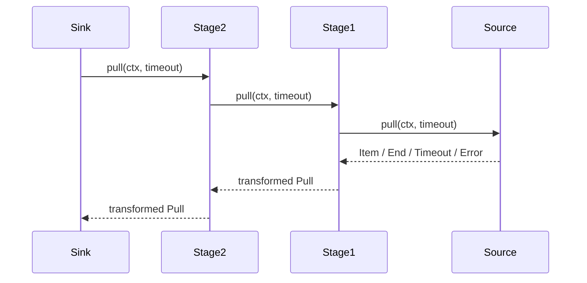
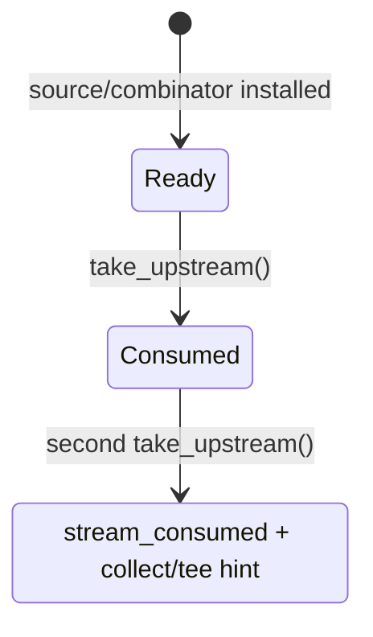
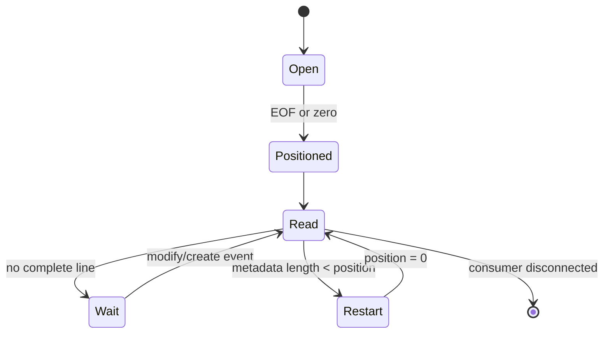
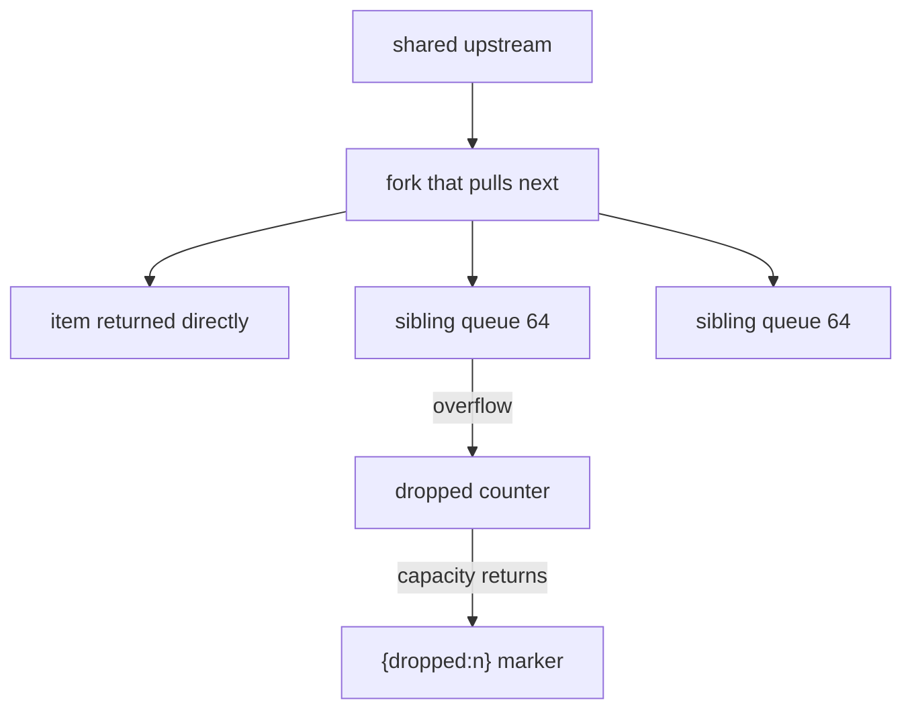
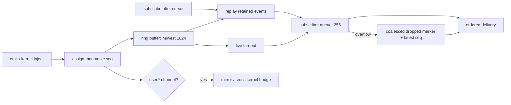

+++
title = "Streams, channels, and backpressure"
description = "The pull protocol, single-consumption state, every/watch/tail sources, lazy stages, tee queues, channel replay, sinks, cancellation, and overflow semantics."
weight = 43
template = "docs/page.html"

[extra]
group = "Language & runtime"
eyebrow = "Value book"
status = "Temporal data state machines"
audience = "Runtime, concurrency, kernel-event, and I/O contributors"
wide = true
+++

Shoal models time-varying data as a lazy, pull-based, single-consumption `stream<T>`. Finite values,
filesystem events, file tails, timers, and in-language channels all enter the same `StreamVal`
pipeline. The unification is real at the value/method layer, but source buffers and the kernel wire
still have different durability and backpressure properties.

Sources: [`shoal-value/src/stream`](https://github.com/alliecatowo/shoal/tree/main/crates/shoal-value/src/stream),
[`shoal-eval/src/streams.rs`](https://github.com/alliecatowo/shoal/blob/main/crates/shoal-eval/src/streams.rs),
[`channels.rs`](https://github.com/alliecatowo/shoal/blob/main/crates/shoal-eval/src/channels.rs), and
[`methods/stream.rs`](https://github.com/alliecatowo/shoal/blob/main/crates/shoal-value/src/methods/stream.rs).

## Core pull protocol

An `Upstream` is `Send` and exposes one operation:

```text
pull(ctx, optional_timeout) -> VResult<Pull>
```

where `Pull` is:

| Variant | Meaning |
|---|---|
| `Item(Value)` | one element arrived |
| `End` | source ended naturally and permanently |
| `Timeout` | deadline elapsed without an element; source remains live |
| `Err(ErrorVal)` | pipeline/source failure through `VResult` |

Closure-bearing stages receive `CallCtx` during each pull. This is why a stream is not a standard
Rust `Iterator`: `.map`, `.where`, `.scan`, and `.flat_map` can call language closures that need the
evaluator bridge.



No stage runs until a sink pulls. Constructing a `watch`/`tail`/`every` source does start its producer
thread today, but no closure stage or downstream method work runs until consumption. Dropping the
receiver is the producer-stop mechanism for those sources.

## Stream state and identity

`StreamVal` contains a label, a boundedness bit, and `Arc<Mutex<StreamState>>`. State has only two
variants:



Cloning a `StreamVal` clones the same state handle; it does **not** create a replayable stream.
Equality uses `Arc` identity. The first consumer atomically replaces `Ready(upstream)` with
`Consumed`. Every combinator consumes the previous stream and returns a fresh wrapper around the
taken upstream.

Use `.tee(n)` to request explicit fan-out, or collect a bounded stream into a replayable list.

## Boundedness is metadata with safety consequences

`from_iter` creates a bounded stream. `from_channel` marks a live source unbounded. Combinators
propagate or alter the bit:

| Stage | Result boundedness |
|---|---|
| `map`, `filter`, `scan`, `flat_map`, `dedupe`, `distinct`, timing/window stages | same as input |
| `take(n)` | always bounded |
| predicate `take_until` | currently same as input, even though predicate may stop it |
| stream `take_until` | currently same as primary input |
| `merge(a,b)` | bounded only when both inputs are bounded |
| `zip(a,b)` | bounded when either side is bounded |
| `tee` fork | inherits source bit |

`collect_stream` checks the bit before taking upstream. An unbounded stream immediately returns
`stream_unbounded` with a hint to use `take`, `take_until`, or `each`; it never enters a potentially
infinite loop.

The metadata is conservative. Predicate/signal termination is not recognized as a proof of
boundedness, so an actually terminating `take_until` chain can still be rejected by `.collect()`
unless another stage such as `.take(n)` marks it bounded.

## Base sources

### Finite value source

`.stream()` converts:

- list elements directly;
- table rows to record values;
- range integers;
- string lines;
- lossy-decoded byte lines.

It uses `IterSource`, which returns the iterator's next result and never times out.

### Live channel source

`ChanSource` wraps `std::sync::mpsc::Receiver<VResult<Value>>`. Without a timeout it blocks in
`recv`; with one it maps `recv_timeout` to item, timeout, or end on disconnection. This adapter is
used for timer, watch, tail, and language-channel subscriptions, but each producer chooses its own
channel capacity upstream.

## System source matrix

| Source | Producer | Buffer | Overflow contract | Item shape |
|---|---|---:|---|---|
| `every(duration)` | one sleeping thread | `sync_channel(1)` | drop tick silently | `DateTime` |
| `watch(path/glob)` | `notify` watcher thread | `sync_channel(64)` | owe one coalesced summary | event record |
| `tail(path)` | `notify` + `Fs` reads | `sync_channel(64)` | count and report dropped lines | string or dropped marker |
| `channel(name).events()` | session EventBus | unbounded `mpsc::channel` per subscriber | no subscriber backpressure bound | event record |
| finite value `.stream()` | caller pull | no producer buffer | exact | element |

The last live-channel row is a significant exception to the general “bounded buffers” aspiration:
EventBus subscribers use unbounded standard channels. `publish_local` holds the bus mutex while it
clones and synchronously sends every event to every subscriber. Sends do not block only because each
subscriber queue is unbounded; a stalled language subscriber can therefore accumulate unbounded live
events even though replay history is capped, and large payload/fan-out cloning extends the critical
section seen by every publisher/subscriber setup call.

## Timer state machine

`every` rejects a zero interval, starts one thread, sleeps the interval, and tries to place the
current zoned datetime into a one-slot channel.


The buffered tick is the earliest undelivered one, not a replacement with the latest missed tick.
Ticks carry timestamps, so a slow consumer can observe one stale tick before current ones resume.

The source uses `thread::sleep` and `Zoned::now` directly, not evaluator `Clock` or cancellation.
Dropping the stream stops it only after the current sleep ends and the next send observes disconnect.

## Watch source

`watch` accepts a path, non-glob string, glob value, or glob-shaped string. A glob is split at the
first wildcard component; its literal prefix becomes the watched root and the absolute full pattern
filters received paths. Recursive mode defaults true at constructor dispatch.

Only create, modify, and remove `notify` event families are projected. Each item is:

```text
{ path: Path, kind: "created" | "modified" | "removed", ts: DateTime }
```

The root existence check and notify watcher use direct path/OS APIs; event production itself is not
fully virtualized by the evaluator's `Fs` port.


An overflow summary is
`{path: root, kind: "modified", ts, coalesced: true}`. It communicates that detailed event identity
was lost and the consumer should rescan. Additional events can be dropped while the summary remains
owed. Watcher errors use a blocking send so they are not intentionally lost.

## Tail source

`tail` validates the target, opens through `Fs`, seeks to EOF by default or byte zero with
`from_start: true`, and watches the path for modifications/creation. It reads only complete
newline-terminated lines. A trailing partial line does not advance `pos` and waits for a later event.



Line bytes decode with UTF-8 loss replacement and trim trailing newline/CR. On a full 64-slot buffer,
the line is dropped and a counter increments. Once capacity returns, a `{dropped: n}` record is
emitted before later lines. Therefore the nominal `stream<str>` widens at runtime to include marker
records; consumers must inspect shape if exact type homogeneity matters.

Errors reopening/seeking during later reads are often treated best-effort and can be retried on a
future event, while watcher setup/errors surface explicitly. Rotation is inferred when metadata
length shrinks; rename/replacement behavior beyond that depends on platform `notify` semantics.

## Lazy combinator ledger

| Combinator | Per-pull state and behavior |
|---|---|
| `map(f)` | one upstream item, returns `f(item)` |
| `where`/`filter(f)` | loops until `f(item).as_condition()` is true |
| `scan(init,f)` | stores accumulator, emits every updated accumulator |
| `flat_map(f)` | drains returned stream or queued list/table/range before next outer item |
| `take(n)` | decrements remaining count and ends at zero |
| `take_until(predicate)` | consumes triggering item and ends without emitting it |
| `take_until(stream)` | polls signal stream and primary source in 20 ms steps |
| `dedupe` | stores last emitted item; removes adjacent equality duplicates |
| `distinct` | stores all seen values in a vector; removes global duplicates |
| `debounce(duration)` | retains latest pending value until quiet deadline |
| `throttle(duration)` | emits first and drops items inside interval |
| `window(count)` | sliding deque; emits only once full, then every item |
| `window(duration)` | stores timestamp/value pairs; emits current time window per item |
| `buffer(n)` | identity in synchronous pull model; no queue or pacing effect |
| `enumerate` | emits `[zero_based_index, value]` |
| `merge(other)` | polls A then B in 20 ms steps until both end |
| `zip(other)` | pulls A then B and emits `[a,b]`; ends/times out with either pull |


`distinct` has unbounded memory growth on an unbounded stream with continuously unique values. It
does not use hashing, so membership is linear in the number seen. `window(duration)` is bounded only
by event rate inside the duration. `.buffer(n)` currently communicates intent but has no operational
backpressure effect.

`debounce` ignores the caller-supplied outer timeout and uses its own pending deadline. This is worth
re-auditing if time budgets become strict RPC cancellation contracts.

## Stream sinks

| Sink | Behavior | Result |
|---|---|---|
| `.each(f)` | drives every item and calls closure, discarding closure result | `null` |
| `.collect()` | rejects unbounded metadata, otherwise drains | `List` |
| `.save(path)` / `.append(path)` | appends each item and newline as it arrives | resolved `Path` |
| `.tee(n)` | exact materialized replay for bounded; lazy bounded queues for live | list of streams |
| `.into(channel)` | evaluator drives and publishes payloads | `null` |
| `.render()` | evaluator drives and sends each item to statement sink | `null` |
| other collection method | collect bounded stream, redispatch on list | method-dependent |

Despite two names, stream `.save` and `.append` both open with create+append. They open once through
the `Fs` port (`CallCtx::fs().open_append`, HR-C2) — a fake can observe or deny the write — rather
than `std::fs::OpenOptions` directly; the write still bypasses the journal undo model, and consults
the evaluator's *sandboxed* port only once the evaluator overrides `CallCtx::fs()`. Strings and bytes
are written verbatim per item; other values become JSON; every item gets an added newline.

`drive_stream` blocks with no timeout until end/error. Cancellation is documented as dropping the
pipeline/receiver, but a sink currently holding and blocking on a live receiver needs its surrounding
task/thread to be released; there is no explicit cancellation token in `Upstream::pull`.

## Tee behavior

Bounded streams are collected once and each fork replays the complete list. Live/unbounded streams
share one upstream with one 64-element queue per fork.



There is no background pump. Whichever empty-queue fork pulls takes the mutex and drives the shared
source. It clones each item into sibling queues. A lagging sibling keeps its first queued items up to
capacity, counts later drops, and receives an ordered marker when room appears or the queue drains.

The mutex is held while calling the shared upstream's potentially blocking `pull`. Two forks driven
on different threads therefore cannot pull independently while the source blocks; the first holder
serializes access. This is correctness-preserving fan-out, not high-throughput broadcast.

## Language EventBus

The evaluator owns an `Arc<EventBus>` shared into selected child tasks. Each channel has:

| State | Purpose |
|---|---|
| `next_seq` | monotonically increasing per-channel sequence, beginning at zero |
| `ring` | newest 1,024 stored events |
| `subs` | live sender list |

Stored events contain sequence, nanosecond timestamp, and cloned payload. Consumer records are:

```text
{ channel: Str, seq: Int, ts: DateTime | null, payload: Value }
```



Only `user.*` language emits cross an installed kernel forwarder. This prevents language code from
spoofing kernel-owned journal, approval, or transcript channels. `inject` publishes locally without
calling the forwarder, preventing echo loops.

The promise is a bridged shape and naming rule, not one shared in-memory bus implementation: kernel
and evaluator maintain their own ring/sequence state. Forwarded events can therefore receive a
different sequence on the other side.

## Channel handle and methods

There is no `Value::Channel`. `channel(name)` returns exactly one-field record
`{channel: name}`. The evaluator recognizes only records of length one with that string field, then
intercepts:

| Method | Semantics |
|---|---|
| `.emit(value)` | publish, return `null` |
| `.events()` | replay whole retained ring, then live stream |
| `.events(since: n)` | replay sequence greater than `n`, then live |
| `.latest()` | newest payload only, or `null` |
| `.take(timeout: d?)` | subscribe to future-only events and return next payload |

`events` uses `since` from a named argument or first positional. `take` similarly accepts timeout.
`take`'s timeout maps any `recv_timeout` error to `timeout`; without timeout, disconnect maps to
`channel_closed`.

Because the handle is an ordinary record, user data of exactly this shape is treated as a channel
capability by evaluator method dispatch. Conversely adding any second field prevents recognition.

## Replay and delivery guarantees


Replay occurs while the bus mutex is held, before the sender is registered as live, so there is no
gap between the ring snapshot and subscription registration. Delivery is in-process clone-and-send.
There is no acknowledgement, durable cursor, subscriber identity, retry ledger, or cross-restart
recovery. “At least once” behavior comes from replaying retained records, not a durable delivery
protocol.

A cursor older than the retained ring silently starts at the oldest still-retained record; there is
no explicit gap marker.

## `on(channel, handler)` tasks

`on` subscribes **before** spawning its worker so emits between setup and thread start are queued.
It creates a `TaskVal`, installs a cancellation hook, snapshots environment/cwd/process env/adapters,
shares selected ports and the EventBus, then drives the subscription and calls the handler for every
full event record. The task is added to evaluator jobs and finishes with `null` or the first error.

The worker is an OS thread. Its cancellation token is set by `task.cancel`, but channel receive/pull
does not poll that token; if no further event arrives, the worker can remain blocked. It also manually
copies evaluator capabilities, so new ports/state can be omitted—configuration is one current audit
site.

## Cross-layer gaps

- `feed_bytes(Stream)` refuses stream-to-process stdin; incremental child-stdin pumping is absent.
- Kernel `WireValue::Stream` carries only a label; there is no RPC cursor/pull/chunk lifecycle.
- EventBus live subscriber queues are unbounded even though replay rings are bounded.
- Dropped/coalesced markers widen stream element shapes without a static type system expressing it.
- Timer and timing combinators use direct system time/sleep, reducing deterministic testability.
- Watch existence/root discovery bypasses `Fs`; tail content reads use it.
- Stream save/append cross the `Fs` port (`open_append`, HR-C2) but still bypass journal undo; they
  reach the evaluator's sandboxed port only once its `CallCtx::fs()` override lands.
- Predicate/signal `take_until` does not mark an unbounded stream collectable.
- No explicit `Upstream` cancellation/deadline context spans an entire sink.
- Event rings are memory-only and sequence spaces are local to each bus side.

## Change protocol

For a new source or combinator:

1. specify natural end and boundedness propagation;
2. define `Item`, `End`, `Timeout`, and error behavior for every internal state;
3. choose a finite buffer and document drop, block, coalesce, or overwrite behavior;
4. expose loss with a marker/event when exact delivery is not guaranteed;
5. ensure dropping the final consumer releases threads, watchers, files, and senders;
6. route filesystem/time/process effects through ports or record the boundary debt explicitly;
7. test single consumption and cloned-handle behavior;
8. test slow consumers, disconnected consumers, source errors, and timeout composition;
9. test `.tee` with one stalled branch and memory bounds;
10. decide language EventBus and kernel wire projection, including cursor gap semantics;
11. never implement an unbounded operation by silently collecting an endless stream;
12. update external stream docs with exact marker shapes and cancellation limitations.
