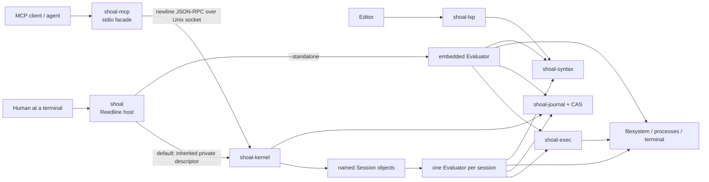
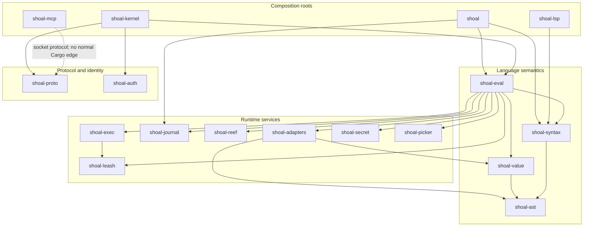
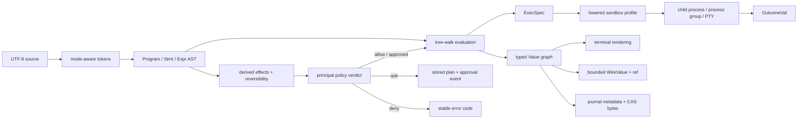
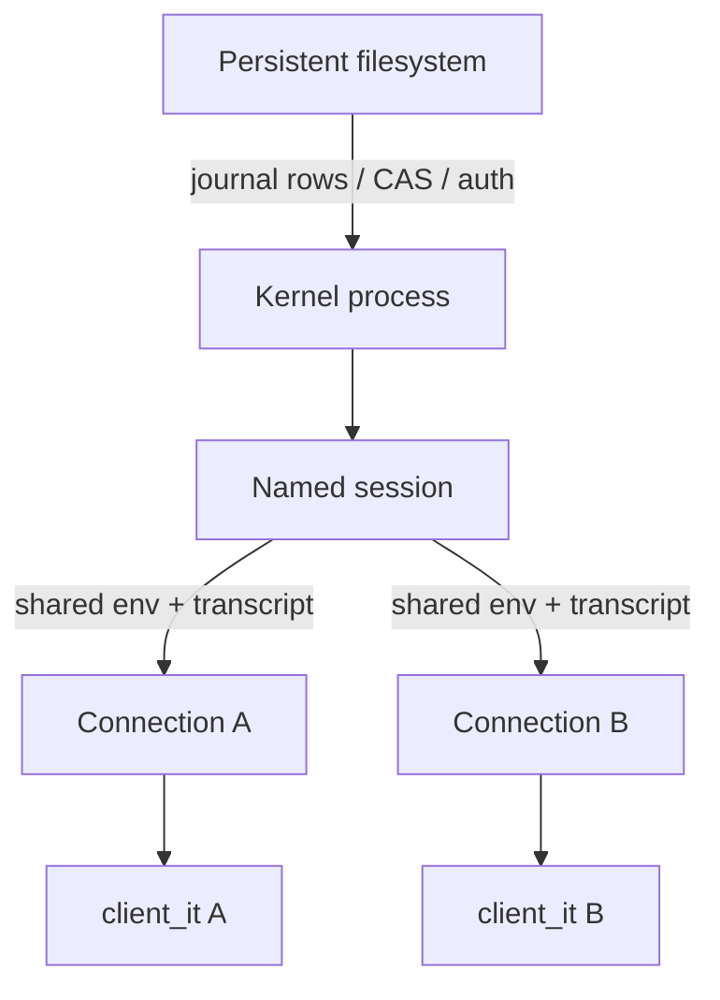
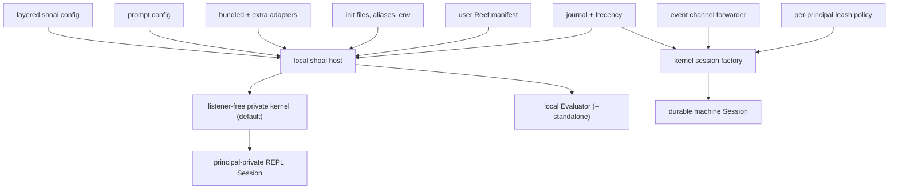

+++
title = "System map"
description = "The composition roots, dependency boundaries, data paths, and state ownership that define Shoal as it exists today."
weight = 10
template = "docs/page.html"

[extra]
group = "Orientation"
eyebrow = "Architecture atlas"
status = "Source-grounded"
audience = "Maintainers and reviewers"
wide = true
+++

Shoal is not one process with one runtime path. It is a workspace of narrow libraries assembled by
two principal hosts:

- `shoal` is the human-facing local shell. It owns Reedline, terminal state, prompt collection,
  configuration loading, bundled adapters, and init files. Its default REPL uses a listener-free
  private kernel child over an inherited anonymous descriptor; `--standalone` embeds the evaluator.
- `shoal-kernel` is a JSON-RPC daemon/private child. It owns principal-private named sessions, authentication,
  transcripts, plans, tasks, long-lived PTYs, event delivery, and an evaluator per session.
  `shoal-mcp` is a stdio MCP facade over that daemon.

This distinction is the first fact to preserve when changing Shoal. “The evaluator supports it” is
not sufficient evidence that the local shell, kernel, and MCP surface all expose it in the same way.

## System context

The CLI can also launch companion binaries (`shoal lsp`, `shoal mcp`). The default REPL does route
normal commands through its private kernel, but it never binds or joins the durable public socket;
standalone mode remains a separate embedded composition root.

Sources: [`shoal` main and REPL](https://github.com/alliecatowo/shoal/tree/main/crates/shoal/src),
[`shoal-kernel`](https://github.com/alliecatowo/shoal/tree/main/crates/shoal-kernel/src), and
[`shoal-mcp`](https://github.com/alliecatowo/shoal/tree/main/crates/shoal-mcp/src).

## Dependency strata

The Cargo graph is deliberately mostly acyclic. The central inversion is that `shoal-value` does
not depend on `shoal-eval`: method callbacks cross that boundary through a `CallCtx`. Likewise,
the AST and syntax crates do not know about execution, policies, or hosts.

`shoal-mcp` intentionally talks to the kernel as an external client and has no normal dependency on
`shoal-proto` or `shoal-kernel`; those are development dependencies for tests. This keeps the
transport boundary honest, at the cost of some duplicated client-side wire shapes.

## The source-to-effect path

The stable mental model is a sequence of representations, not a single “run command” operation.

Not every branch occurs in every host. The local evaluator can plan and apply through language
builtins. The kernel adds RPC-level plan storage, approval, reference scoping, bounded wire
rendering, and events.

## State ownership

State is intentionally split by lifetime. Confusing these lifetimes causes most restart, sharing,
and isolation bugs.

| State | Owner | Lifetime | Shared with |
|---|---|---|---|
| lexical environment, `cwd`, process env, `it`, functions, aliases | `Evaluator` | evaluator/session | callers of the same evaluator |
| local line editor state and filtered history | `shoal` REPL | process / history file | local user only |
| named session transcript and `out[n]` values | kernel `Session` | kernel process | clients with the exact principal+Session owner |
| per-connection `it` reference | kernel attachment/client | connection | no other connection |
| plans, task wrappers, open PTYs | kernel maps | kernel process | exact principal+Session lookup |
| event channel rings and subscribers | kernel `EventBus` | kernel process | permitted principal+Session clients |
| durable transcript/journal events | SQLite journal | filesystem | later kernel processes |
| output blobs | journal CAS | filesystem until GC | any authorized ref lookup |
| Reef lock and executable view | project/user filesystem | filesystem | processes using that scope |
| auth tokens and policy | user state directory | filesystem | kernel/policy loaders |
| secrets | encrypted secret store | filesystem | same-user callers with key access |

Kernel restart currently loses named evaluator state, transcripts held as live `Value`s, plans,
task wrappers, PTYs, and in-memory event rings. The journal, CAS, auth store, policy, Reef manifests,
and Reef locks survive.

## Private-kernel default and explicit standalone path

The interactive CLI performs presentation/bootstrap assembly around either a private kernel-backed
protocol Session (the default) or an explicit standalone evaluator. A durable public kernel remains
a separate process/trust domain and does not share the private REPL's live state:

As implemented, a newly created kernel session installs journal/frecency support and a channel
forwarder, but does not load the CLI's layered config, aliases, environment overrides, init files,
bundled/extra adapter directories, or user Reef manifest. This is a parity boundary, not merely a
documentation omission. Test a feature through the intended host before describing it as universal.

There is a second parsing difference: the local REPL constructs a `ParseCtx` from session bindings,
while the kernel `exec` handler parses submitted source without that context. Evaluation can still
resolve command-shaped callable names, but statement-head classification of session-bound values can
differ across requests.

Sources: [`shoal/src/repl.rs`](https://github.com/alliecatowo/shoal/blob/main/crates/shoal/src/repl.rs),
[`shoal-kernel/src/session.rs`](https://github.com/alliecatowo/shoal/blob/main/crates/shoal-kernel/src/session.rs),
and [`handlers_exec.rs`](https://github.com/alliecatowo/shoal/blob/main/crates/shoal-kernel/src/handlers_exec.rs).

## Architectural rules worth defending

1. **ASTs are syntax, not authority.** Effects are derived and then checked by Leash before an
   authorized host crosses an OS boundary.
2. **Values remain structured until a boundary requires bytes.** Rendering, stdin feeding, JSON
   wire encoding, and CAS persistence are separate conversions.
3. **Paths preserve bytes.** Display strings are not treated as reversible path encodings.
4. **Session state is explicit.** Process-wide `cwd` or environment mutation would violate
   concurrent kernel sessions.
5. **External execution is centralized.** Process groups, cancellation, sandbox lowering, capture,
   and PTYs belong in `shoal-exec`, not ad-hoc evaluator builtins.
6. **Wire responses are bounded and recoverable.** Large results become previews plus typed refs;
   clients follow refs deliberately.
7. **Reversibility is evidence-based.** If the journal cannot safely snapshot or invert a mutation,
   the plan must not call it reversible.
8. **Durability is opt-in and named.** An in-memory transcript or event ring must not be mistaken for
   journal durability.

## Where to continue

- [Crate and module ledger](../crate-ledger/) for ownership and dependency direction.
- [Language engine](../language-engine/) for lexer, parser, AST, evaluator, and dispatch.
- [Kernel, protocol, and sessions](../kernel-protocol/) for RPC and concurrent state.
- [Change map and known debt](../change-map/) before making cross-cutting changes.
