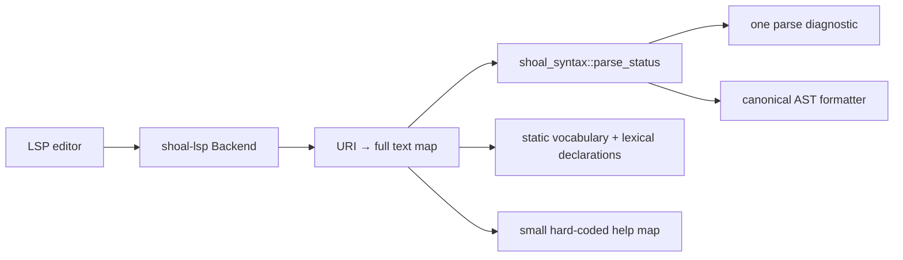
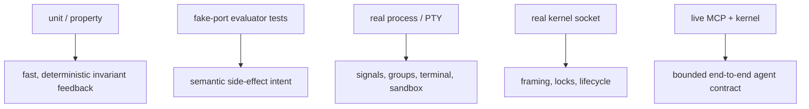

+++
title = "LSP, doctor, testing, and quality gates"
description = "Editor services, installation diagnostics, the normative conformance corpus, integration-test ownership, property/fuzz coverage, CI, and release verification."
weight = 110
template = "docs/page.html"

[extra]
group = "Storage & tooling"
eyebrow = "Engineering system"
status = "Tests are part of the architecture"
audience = "All contributors"
wide = true
+++

Shoal's correctness surface spans a grammar, evaluator, terminal, Unix process behavior, persistence,
security policy, and two remote protocols. No single test style covers that. The project uses a
normative TOML corpus for language behavior, focused unit/property tests for invariants, injected
ports for deterministic effects, and live process/socket/PTY tests for host boundaries.

## Editor service

`shoal-lsp` is intentionally lexical and parse-based today. It keeps full document text in memory and
advertises full-document sync, diagnostics, whole-document formatting, completion, and hover.



Completion combines parser-reserved words, a few additional grammar heads, the canonical builtin
registry, and names found by token-splitting earlier `let`/`var`/`fn`/`alias` declarations. Hover only
covers a small set of language words. UTF-8 byte offsets are converted to LSP UTF-16 positions.

It does not currently implement a semantic resolver, scope-aware/type-aware completion, incremental
sync, go-to-definition, references, rename, signature help, or semantic tokens. Adding one of those
requires a reusable semantic index; extending the token-splitting heuristic would create false
confidence rather than a real language service.

Source: [`shoal-lsp/src/lib.rs`](https://github.com/alliecatowo/shoal/blob/main/crates/shoal-lsp/src/lib.rs).

## Doctor

`shoal-doctor` is a read-mostly operational probe that returns structured `Ok`, `Warn`, or `Fail`
checks and exit codes 0, 1, or 2. It checks:

- available/active Leash enforcement;
- stdin TTY and `/dev/ptmx`;
- writable runtime, state, and config directories;
- kernel socket reachability;
- configured adapter directory parsing;
- representative tool availability (`sh`, `git`, `rg`, `cargo`);
- an isolated SQLite journal open/write cycle;
- TOML syntax for core config and full policy parsing.

`Options::from_env` currently derives `state_dir` from `$XDG_DATA_HOME` (or
`~/.local/share/shoal`), while evaluator/kernel state uses `$XDG_STATE_HOME` (or
`~/.local/state/shoal`). Its writable-state and isolated-journal probes can therefore validate a
different tree from the live REPL/kernel, the same default-root divergence as `shoal-history`.
Passing an explicit shared state directory avoids the mismatch; default doctor success does not
currently prove the active state root is healthy.


The journal probe uses a temporary subdirectory, so it proves SQLite/CAS prerequisites without
polluting normal history. The config probe currently checks generic TOML syntax rather than running
the full `shoal-config` layered schema loader, a diagnostic coverage gap for unknown/type-invalid
core keys.

## Normative conformance corpus

`spec/cases/` contains 77 TOML suite files and 1,310 `[[case]]` records. Cases declare globally named
source, expected rendered value or stable error code, optional message substring, parse-error
expectation, filesystem fixtures, and an explicit skip reason.

```mermaid
flowchart LR
accTitle: Normative conformance corpus
accDescr: Shows the components and relationships described in Normative conformance corpus.
  TOML["spec/cases/*.toml"] --> Load["sorted deterministic load"]
  Load --> Fixture["fresh temp cwd + fixture tree per case"]
  Fixture --> Parse["script-mode parse"]
  Parse --> Eval["fresh Evaluator"]
  Eval --> Render["canonical inline render"]
  Render --> Compare["value / error code / parse error / teaching text"]
  Compare --> Summary["collect all failures; one corpus summary"]
```



The corpus is the language contract when prose and implementation disagree. It should describe
correct intended behavior, while focused Rust tests explain implementation invariants.

As of the 2026-07-16 source audit, the live corpus result is **1,306 passed, 0 failed, 4 skipped**.
The skips are explicitly host-dependent: native-thread recursion stack size, a Node block, a jq feed
composition, and a full-chain Reef `which` case. Counts in older root prose are stale; obtain a fresh
summary before publishing a release claim.

The corpus currently has two very similar Rust harnesses, under `shoal` and `shoal-eval`. They can
drift in fixture parsing, trimming, error-substring checks, and duplicate-name enforcement. Extracting
a shared test-support library would make “the corpus decides” literally one runner contract while
preserving two integration entrypoints.

`tests/language_spec.shl` is a small executable language tour/smoke script, not the normative corpus.

## Integration-test ownership

| Test asset | Boundary it owns |
|---|---|
| `shoal-adapters/tests/adapter_fixtures.rs` | every bundled adapter TOML parses; catalog/fixture invariants |
| `shoal-syntax/tests/defects.rs` | pinned parser/diagnostic regressions |
| `shoal-syntax/tests/dispatch.rs` | expression-versus-command classification |
| `shoal-syntax/tests/properties.rs` + regression file | parser/formatter properties and minimized failures |
| `shoal-syntax/tests/test_caret.rs` | forced-command caret behavior |
| `shoal-proto/tests/properties.rs` | wire/path/ref round trips and framing properties |
| `shoal-eval/tests/conformance.rs` | normative semantics through evaluator library |
| `shoal-eval/tests/exit_and_stream.rs` | evaluator exit and stream lifecycle interactions |
| `shoal-eval/tests/ports.rs` | capability requests through fake ports |
| `shoal-eval/tests/streams.rs` | pull, operators, bounds, timeouts, tee/backpressure |
| `shoal-eval/tests/reef_integration.rs` | scopes/locks/runners through language dispatch |
| `shoal-eval/tests/leash_activation.rs` | evaluator policy to exec/sandbox path |
| `shoal-exec/tests/exec.rs` | real child capture, PTY/process/cancellation behavior |
| `shoal-exec/tests/sandbox.rs` | execution-layer sandbox selection/reporting |
| `shoal-leash/tests/landlock.rs` | Linux-only real Landlock enforcement |
| `shoal-kernel/tests/daemon.rs` | real daemon, secure socket, sequential framing, shutdown cleanup |
| `shoal-mcp/tests/live_kernel.rs` | real socket + MCP facade, elision/ref/resource/events behavior |
| `shoal-prompt/tests/format_parser.rs` | prompt template grammar |
| `shoal-prompt/tests/modules.rs` | module rendering/config behavior |
| `shoal-prompt/tests/render_parity.rs` | expected pure render output |
| `shoal-prompt/tests/speed.rs` | no-regression performance/pure-render expectation |
| `shoal/tests/config_wiring.rs` | host actually consumes configured fields |
| `shoal/tests/conformance.rs` | normative corpus through top-level package context |
| `shoal/tests/interactive.rs` | real `shoal -c` and PTY-driven Reedline/exit/render behavior |

Crate-local `#[cfg(test)]` modules own smaller state transitions and serializers. In particular,
`shoal-journal/src/tests.rs` is a broad storage suite covering schema adoption, CAS integrity,
truncation, spills, undo safety, pins/GC, queries, and transcript rows.

## Why the live tests are separate



Mocking a socket cannot catch accepted-stream blocking behavior; evaluating a fake command cannot
catch pipe deadlocks or terminal restoration; unit-testing URI parsing cannot prove a ref still
resolves through the live kernel. Keep the expensive layer focused but real.

## Fuzz targets

The `fuzz/` workspace has three libFuzzer targets:

| Target | Current operation |
|---|---|
| `lexer` | walk valid UTF-8 in expression mode while spans advance |
| `parser` | call `parse_status` on valid UTF-8 |
| `proto_frame` | append newline and call protocol `read_frame` on arbitrary bytes |

These are useful panic/non-progress smoke targets but shallow. The lexer target does not cross CMD
mode or mode transitions; the parser target asserts no semantic properties; the protocol target does
not exercise multi-frame streams, response/notification shapes, wire values, or bounded partial-line
behavior. CI only builds fuzz targets and marks that job `continue-on-error`, so fuzz health is not a
release gate and no timed fuzz run occurs.

## Local and CI gates

### Performance review gates

The repository defines four Criterion entrypoints for the expensive representative workloads:

```bash
cargo bench -p shoal-syntax --bench syntax
cargo bench -p shoal-value --bench table
cargo bench -p shoal-journal --bench journal
cargo bench -p shoal-exec --bench spawn
```

The table benchmark retains one million rows and the journal benchmark seeds 100,000 entries, so
these are review jobs rather than ordinary unit tests. The inherited performance budgets are:

| Workload | Review budget |
|---|---:|
| reparse a 10 kB interactive buffer | p99 below 1 ms |
| one-million-row `where` plus sort | below 150 ms |
| query a 100,000-entry journal | below 50 ms |
| Shoal spawn overhead | within 5% of direct `execve` |
| cold CLI startup | below 15 ms |

These are **targets to review against pinned-runner baselines**, not claims that this audit measured
and proved every number. Criterion results are deliberately not hard assertions on noisy shared CI.
The cold-start target has no corresponding command in the four Criterion invocations and needs a
dedicated reproducible harness before it can become a credible gate. Prompt rendering has its own
speed test, Criterion bench, and `shoal prompt bench` path described in the prompt internals chapter.

When reporting a result, record CPU/OS, build profile, sample count, dataset construction, baseline
revision, and whether caches are warm. A raw local wall-clock number without that context is not a
release guarantee.

`scripts/check.sh` runs:

```text
cargo fmt --all -- --check
cargo test --workspace
cargo clippy --workspace --all-targets -- -D warnings
cargo build --workspace --release
```

GitHub CI builds/tests on Ubuntu and macOS with locked dependencies, runs the conformance harness,
checks fmt/Clippy, and performs release builds. Release automation produces binaries for x86_64 and
AArch64 on Linux and macOS.


The root manifest declares workspace lint settings, but member crates do not opt in with
`[lints] workspace = true`; the effective lint gate today is the explicit Clippy CI command.

### Ambient-environment test debt

This audit environment exports `NO_COLOR=1`. Under that environment, `cargo test --workspace` fails
seven color-asserting highlighter tests; all 13 highlighter tests pass when run with `NO_COLOR`
unset. The product is right to honor `NO_COLOR`; the tests incorrectly inherit ambient policy while
asserting colored output. Those tests should set/unset their environment explicitly or inject color
policy so workspace results do not depend on the invoking shell.

## Choosing the right test

| Change | Minimum evidence |
|---|---|
| grammar/diagnostic | corpus case + focused syntax test + formatter round trip |
| value operation | focused value/eval test + corpus behavior case |
| new side effect | plan/effect test + fake-port test + policy verdict test |
| external execution | process-group/capture test on relevant OS; PTY test if interactive |
| kernel method | handler test + live socket framing/session-scope test |
| MCP tool/resource | schema/map unit test + live-kernel ref/elision test |
| adapter | fixture load + argv/consumed/effect/parser cases against representative bytes |
| Reef resolution | provider-free temp-tree unit test + evaluator integration |
| journal schema | hand-built prior-version fixture + data preservation + newer-version refusal |
| prompt/editor | pure snapshot test; PTY-driven test only for terminal lifecycle |

## Test hygiene invariants

- Every test owns its environment, XDG directories, cwd, signals, and color policy.
- Real daemons/PTY children are reaped and sockets/terminal modes cleaned on failure paths.
- Timeouts diagnose a hang without creating ordinary timing races.
- Host-dependent skips carry a concrete reason and are counted visibly.
- Conformance case names are globally unique and suites load in sorted order.
- Tests for bounded output generate data large enough to cross the actual threshold.
- OS enforcement tests distinguish “backend available” from “restriction active.”
