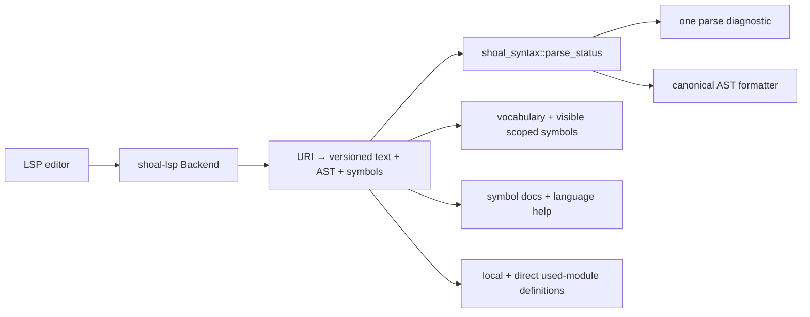
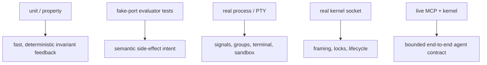

+++
title = "LSP, doctor, testing, and quality gates"
description = "Editor services, installation diagnostics, the normative conformance corpus, integration-test ownership, property/fuzz coverage, CI, and release verification."
weight = 110
template = "docs/page.html"

[extra]
group = "Storage & tooling"
eyebrow = "Engineering system"
status = "Tests are part of the architecture"
audience = "All contributors"
wide = true
+++

Shoal's correctness surface spans a grammar, evaluator, terminal, Unix process behavior, persistence,
security policy, and two remote protocols. No single test style covers that. The project uses a
normative TOML corpus for language behavior, focused unit/property tests for invariants, injected
ports for deterministic effects, and live process/socket/PTY tests for host boundaries.

## Editor service

`shoal-lsp` is parser- and local-document-based today. It keeps document text plus versioned AST
analysis in memory and advertises incremental sync, diagnostics, whole-document formatting,
completion, hover, goto definition, and document symbols.



Completion and symbols walk the parsed AST, respect lexical scope/visibility and shadowing, and
include bindings, functions, parameters, aliases, and destructuring patterns. Incremental edits are
applied sequentially using strict UTF-16 positions and analyzed off the async request thread through
a four-worker, 32 MiB/64-job scheduler. Same-URI floods retain only the latest pending version; stale
analysis cannot overwrite a newer version. A bounded stdio pump rejects excessive LSP headers or
bodies before tower-lsp's codec allocates them. Definition lookup resolves local declarations and
the exported members/paths of directly used file modules.

It does not currently implement a workspace/project index, references, rename, signature help,
semantic tokens, code actions, file watching, or type-aware completion. Those features require a
reusable cross-document semantic graph beyond the current direct-module lookup.

Source: [`shoal-lsp/src/lib.rs`](https://github.com/alliecatowo/shoal/blob/main/crates/shoal-lsp/src/lib.rs).

## Doctor

`shoal-doctor` is a read-mostly operational probe that returns structured `Ok`, `Warn`, or `Fail`
checks and exit codes 0, 1, or 2. It checks:

- available/active Leash enforcement;
- stdin TTY and `/dev/ptmx`;
- writable runtime, state, and config directories;
- kernel socket reachability;
- configured adapter directory parsing;
- representative tool availability (`sh`, `git`, `rg`, `cargo`);
- an isolated SQLite journal open/write cycle;
- TOML syntax for core config and full policy parsing.

`Options::from_env`, the evaluator/kernel, and `shoal-history` use the shared `ShoalPaths` state root.
Doctor also loads layered config and honors `journal.state_dir`, resolving relative values from its
startup cwd. A caller that starts components from different cwd values while using a relative custom
state path can still point them at different trees; the default path contract itself is shared.


The journal probe uses a temporary subdirectory, so it proves SQLite/CAS prerequisites without
polluting normal history. Config and policy file probes call the authoritative bounded core loaders;
typed schema errors, structural limits, and policy-specific admission therefore match production.

## Normative conformance corpus

`spec/cases/` contains 79 TOML suite files and 1,355 `[[case]]` records. Cases declare globally named
source, expected rendered value or stable error code, optional message substring, parse-error
expectation, filesystem fixtures, and an explicit skip reason.

```mermaid
flowchart LR
accTitle: Normative conformance corpus
accDescr: Shows the components and relationships described in Normative conformance corpus.
  TOML["spec/cases/*.toml"] --> Load["sorted deterministic load"]
  Load --> Fixture["fresh temp cwd + fixture tree per case"]
  Fixture --> Parse["script-mode parse"]
  Parse --> Eval["fresh Evaluator"]
  Eval --> Render["canonical inline render"]
  Render --> Compare["value / error code / parse error / teaching text"]
  Compare --> Summary["collect all failures; one corpus summary"]
```



The corpus is the language contract when prose and implementation disagree. It should describe
correct intended behavior, while focused Rust tests explain implementation invariants.

As of the 2026-07-16 source audit, the live corpus result is **1,306 passed, 0 failed, 4 skipped**.
The skips are explicitly host-dependent: native-thread recursion stack size, a Node block, a jq feed
composition, and a full-chain Reef `which` case. Counts in older root prose are stale; obtain a fresh
summary before publishing a release claim.

The corpus currently has two very similar Rust harnesses, under `shoal` and `shoal-eval`. They can
drift in fixture parsing, trimming, error-substring checks, and duplicate-name enforcement. Extracting
a shared test-support library would make “the corpus decides” literally one runner contract while
preserving two integration entrypoints.

`tests/language_spec.shl` is a small executable language tour/smoke script, not the normative corpus.

## Integration-test ownership

| Test asset | Boundary it owns |
|---|---|
| `shoal-adapters/tests/adapter_fixtures.rs` | every bundled adapter TOML parses; catalog/fixture invariants |
| `shoal-syntax/tests/defects.rs` | pinned parser/diagnostic regressions |
| `shoal-syntax/tests/dispatch.rs` | expression-versus-command classification |
| `shoal-syntax/tests/properties.rs` + regression file | parser/formatter properties and minimized failures |
| `shoal-syntax/tests/test_caret.rs` | forced-command caret behavior |
| `shoal-proto/tests/properties.rs` | wire/path/ref round trips and framing properties |
| `shoal-eval/tests/conformance.rs` | normative semantics through evaluator library |
| `shoal-eval/tests/exit_and_stream.rs` | evaluator exit and stream lifecycle interactions |
| `shoal-eval/tests/ports.rs` | capability requests through fake ports |
| `shoal-eval/tests/streams.rs` | pull, operators, bounds, timeouts, tee/backpressure |
| `shoal-eval/tests/reef_integration.rs` | scopes/locks/runners through language dispatch |
| `shoal-eval/tests/leash_activation.rs` | evaluator policy to exec/sandbox path |
| `shoal-exec/tests/exec.rs` | real child capture, PTY/process/cancellation behavior |
| `shoal-exec/tests/sandbox.rs` | execution-layer sandbox selection/reporting |
| `shoal-leash/tests/landlock.rs` | Linux-only real Landlock enforcement |
| `shoal-kernel/tests/daemon.rs` | real daemon, secure socket, sequential framing, shutdown cleanup |
| `shoal-mcp/tests/live_kernel.rs` | real socket + MCP facade, elision/ref/resource/events behavior |
| `shoal-prompt/tests/format_parser.rs` | prompt template grammar |
| `shoal-prompt/tests/modules.rs` | module rendering/config behavior |
| `shoal-prompt/tests/render_parity.rs` | expected pure render output |
| `shoal-prompt/tests/speed.rs` | no-regression performance/pure-render expectation |
| `shoal/tests/config_wiring.rs` | host actually consumes configured fields |
| `shoal/tests/conformance.rs` | normative corpus through top-level package context |
| `shoal/tests/interactive.rs` | real `shoal -c` and PTY-driven Reedline/exit/render behavior |

Crate-local `#[cfg(test)]` modules own smaller state transitions and serializers. In particular,
`shoal-journal/src/tests.rs` is a broad storage suite covering schema adoption, CAS integrity,
truncation, spills, undo safety, pins/GC, queries, and transcript rows.

## Why the live tests are separate



Mocking a socket cannot catch accepted-stream blocking behavior; evaluating a fake command cannot
catch pipe deadlocks or terminal restoration; unit-testing URI parsing cannot prove a ref still
resolves through the live kernel. Keep the expensive layer focused but real.

## Fuzz targets

The `fuzz/` workspace has seven libFuzzer targets:

| Target | Current operation |
|---|---|
| `lexer` | require progress while walking valid UTF-8 in both expression and command mode |
| `parser` | format every complete parse and require the formatted source to parse completely |
| `proto_frame` | decode up to 64 frames, require cursor progress, and round-trip valid requests |
| `planner` | derive a plan for every complete parse without executing it |
| `value_wire` | normalize JSON values idempotently and round-trip valid wire values |
| `stream` | compose bounded closure-free stream operations and pin single consumption |
| `policy` | evaluate parsed policies against decoded plans and each effect |

These are useful panic/non-progress and invariant smoke targets, not exhaustive semantic proof. The
`ci.yml` `fuzz-build` job is a blocking compile check for every target on every push/PR; building
alone still cannot catch a crash. Both fuzz workflows explicitly set `RUSTUP_TOOLCHAIN=nightly`; otherwise the root
stable pin would override the installed nightly toolchain required by cargo-fuzz. Each workflow first
runs locked Cargo metadata against `fuzz/Cargo.toml`: cargo-fuzz does not expose Cargo's `--locked`
flag, so this preflight rejects dependency changes that would otherwise rewrite `fuzz/Cargo.lock`
silently during the build/run.

A separate `.github/workflows/fuzz-nightly.yml` (HR-F4) runs each target for a bounded 120-second
libFuzzer budget (`cargo fuzz run <target> --fuzz-dir fuzz -- -max_total_time=120`) on a daily cron
schedule plus manual `workflow_dispatch`, one job per target, and fails (no `continue-on-error`) on
a crash/timeout/OOM, uploading the libFuzzer artifact for triage. 120 seconds per target is a
deliberate smoke-not-exhaustive budget chosen to keep the schedule cheap; it will not find a deep
bug the way a multi-hour/day corpus-accumulating campaign would, but it does mean a fast regression
(an immediate panic/non-progress case) surfaces within a day instead of never.

## Local and CI gates

### Performance review gates

The repository defines four Criterion entrypoints for the expensive representative workloads:

```bash
cargo bench -p shoal-syntax --bench syntax
cargo bench -p shoal-value --bench table
cargo bench -p shoal-journal --bench journal
cargo bench -p shoal-exec --bench spawn
```

The table benchmark retains one million rows and the journal benchmark seeds 100,000 entries, so
these are review jobs rather than ordinary unit tests. The inherited performance budgets are:

`table_1m_where_sort` (HR-F5, deep audit I12) now builds a real `shoal_value::Value::Table` and
drives it through the actual `shoal_value::methods::call_method` dispatcher — the same `where`/
`sort` entry point `shoal-eval` calls for every language-level `.where(...)`/`.sort(...)` — instead
of hand-filtering/sorting a bare `Vec<i64>` with plain Rust code, which is what it did before and
which measured nothing about table-method performance. Closure evaluation itself is stood in by a
small bench-local `CallCtx` (mirroring `shoal-value`'s own unit-test harness) because interpreting a
real AST closure needs `shoal-eval`, which sits above `shoal-value` in the dependency graph; the
bench file's own doc comment states exactly what is and is not measured.

| Workload | Review budget |
|---|---:|
| reparse a 10 kB interactive buffer | p99 below 1 ms |
| one-million-row `where` plus sort | below 150 ms |
| query a 100,000-entry journal | below 50 ms |
| Shoal spawn overhead | within 5% of direct `execve` |
| cold CLI startup | below 15 ms |

These are **targets to review against pinned-runner baselines**, not claims that this audit measured
and proved every number. Criterion results are deliberately not hard assertions on noisy shared CI.
The cold-start target has no corresponding command in the four Criterion invocations and needs a
dedicated reproducible harness before it can become a credible gate. Prompt rendering has its own
speed test, Criterion bench, and `shoal prompt bench` path described in the prompt internals chapter.

When reporting a result, record CPU/OS, build profile, sample count, dataset construction, baseline
revision, and whether caches are warm. A raw local wall-clock number without that context is not a
release guarantee.

`scripts/check.shl` runs through Shoal:

```text
cargo fmt --all -- --check
cargo test --workspace
cargo clippy --workspace --all-targets -- -D warnings
cargo build --workspace --release
```

GitHub CI builds/tests on Ubuntu and macOS with locked dependencies, runs the conformance harness,
checks fmt/Clippy, and performs release builds. Release automation produces binaries for x86_64 and
AArch64 on Linux and macOS.

### Workflow supply-chain policy

Every third-party `uses:` entry is pinned to a full 40-character commit SHA. The trailing version
comment records the reviewed upstream line without turning a moving tag into executable authority.
Dependabot checks the `github-actions` ecosystem weekly; action updates must resolve the proposed SHA
back to the expected upstream tag/branch and pass the same workflow review before merge. Rust jobs
likewise pin 1.97.0 exactly; only fuzzing deliberately uses a dated immutable snapshot of nightly.
Workflow-installed Rust tools are version-pinned as well (`cargo-fuzz` 0.13.2 and `cargo-audit`
0.22.2): Cargo's `--locked` flag locks a selected release's dependencies but does not choose that
release.

Workflow token permissions default to read-only or empty. CI and fuzz receive only `contents: read`;
the Pages build/deploy jobs receive Pages and OIDC rights only where used; the release job alone gets
`contents: write` to create and upload a tag release. New jobs must declare the smallest permission
set their API calls require instead of inheriting write authority at workflow scope.

### Supply-chain advisories (HR-F6)

Hundreds of registry dependencies are real supply-chain surface with no advisory audit before this
task (deep audit H9). The `supply-chain-audit` job in `ci.yml` installs `cargo-audit` and audits both
the root `Cargo.lock` and the independently tracked `fuzz/Cargo.lock` on every push/PR to `main`.

The documented allowlist lives at **`.cargo/audit.toml`** — this is `cargo-audit`'s own
auto-discovered config path (a bare root-level `audit.toml` is silently ignored by the tool; this
was verified locally before landing the CI job). The workspace upgraded `shoal-wasm` from Wasmtime
37 to **46.0.1**, retiring all 15 advisories that had required a major-version bump; the explicit
allowlist is now empty. Any future ignored `RUSTSEC-*` ID must carry its root cause and revisit
condition in that file. The
config also sets `output.deny = ["unmaintained", "unsound", "yanked"]`, so an unmaintained/unsound
crate or a yanked version newly appearing in either lockfile fails the gate even though none exist
today. Re-run both CI audit commands after dependency bumps and prune allowlist entries that no
longer apply.

### The `shoal-wasm` compile cost decision (HR-F8)

`shoal-wasm` is now a runtime dependency of `shoal-eval`: validated component commands participate
in canonical command resolution and execute through the preview ABI. It pulls in Wasmtime 46.0.1 with
the `cranelift` codegen backend, which is by far the largest single dependency subtree in this
workspace (dozens of `wasmtime-internal-*`/`cranelift-*` crates) — `cargo build --workspace
--all-targets` pays that compile/cache cost on every CI run, now for shipped evaluator behavior.

Decision: **keep it in ordinary workspace CI; the runtime path is load-bearing.** Reasoning:

- Feature-gating it out of the default workspace build would need `shoal-wasm`'s own
  `Cargo.toml`/`Cargo.lock` and CI matrix changes (a dependency-shape change, not a lint/doc one);
  evaluator integration needs the same locked graph and gate as other command dispatch paths;
  splitting it into a separate job would no longer test the real workspace composition.
- The crate is small (single `lib.rs`, ~250 lines) and its own compile is fast; the cost is entirely
  `wasmtime`/`cranelift`'s, and `Swatinem/rust-cache` already amortizes that across CI runs on the
  same OS/lockfile, so the marginal per-PR cost after a cache hit is low.
- Runtime/evaluator tests exercise validation, resource limits, deadlines, cancellation, and the
  declared host calls; compiling only the leaf crate would miss that integration.

Revisit this decision (feature flag or a carefully equivalent matrix) only if measured CI cost
justifies preserving the same evaluator integration coverage another way.


Every member crate opts in with `[lints] workspace = true` (HR-F1,
[hardening roadmap](@/internals/hardening-roadmap.md)), so the root manifest's lint table is
actually active per-crate, not merely staged. `rust-toolchain.toml` at the repository root pins
1.97.0 and every non-fuzz CI job installs that exact `dtolnay/rust-toolchain@1.97.0` toolchain
(HR-F2). Fuzz jobs explicitly override it with nightly. `rustup` picks the root pin up automatically
for local `cargo`/`rustc`/`clippy`/`fmt` invocations unless the environment supplies a stronger
override, so a compiler change requires a deliberate file/workflow update.

### Ambient-environment test debt (resolved, HR-F3)

`crates/shoal/src/highlight.rs`'s test module previously inherited whatever `NO_COLOR` the invoking
shell/CI exported; under an ambient `NO_COLOR=1` (as this audit environment set), seven of the
thirteen color-asserting highlighter tests failed even though the product was correctly honoring
`NO_COLOR` — a test-isolation defect (deep audit H13), not a product bug. `styles_for`/
`styles_with_bindings` now route through a shared `with_forced_color` helper that unsets `NO_COLOR`
under `crate::ENV_TEST_LOCK` for the duration of the call and restores whatever was there before.
All 13 highlighter tests now pass identically with `NO_COLOR=1 cargo test -p shoal` and with
`NO_COLOR` unset; verify with both invocations after touching this module.

## Choosing the right test

| Change | Minimum evidence |
|---|---|
| grammar/diagnostic | corpus case + focused syntax test + formatter round trip |
| value operation | focused value/eval test + corpus behavior case |
| new side effect | plan/effect test + fake-port test + policy verdict test |
| external execution | process-group/capture test on relevant OS; PTY test if interactive |
| kernel method | handler test + live socket framing/session-scope test |
| MCP tool/resource | schema/map unit test + live-kernel ref/elision test |
| adapter | fixture load + argv/consumed/effect/parser cases against representative bytes |
| Reef resolution | provider-free temp-tree unit test + evaluator integration |
| journal schema | hand-built prior-version fixture + data preservation + newer-version refusal |
| prompt/editor | pure snapshot test; PTY-driven test only for terminal lifecycle |

## Test hygiene invariants

- Every test owns its environment, XDG directories, cwd, signals, and color policy.
- Real daemons/PTY children are reaped and sockets/terminal modes cleaned on failure paths.
- Timeouts diagnose a hang without creating ordinary timing races.
- Host-dependent skips carry a concrete reason and are counted visibly.
- Conformance case names are globally unique and suites load in sorted order.
- Tests for bounded output generate data large enough to cross the actual threshold.
- OS enforcement tests distinguish “backend available” from “restriction active.”
