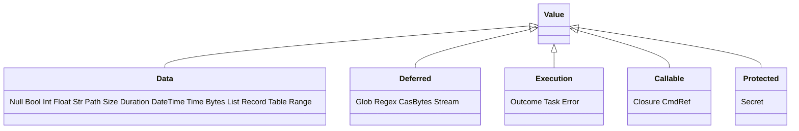
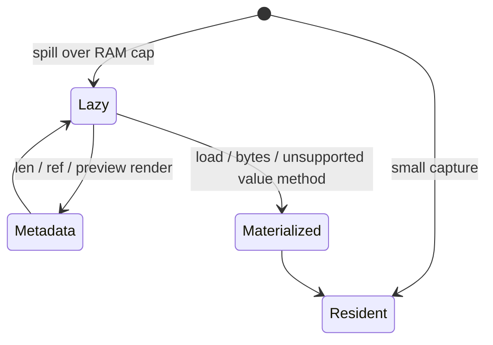

+++
title = "Runtime value algebra"
description = "Every Value variant, equality and condition contracts, error anatomy, feed serialization, JSON projection, rendering, and lazy CAS bytes."
weight = 41
template = "docs/page.html"

[extra]
group = "Language & runtime"
eyebrow = "Value book"
status = "Canonical runtime data model"
audience = "Language, runtime, protocol, and rendering contributors"
wide = true
+++

`shoal-value` is the common data plane between evaluation, methods, adapters, execution, rendering,
journaling, and the kernel wire. Its `Value` enum is a closed algebra: adding a variant requires an
explicit decision at every serialization, equality, rendering, method, and protocol boundary.

Sources: [`lib.rs`](https://github.com/alliecatowo/shoal/blob/main/crates/shoal-value/src/lib.rs),
[`value_types.rs`](https://github.com/alliecatowo/shoal/blob/main/crates/shoal-value/src/value_types.rs),
[`outcome.rs`](https://github.com/alliecatowo/shoal/blob/main/crates/shoal-value/src/outcome.rs),
[`json.rs`](https://github.com/alliecatowo/shoal/blob/main/crates/shoal-value/src/json.rs), and
[`render.rs`](https://github.com/alliecatowo/shoal/blob/main/crates/shoal-value/src/render.rs).

## Complete variant inventory

| Variant | Payload | `type_name()` | Semantic class |
|---|---|---|---|
| `Null` | none | `null` | absence/unit-like result |
| `Bool` | `bool` | `bool` | condition |
| `Int` | `i64` | `int` | scalar number |
| `Float` | `f64` | `float` | scalar number |
| `Str` | UTF-8 `String` | `str` | text |
| `Path` | `PathBuf` | `path` | bytes/native filesystem name |
| `Glob` | pattern, cwd, options | `glob` | deferred path selection |
| `Regex` | compiled regex plus source | `regex` | pattern object |
| `Size` | decimal bytes as `u64` | `size` | dimensional scalar |
| `Duration` | nanoseconds as `i64` | `duration` | signed dimensional scalar |
| `DateTime` | boxed `jiff::Zoned` | `datetime` | instant plus zone |
| `Time` | hour/minute/second | `time` | wall-clock time of day |
| `Bytes` | `Arc<Vec<u8>>` | `bytes` | resident opaque bytes |
| `CasBytes` | lazy reference, length, preview, loader | `bytes` | spilled opaque bytes |
| `List` | `Vec<Value>` | `list` | ordered heterogeneous sequence |
| `Record` | ordered `IndexMap<String, Value>` | `record` | ordered string-key map |
| `Table` | `Vec<Record>` | `table` | semantic `list<record>` |
| `Range` | integer bounds/inclusive flag | `range` | finite integer sequence |
| `Stream` | single-consumption stream state | `stream` | lazy temporal sequence |
| `Error` | `Arc<ErrorVal>` | `error` | caught/reified failure |
| `Outcome` | `Arc<OutcomeVal>` | `outcome` | command result envelope |
| `Task` | shared task handle | `task` | async/job lifecycle handle |
| `Closure` | captured function | `closure` | callable language value |
| `CmdRef` | structured AST command | `command` | callable command alias |
| `Secret` | name plus opaque shared text | `secret` | protected spawn-only material |

`type_name` intentionally reports `CasBytes` as `bytes`; backing strategy is not a language type.
Likewise, a `Table` is distinct enough for rendering and methods but semantically comparable with a
list of records.

## Ownership and cloning

Small scalars clone by value. Large or identity-bearing objects use `Arc` or their own shared handle.
Cloning a `Value::Bytes` clones the `Arc`, not the byte vector. Cloning an `Outcome`, closure, regex,
or lazy bytes value similarly preserves shared identity/backing state. Lists, records, tables, paths,
and strings clone their containers.

This distinction matters for equality: some variants compare content, some compare selected logical
fields, and some compare shared identity.

## Equality matrix

| Pair | Equality rule |
|---|---|
| same primitive type | payload equality |
| `Int` and `Float` | numeric promotion to `f64` |
| `Path` and `Str` | lossy path display compared to string |
| `Glob` and `Glob` | pattern text only |
| `Regex` and `Regex` | source text |
| `DateTime` and `DateTime` | timestamps, not zone presentation |
| `Bytes` and `Bytes` | byte-vector content |
| `CasBytes` and `CasBytes` | hash and length, without loading |
| resident `Bytes` and `CasBytes` | always unequal until explicitly materialized |
| list/record/table/range/error | structural equality |
| `Table` and list of records | element-wise semantic equality |
| streams | shared stream identity via `same` |
| tasks | shared task identity via `same` |
| outcomes | `Arc` pointer identity |
| closures | `Arc` pointer identity |
| command refs | structured AST equality |
| secrets | name and secret content |
| all unlisted mixed pairs | false |

Path/string equality is pragmatic but lossy on platforms with non-UTF-8 path bytes. Glob equality
ignores captured cwd/options, so it is pattern equality rather than full execution identity. Secret
equality compares the protected value internally even though render/JSON never reveal it.

## There is no general truthiness

`as_condition` accepts only:

- `Bool`, returning the contained boolean;
- `Outcome`, returning its `ok` flag.

Everything else is `type_error` with a hint toward explicit predicates such as `.is_empty()`,
`.is_some()`, or comparison with `null`. Empty strings, zero, empty lists, and `null` are not false.

This rule is relied on by `if`, `while`, predicate methods, logical operators, and assertion paths.
Adding truthiness in one caller would fragment the language.

## Error values and thrown errors

`VResult<T>` is `Result<T, ErrorVal>`. The same `ErrorVal` can be wrapped in `Value::Error` by
language catch behavior.

| Field | Meaning |
|---|---|
| `code` | stable machine-facing category |
| `msg` | human-facing detail |
| `span` | optional source byte range |
| `hint` | optional corrective guidance |
| `stderr` | optional captured process stderr context |
| `status` | optional external exit status |

`with_span` overwrites/set a span. `or_span` fills it only when absent, so the innermost location wins.
Use `type_error` and `arg_error` constructors for common categories, but preserve domain-specific
codes such as `not_found`, `feed_error`, `stream_consumed`, or `cmd_failed` where callers rely on them.

An error's display is only `<code>: <msg>`; renderers and protocols must explicitly project the
other fields.

## Feed serialization is not rendering

`feed_bytes` defines what `.feed(command)` places on stdin. It is deliberately different from
inline and block display.

| Value | Fed bytes |
|---|---|
| `Str` | UTF-8 verbatim, no newline added |
| resident/lazy bytes | raw full content; lazy content resolves |
| `Int`, `Float`, `Bool`, `Size`, `Duration`, `DateTime`, `Time` | inline text, no newline |
| `List<Str>` | each item plus newline, including a final newline |
| other list, record, table | compact JSON |
| `Outcome` | structured `.out` recursively; otherwise raw stdout |
| `Path` | error: a name is not file content |
| `Stream` | honest not-implemented error; no buffering fake |
| `Secret` | `feed_error`; secrets enter only at spawn injection |
| task/closure/error/glob/regex | `feed_error` |
| null/command reference/other | `type_error` |

A path's `.read` must be invoked before feed. A stream must currently be bounded and collected first.
These refusals prevent accidental filename-as-data behavior and unbounded buffering.

## Outcome anatomy

`OutcomeVal` is the process/builtin result envelope:

| Field | Purpose |
|---|---|
| `status` | optional numeric exit status |
| `signal` | optional termination signal name/number representation |
| `ok` | normalized success boolean |
| `stdout` | resident preview/full bytes depending capture strategy |
| `stdout_ref` | optional lazy/full-content backing object |
| `stderr` | captured stderr bytes |
| `dur_ns` | measured duration |
| `pid` | child PID, or zero for builtins |
| `cmd` | display command |
| `parsed` | optional adapter/builtin structured output |
| `streamed` | whether bytes already reached the terminal |
| `span` | optional invocation span |

`stdout_bytes()` loads from `stdout_ref` when present. `stdout_value()` exposes bytes/lazy bytes.
`out_value()` returns parsed output when present, otherwise a string for UTF-8 stdout or bytes-like
content as implemented. Outcome value methods frequently forward to this logical `.out`.

## Lazy CAS bytes

Large captures spill out of the resident path and become `CasBytesVal`. The value retains a bounded
preview, true length, content hash/reference, and a loader capability. Its cheap methods (`len`,
`count`, `is_empty`, and reference access) must not load content.

There are deliberately two JSON call-site behaviors:

- general `value_to_json(CasBytes)` returns a bounded `bytes_ref` metadata/preview object without
  loading, including when nested in a larger value;
- the `.json()` **method** first goes through method dispatch, whose bare lazy-bytes fallback
  materializes, then encodes resident bytes.

Do not simplify this distinction without re-auditing memory bounds and user expectations.

## JSON projection into values

`json_to_value` maps JSON primitives normally. JSON arrays become a `Table` when every element is an
object, otherwise a `List`. Objects become ordered `Record` values.

This array heuristic is semantic: an empty array vacuously satisfies "all objects" only if the
implementation's explicit handling says so; callers should consult tests before depending on empty
array type. Mixed arrays remain lists.

## Value projection to JSON

| Value family | JSON shape |
|---|---|
| null/bool/int/float/string | corresponding primitive |
| path/glob/regex/datetime/time | display/source string |
| size/duration | numeric base unit |
| bytes | lossy UTF-8 string |
| lazy bytes | bounded tagged reference object |
| list/range | array |
| record | object |
| table | array of objects |
| outcome | object with `status`, `ok`, text `out`, text `err` |
| error | object with `code`, `msg` |
| secret | redacted `secret(name)` string |
| task/closure/stream/command and fallback | inline-rendered string |

JSON projection is for language data interchange, not a lossless wire encoding. Paths lose invalid
Unicode bytes, bytes are lossy text, outcome metadata is partial, identity objects stringify, and
secrets redact. The kernel has its own tagged wire projection and should not blindly substitute this
function when round-trip fidelity matters.

## Inline rendering contract

`render_inline` is canonical one-line language display and is directly asserted by conformance.

- strings are quoted and escape quote, slash, newline, tab, carriage return, and NUL;
- paths are unquoted unless the lossy display contains a space;
- sizes use decimal SI units with up to two trimmed decimals;
- durations decompose across weeks through nanoseconds;
- datetimes render their timestamp; times use `HH:MM` or `HH:MM:SS`;
- bytes render a size marker; lazy bytes also show their canonical
  `val:blake3:` reference (exactly 64 lowercase hexadecimal digits; abbreviated displays remain
  ordinary strings);
- records preserve insertion order and quote non-identifier-shaped keys;
- streams/tasks/functions/commands/secrets render opaque descriptors;
- outcomes render compact status/signal and `ok`, not captured output.

## Block rendering contract

`render_block` is presentation for top-level host output:

- strings become raw text;
- tables and lists of records become aligned ANSI-colored tables;
- ordinary lists render one element per line;
- records render aligned key/value lines;
- successful structured outcomes render their parsed table/record/list;
- other outcomes render captured stdout text, a success marker when genuinely outputless, or a
  failure marker;
- resident bytes decode lossily; lazy bytes use a bounded preview/marker path.

Table columns use first-seen key order across rows. Cells cap at 60 display columns and the widest
column is shrunk to fit the requested width when possible. Unicode display width, not byte length,
governs padding and truncation.

Inline rendering, block rendering, feed bytes, builtin redirect bytes, JSON, and kernel wire values
are six different contracts. Treating one as a universal serializer is a recurring architecture bug.

## Change checklist for a new variant

1. add the enum variant, `type_name`, clone/ownership choice, and equality rule;
2. decide condition behavior explicitly—usually reject;
3. define inline and block rendering without leaking protected content;
4. define feedability and newline rules;
5. define `json_to_value`/`value_to_json` behavior and whether it is lossy;
6. add value methods and suggestion metadata where appropriate;
7. add operator and comparison behavior or explicit type errors;
8. add kernel tagged-wire encode/decode and round-trip tests if transportable;
9. audit adapter validation/coercion, journal serialization, transcript storage, and MCP projection;
10. test nesting inside list, record, table, outcome, stream, and errors—not only the top level.

## Known sharp edges

- Mixed path/string equality and JSON path projection are lossy on non-UTF-8 names.
- Float equality follows IEEE behavior, including `NaN != NaN`.
- Lazy bytes and resident bytes are unequal without materialization.
- Generic JSON conversion is intentionally not round-trip-complete for runtime handles.
- Secrets compare by content internally, so equality code is a sensitive-data path even though
  display is redacted.
- `Outcome` equality is identity, not equivalent result content.
- Table/list duality is implemented in equality and many methods but can still diverge in callers
  that match only one variant.
