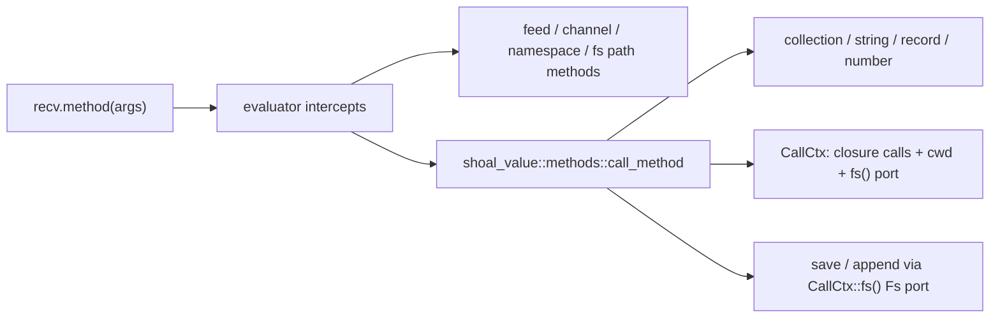
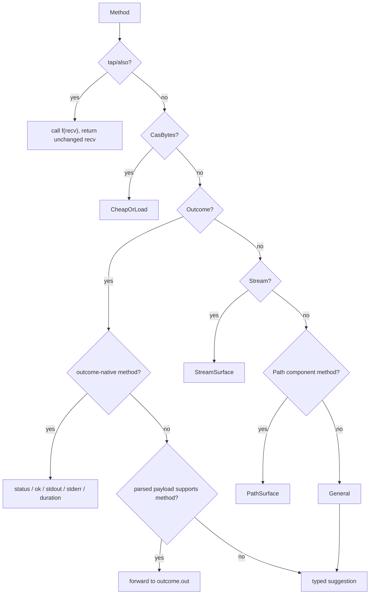

+++
title = "Value method dispatch"
description = "Dispatch precedence, complete method families, collection and string semantics, path effects, outcome forwarding, task methods, and extension workflow."
weight = 42
template = "docs/page.html"

[extra]
group = "Language & runtime"
eyebrow = "Value book"
status = "Method standard-library reference"
audience = "Runtime, language, and completion contributors"
wide = true
+++

Value methods form Shoal's standard library. Most live in `shoal-value`, where they are pure or use
the narrow `CallCtx` bridge. Methods needing evaluator capabilities—filesystem inspection, `.feed`,
channels, or namespaces—are intercepted before this crate sees the call.

Sources: [`methods/mod.rs`](https://github.com/alliecatowo/shoal/blob/main/crates/shoal-value/src/methods/mod.rs)
and its receiver modules under
[`methods/`](https://github.com/alliecatowo/shoal/tree/main/crates/shoal-value/src/methods).

## Capability boundary

The value crate's `CallCtx` exposes:

```text
call_closure(function, positional_values) -> VResult<Value>
cwd() -> PathBuf
fs() -> &dyn Fs        // required: embedding chooses StdFs or an injected adapter
```

This is enough for functional collection stages, pure path absolutization, and the explicit write
sinks (`.save`/`.append`), which route through the `fs()` port rather than `std::fs` directly. It is
still not enough to spawn a command or inspect arbitrary filesystem state (reads, stat, globbing);
those operations remain evaluator responsibilities. `fs()` is compile-required so a new context
cannot silently acquire ambient real-filesystem authority by forgetting the wire. A plain evaluator
explicitly returns its configured port, which defaults to `StdFs`; tests can replace it with a
recording/denying adapter. No production Leash-backed `Fs` adapter exists yet.



`call_method` attaches the call span with `or_span`, preserving a more precise error span produced
inside a closure or argument operation.

## Dispatch precedence

Order is observable:

1. `.tap` and `.also` act on the original receiver;
2. lazy CAS bytes answer cheap methods, materialize for `.load`/`.bytes`, or materialize and
   redispatch for other methods;
3. outcomes forward through their outcome-specific layer;
4. streams use lazy combinators/sinks;
5. pure path component methods intercept ambiguous names such as `.abs`;
6. the general method match handles collections, strings, records, numbers, persistence, and tasks;
7. unknown-method suggestions are produced for the receiver type.



`.tap(f)`/`.also(f)` calls `f(receiver)` for its effect, discards the closure result, and returns an
unchanged clone of the receiver. Intercepting before outcome forwarding ensures a tap sees the full
outcome rather than only `.out`.

## General collection surface

The sequence adapter accepts `List`, `Table`, and `Range`. Tables convert to values containing their
records; ranges materialize at most 16,384 integers before raising `range_materialization_limit`.
Raw streams are rejected here because stream driving needs
context and boundedness rules.

| Method | Contract |
|---|---|
| `len`, `count` | character count for strings; bytes/elements/fields/range length otherwise |
| `is_empty` | `len == 0` on supported receivers |
| `first`, `last` | zero args returns value/null; integer arg returns a list slice |
| `collect` | materializes a range up to its 16,384-item wall; returns list/table unchanged |
| `stream` | finite list/table/range or text lines to a lazy stream |
| `tee` | split finite sequence into `n` coordinated branches |
| `map` | call closure once per element, return list |
| `reduce`, `fold` | accumulator plus element closure |
| `where`, `filter` | retain items whose closure condition is true |
| `each` | call closure for every finite element, discard all results, return `null` |
| `any`, `all` | short-circuit predicate aggregation |
| `find` | first matching element or null |
| `flat_map` | map then flatten collection results |
| `sort_by` | stable/implementation sort by closure-extracted key |
| `sort` | direct total-order sort, or `sort_by` when closure supplied |
| `reverse` | reverse element order |
| `uniq` | structural de-duplication |
| `sum`, `min`, `max` | zero-argument aggregate |
| `flatten` | one-level collection flattening |
| `enumerate` | attach index/value structure |
| `skip`, `take` | nonnegative count slice |
| `chunks` | divide into fixed-sized lists |
| `zip` | pair with another finite collection |
| `group`, `group_by` | `List` of `{key, values}` records |
| `join` | concatenate with string separator, default empty |

The zero-argument aggregates explicitly reject projection arguments and suggest
`.map(f).sum()`/`.min()`/`.max()`. This prevents a plausible-looking lambda from being silently
ignored.

`first()` and `last()` return a single value; `first(n)` and `last(n)` always return a list. Empty
single-value selection returns `null`.

## Ordering and conditions

Direct `sort`, `min`, and `max` delegate to the same total-order comparator used by relational
operators. Comparable families include numeric, strings, paths, sizes, durations, datetimes, times,
and booleans according to `ops::compare`. Mixing incomparable values returns an error rather than
falling back to rendered text.

Predicate methods call `Value::as_condition`, so only `bool` and `outcome` are accepted. A closure
returning `null`, zero, or an empty list is a type error.

## String surface

| Method | Result |
|---|---|
| `lines` | list of lines, strips trailing `\r` per line |
| `words` | Unicode-whitespace-separated strings |
| `chars` | Unicode scalar values as one-character strings |
| `trim` | trimmed string |
| `upper`, `lower` | Unicode case conversion |
| `split(separator)` | list of substrings; separator is required |
| `starts_with(prefix)` | boolean; prefix required |
| `ends_with(suffix)` | boolean; suffix required |
| `contains(value)` | receiver-polymorphic containment |
| `replace(pattern, replacement)` | string/regex-aware replacement path |
| `matches(pattern)` | all match projection defined in `strops.rs` |
| `match(pattern)` | first match projection |
| `parse_int`, `parse_float` | numeric parsing or typed error |
| `str` | canonical string conversion |
| `display` | display-oriented string conversion |
| `json` | compact JSON through `value_to_json` |

Required string arguments use `req_str_arg`; missing arguments are `arg_error`, not an empty-string
default. This prevents calls like `"x".starts_with()` from returning the misleading value `true`.

String `len` counts Unicode scalar values (`chars().count()`), not UTF-8 bytes and not user-perceived
grapheme clusters.

`materialize.rs` is the shared transient admission boundary. Eager collection transforms, record
projections, string-to-list methods, and list concatenation admit each value against 16,384-value /
16 MiB walls. Keyed transforms also account for transient keys retained during sorting/grouping.
Collection and bounded-stream `tee` admit one replay vector and share it across fork cursors instead
of cloning the whole vector per fork. String concatenation, `join`, case conversion, and
literal/regex replacement append into a 16 MiB bounded builder. Regex capture references are
expanded directly into that builder, so a small pattern/replacement cannot allocate an unchecked
multiplicative intermediate before the environment quota runs.

## Record and receiver-polymorphic methods

| Method | Receiver | Behavior |
|---|---|---|
| `keys` | record | ordered key list |
| `values` | record | values in insertion order |
| `items` | record | `List` of two-element `[key, value]` lists |
| `set(key, value)` | record | persistent-style updated record |
| `merge(other)` | record | merge with right/other values winning; existing positions stay, new keys append |
| `get(key, default = null)` | record/list/string-like supported cases | safe lookup |
| `contains(value)` | string/collection/record-supported path | receiver-specific membership |

Records use `IndexMap`, so key, value, item, JSON, and render order follows insertion order. Callers
must not replace them with unordered maps without updating visible contracts.

## Path method split

Pure path methods live in `shoal-value`:

| Method | Behavior |
|---|---|
| `name` | filename component |
| `stem` | filename without final extension |
| `ext` | final extension |
| `parent` | parent path or null-like result as implemented |
| `join(value)` | append path component |
| `abs` | make absolute using `CallCtx::cwd` |

Filesystem-backed path methods such as read, lines, size, metadata, or existence are intercepted in
the evaluator because they require the injected `Fs` port. This split is easy to miss when adding
completion metadata: both sets are language-visible methods on `path`.

The general `save` and `append` methods write a receiver to a supplied path through
`CallCtx::fs().write`/`.append` in `methods/path.rs`; stream `.save`/`.append` opens once through
`CallCtx::fs().open_append` in `methods/stream.rs` (HR-C1/HR-C2). `CallCtx::fs()` is the filesystem
capability: every `CallCtx` must explicitly return a port, and the evaluator returns its configured
`Arc<dyn Fs>` (default `StdFs`; injectable through `set_fs`) so a fake can observe or deny the write.
Evaluator call sites still surround some value saves with journal undo hooks. The eval-side
wire is in place: `impl CallCtx for Evaluator` overrides `fs()` to return the evaluator's injected
`Arc<dyn Fs>` (installed via `set_fs`), so value-method writes are mediated by the session's actual
port — a denying injected adapter blocks `"x".save(...)` end to end, pinned by
`value_method_saves_go_through_the_injected_fs_port` in `shoal-eval`.

## Numeric methods

`abs` is supported on numeric values, but path `.abs` wins earlier in dispatch. Integer absolute
value uses checked arithmetic so `i64::MIN` cannot silently overflow. `round`, `floor`, and `ceil`
accept an optional nonnegative precision argument and preserve numeric semantics implemented in
`num.rs`.

## Outcome forwarding

An outcome has native fields/methods for command metadata and output. If a method is not outcome-
specific, the dispatcher forwards it to `out_value()`. That makes a structured builtin or adapted
command behave like its table/record/list:

```text
ls.where(row => row.size > 1mb).sort_by(row => row.name)
```

while raw stdout/stderr remain explicitly accessible.


Forwarding means a newly added general method can automatically become available on outcomes. Test
both a parsed structured outcome and an unparsed text outcome.

## Stream methods

Streams are intercepted before finite collection dispatch. Lazy combinators return a new `StreamVal`
without driving upstream; sinks drive it with `CallCtx` for closure stages. A method that is neither
a stream-native combinator nor sink may collect only when the stream is statically/operationally
bounded; unbounded sources raise `stream_unbounded` rather than hang forever.

The dedicated [streams and channels](../streams-channels/) chapter maps the pull and tee state
machines.

## Task lifecycle methods

| Method | Behavior |
|---|---|
| `await`, `wait` | block until task result, then return value/error |
| `cancel` | request cancellation and invoke registered hook |
| `is_done` | current completion boolean |
| `suspend` | request/mark suspension through hooks |
| `resume` | resume through hooks |
| `is_suspended` | current suspension boolean |

All are zero-argument methods. Task identity survives cloning, so lifecycle calls through any clone
affect the same shared task.

## Method suggestions

`suggest.rs` owns Levenshtein distance, the global method-name inventory, receiver-specific method
lists, and unknown-method construction. This metadata serves diagnostics and may serve completion.
Adding dispatch without adding suggestion metadata creates a method that works but is absent from
helpful discovery; adding metadata without dispatch advertises a nonexistent method.

## Arity helpers

| Helper | Rule |
|---|---|
| `arg(args, n)` | required positional or `arg_error` |
| `no_args` | rejects any positional or named arguments |
| `agg_no_args` | same, with aggregate-specific correction hint |
| `int_arg` | optional nonnegative integer with nonnegative default |
| `str_arg` | optional string with default |
| `req_str_arg` | required string with caller-supplied missing message |

Most general methods do not accept named arguments. A method implementation must reject stray
arguments rather than accidentally ignoring them.

## Change workflow

1. decide whether the method belongs in evaluator interception, stream/outcome special dispatch, a
   receiver module, or the general match;
2. choose its position relative to lazy bytes, outcomes, streams, and path ambiguity;
3. validate all positional and named arity explicitly;
4. reuse `CallCtx` only for closure invocation/cwd; add broader effects at the evaluator boundary;
5. specify lazy versus eager behavior and boundedness;
6. preserve table/list duality where semantically appropriate;
7. attach span with `or_span` so nested locations win;
8. update `method_names` and `methods_for` suggestion metadata;
9. test direct receiver, outcome-forwarded receiver, lazy-CAS receiver, and unknown-method hint;
10. update external method reference and internal value/wire docs.

## Known sharp edges

- Dispatch is a hand-ordered chain; moving an arm can change meaning on path, outcome, stream, or
  lazy bytes receivers.
- `save`/`append` and stream `.save` route through the compile-required `CallCtx::fs()`
  (`.write`/`.append`/`.open_append`), preserving streaming and append semantics. The evaluator wire
  is complete, but its production default is still ambient `StdFs`, not a Leash enforcement adapter.
- Some method aliases expand the discoverable surface (`reduce`/`fold`, `where`/`filter`,
  `group`/`group_by`, `tap`/`also`). Registry/help must include both.
- Unicode string length counts scalar values, not graphemes.
- Outcome forwarding can make a method appear to exist on outcomes even when its behavior differs
  between structured and raw output.
- Generic `.json()` on lazy bytes materializes, while nested `value_to_json` is bounded; the call-site
  distinction is intentional but nonobvious.
- Receiver metadata and dispatch both cover list/table/range integer `.get` plus record string
  `.get`; owning fixtures pin negative indexing and default values for the sequence variants.
- Boolean `.str()`/`.display()` is present in both dispatch and the receiver-specific metadata, so
  completion and unknown-method hints expose the executable conversion surface.
