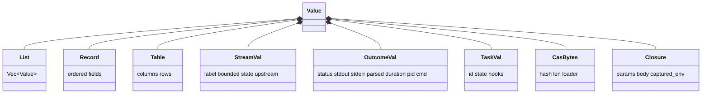
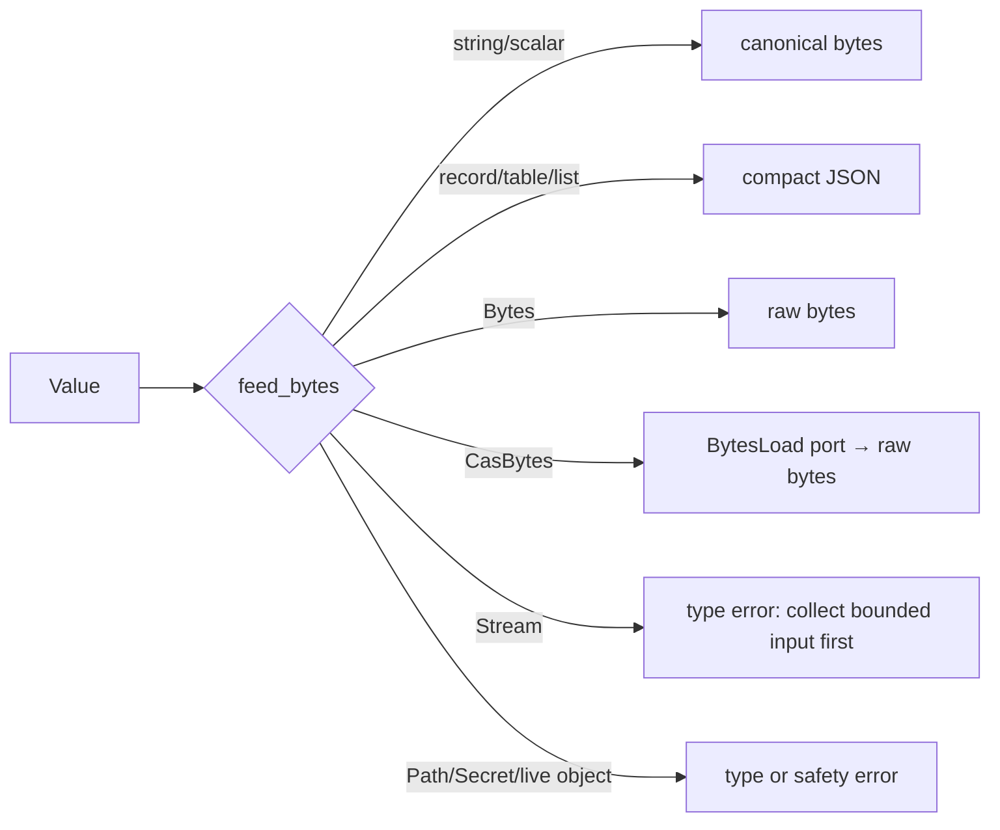
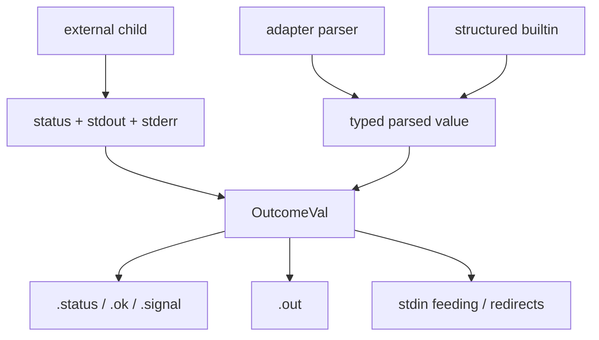
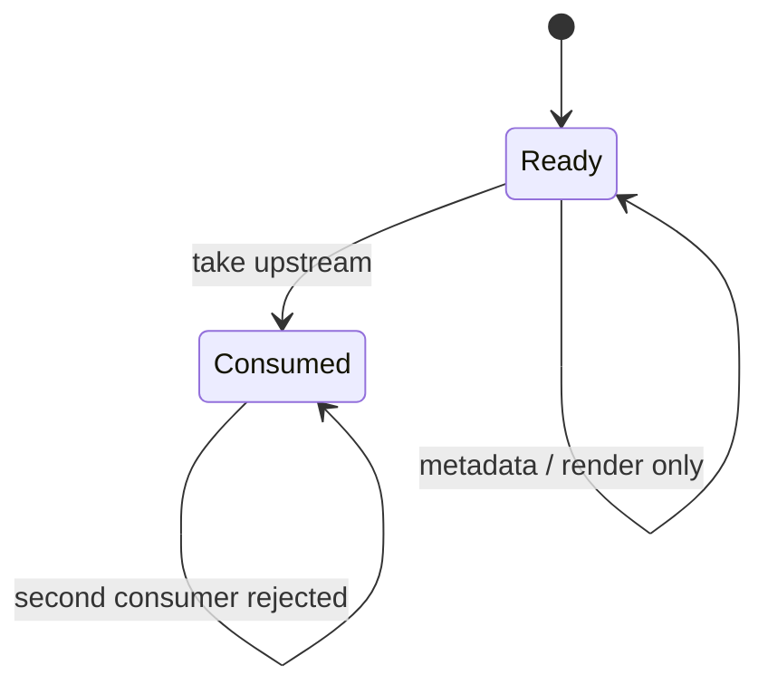
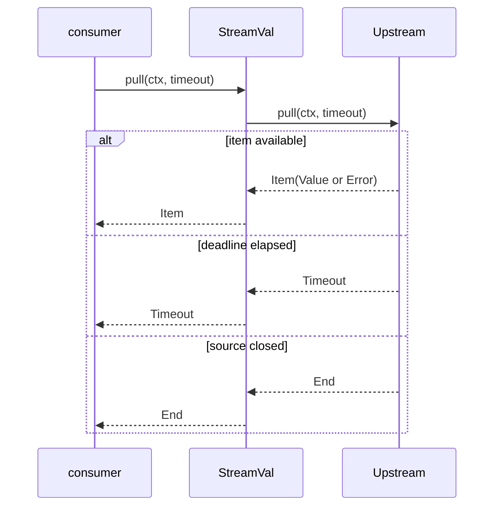
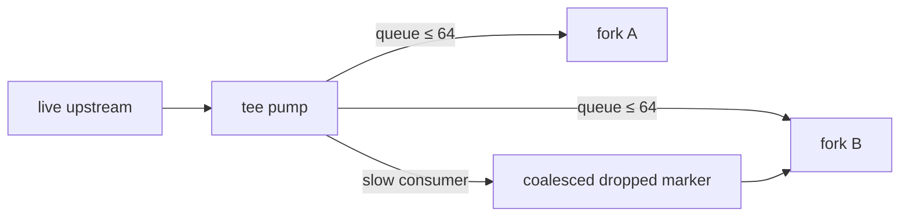
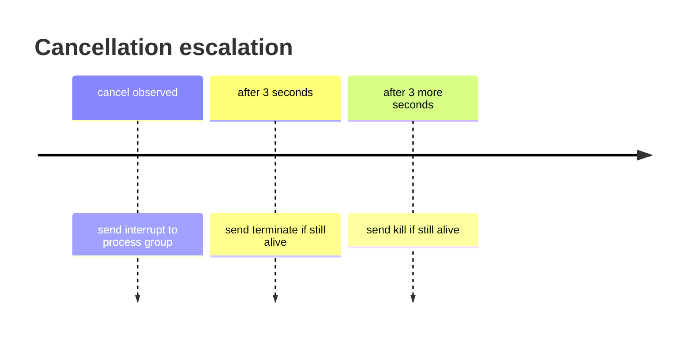

+++
title = "Values, streams, and execution"
description = "The runtime value algebra, lazy stream protocol, command outcomes, process capture, PTYs, cancellation, and byte boundaries."
weight = 40
template = "docs/page.html"

[extra]
group = "Language & runtime"
eyebrow = "Runtime internals"
status = "Value and OS boundaries"
audience = "Runtime and execution contributors"
wide = true
+++

Shoal's central runtime promise is that data remains structured for as long as possible. A table is
not terminal text; an outcome is not only an exit code; a path is not only a UTF-8 string; a stream
is not an eager list. Bytes appear at explicit boundaries: process stdin, captured stdout/stderr,
persistence, rendering, or the wire.

## Value algebra

`shoal-value` currently defines these runtime families:

| Family | Variants |
|---|---|
| scalar | `Null`, `Bool`, `Int`, `Float`, `Str` |
| domain scalar | `Path`, `Glob`, `Regex`, `Size`, `Duration`, `DateTime`, `Time` |
| bytes | resident `Bytes`, lazy `CasBytes` |
| structured | `List`, `Record`, `Table`, `Range` |
| live/identity | `Stream`, `Task`, `Closure`, `CmdRef` |
| result/control | `Error`, `Outcome` |
| protected | `Secret` |

Sources: [`Value`](https://github.com/alliecatowo/shoal/blob/main/crates/shoal-value/src/lib.rs),
[`value_types.rs`](https://github.com/alliecatowo/shoal/blob/main/crates/shoal-value/src/value_types.rs), and
[`methods`](https://github.com/alliecatowo/shoal/tree/main/crates/shoal-value/src/methods).

## Equality and identity

Equality is structural for ordinary data and identity-aware for live runtime objects.

- integers and floats compare through numeric promotion;
- paths and strings can compare through path display semantics;
- a `Table` and a `List<Record>` can compare as equivalent tabular structures;
- resident lists/records/bytes compare by content;
- `CasBytes` compare by content hash and length without loading;
- a lazy CAS object and resident bytes are not implicitly materialized merely to compare;
- streams, tasks, closures, and similar live objects compare by shared identity.

The key invariant is that equality must not unexpectedly consume a stream, await a task, perform IO,
or allocate a large blob.

## Converting values to process stdin

`feed_bytes` is the explicit structured-value → byte-stream conversion:

| Value | Feed encoding |
|---|---|
| string | raw UTF-8, no automatic newline |
| bytes / CAS bytes | raw bytes, loading CAS content on demand |
| scalar | canonical textual form |
| list of strings | newline-delimited with a trailing newline |
| records, tables, heterogeneous lists | compact JSON |
| outcome | its structured/parsed output when available, otherwise raw output |
| path | rejected rather than silently reading the file |
| secret/task/closure and other unsafe kinds | rejected |
| stream | **currently rejected**; streaming stdin feed is not implemented |

The stream case is a known gap, not an implicit eager collect. The error directs callers toward a
bounded collection, preserving the rule that unbounded streams cannot silently become unbounded
memory use.

## Outcomes unify commands

Both builtins and external commands produce `OutcomeVal`. Its fields include normalized status and
signal, success, raw stdout/stderr, duration, PID/command metadata, optional parsed structured output,
streaming markers, and a source span. Large external stdout can be represented by a journal/CAS ref
rather than a resident vector.

JSON output parsing is lazy: asking for structured output may parse stdout, but merely inspecting
status does not. This keeps process execution separate from format interpretation.

## Stream protocol

A `StreamVal` is a labeled, optionally bounded, single-consumption handle to an `Upstream`. Pulling
returns one of three protocol results: item, timeout, or end. Items themselves can be values or
language errors.

Operators such as mapping/filtering/taking/merging/zipping compose lazy upstreams. `collect` rejects
an unbounded stream unless the caller first establishes a bound. Sources include iterable values and
runtime channel/time/file producers implemented by the evaluator.

### Tee behavior

For a bounded stream, tee can materialize once and replay exact values to each branch. A live stream
uses a bounded queue per fork (currently 64 items). A slow fork can lose items and receives an
explicit dropped marker rather than silently pretending delivery was lossless.

`buffer(n)` is currently an identity operation in the synchronous pull model; do not infer an
independent asynchronous prefetch worker from its name.

## Tasks

`TaskVal` wraps running/completed state behind a condition variable and optional cancel, suspend,
and resume hooks. Evaluator-spawned language tasks and parked local external jobs can install useful
control hooks. A task's value is identity-bearing and may resolve to a value or error.

Kernel task wrappers are different: async/timeout RPC execution runs recursive dispatch on a Rust
thread. The wrapper cannot identify one child process group to signal, so kernel `task.suspend` and
`task.resume` intentionally return `TASK_CONTROL_UNAVAILABLE`. Cancellation is supported through
the task path; suspend/resume are not.

## External execution modes

`shoal-exec` is a blocking/threaded Unix execution layer rather than a Tokio runtime. It owns two
main one-shot modes plus a long-lived PTY session API.

```mermaid
flowchart TD
  Request["ExecSpec"] --> Resolve["resolve executable"]
  Resolve --> Sandbox["apply lowered sandbox / hash pin"]
  Sandbox --> Mode{"mode"}
  Mode -->|Capture| Pipes["stdout/stderr pipes"]
  Pipes --> Drains["concurrent drain threads"]
  Drains --> Result["ExecResult"]
  Mode -->|PtyTee| Pty["portable-pty + raw terminal"]
  Pty --> Watch["window polling + WUNTRACED"]
  Watch --> Result
  Mode -->|long-lived PTY| Session["PtySession reader + VT100 grid"]
```

### Capture

Capture drains stdout and stderr concurrently to avoid child deadlock. The evaluator normally keeps
up to 64 MiB resident; with a journal installed, larger output can spill to CAS up to the configured
hard ceiling (currently 1 GiB in this path). The journal itself applies its own persisted-output cap
and records truncation metadata rather than presenting a truncated blob as complete.

### PTY tee

Interactive statement-position commands run on a real PTY when the host is interactive. The host
enters raw mode, forwards input/output, polls terminal size, and tracks process-group state. A
stopped process can be parked as a resumable local job rather than mistaken for a completed child.

### Long-lived PTY sessions

The kernel `pty.*` surface uses `PtySession`, which owns a child, reader thread, VT100 parser/grid,
input, resizing, and close lifecycle. It is separate from evaluator command capture. The kernel
retains PTY entries in an in-memory session-scoped map and exposes reads as explicit snapshots;
there is currently no durable PTY state or MCP PTY change subscription.

## Cancellation escalation

Children are placed in process groups so signals reach pipelines/descendants as a unit where the OS
allows. Cancellation is polled, then escalated:

The precise status module normalizes exit code, signal, and stopped state into `ExecResult`.

## Unsafe and OS-specific boundary

Unix signal, process-group, terminal, `waitpid`, Landlock, and Seatbelt operations necessarily touch
platform APIs and some unsafe interfaces. The architecture keeps that concentration in
`shoal-exec`/`shoal-leash`. New evaluator builtins should use the execution/port boundary instead of
adding direct libc calls, global `chdir`, or ad-hoc signal handlers.

## Wire-stream limitation

The kernel wire can encode a stream as a typed `WireValue::Stream` label/ref, but the protocol has no
follow-up “pull next chunk” RPC. This is separate from the missing process-stdin stream feed: one is a
wire transport gap, the other a local byte-conversion gap. Until a bounded pull protocol exists,
agents should receive materialized bounded values or a domain-specific resource/ref.

## Invariants and failure modes

- Pulling metadata or rendering a stream must not consume it.
- A second real consumer of a single-consumption stream must receive an error.
- No equality operation may await, pull, or load arbitrarily large data.
- A path value passed to stdin must not silently read the path's file.
- Output truncation/spill must be represented explicitly in metadata and refs.
- Child cancellation targets process groups, not only the immediate PID.
- Terminal raw mode and signal dispositions must be restored on every exit path.
- Kernel PTY IDs and task IDs are session-scoped and disappear on kernel restart.
