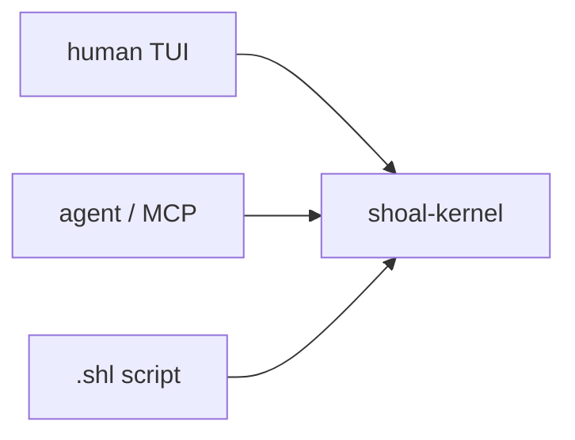

+++
title = "shoal"
sort_by = "weight"
+++

# The shell, out of the box

**shoal** is an agent-first structured shell. Stub landing page.

```shoal
ls.where(.size > 1mb)
```


```mermaid
flowchart LR
  a[human TUI] --> k[shoal-kernel]
  b[agent / MCP] --> k
  c[.shl script] --> k
```
